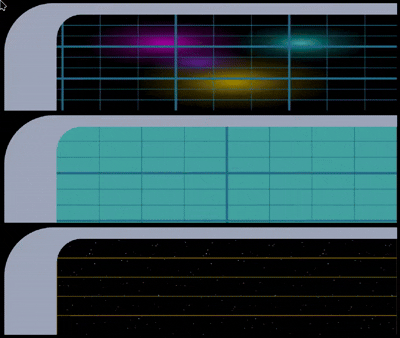

<p align="center">


</p>
<p align="center">
    <em>A <b>Star Trek LCARS</b> experience for Home Assistant</em>
</p>
<p align="left">
	
	
  
<p>

- [CB-LCARS](#cb-lcars)
  - [Overview](#overview)
  - [Features](#features)
    - [What it isn't...](#what-it-isnt)
  - [Installation - Make it so!](#installation---make-it-so)
    - [1. Dependencies and Extras](#1-dependencies-and-extras)
    - [2. HA-LCARS Theme - Setup and Customizations](#2-ha-lcars-theme---setup-and-customizations)
      - [Fonts](#fonts)
      - [Customized *CB-LCARS* Colour Scheme](#customized-cb-lcars-colour-scheme)
    - [3. Install CB-LCARS from HACS](#3-install-cb-lcars-from-hacs)
    - [4. Engage!](#4-engage)
  - [States](#states)
  - [Joining with a Symbiont \[Card Encapsulation\]](#joining-with-a-symbiont-card-encapsulation)
    - [Imprinting](#imprinting)
      - [User card-mod styles](#user-card-mod-styles)
  - [CB-LCARS Cards](#cb-lcars-cards)
    - [LCARS Elbows](#lcars-elbows)
    - [LCARS Buttons](#lcars-buttons)
    - [LCARS Multimeter (Sliders/Gauges)](#lcars-multimeter-slidersgauges)
      - [Ranges](#ranges)
    - [LCARS Labels](#lcars-labels)
    - [LCARS DPAD](#lcars-dpad)
  - [Animations and Effects](#animations-and-effects)
  - [Screenshots and Examples](#screenshots-and-examples)
    - [Example: Tablet Dashboard](#example-tablet-dashboard)
  - [Example: Room Selector with Multimeter Light Controls](#example-room-selector-with-multimeter-light-controls)
    - [Control Samples](#control-samples)
      - [Button Samples](#button-samples)
      - [Sliders/Gauges](#slidersgauges)
      - [Row of sliders (Transporter controls? :grin:)](#row-of-sliders-transporter-controls-grin)
  - [Some Dashboard possibilities...](#some-dashboard-possibilities)
  - [Acknowledgements \& Thanks](#acknowledgements--thanks)
  - [License](#license)


<br>

---
# CB-LCARS

##  Overview

CB-LCARS is a collection of custom cards for Home Assistant, inspired by the iconic LCARS interface from Star Trek.  Build your own LCARS-style dashboard with authentic controls and animations.

## Features

- Built upon a [Starfleet-issued version](https://github.com/snootched/button-card-lcars/tree/cb-lcars) of `custom-button-card` enhanced with additional features and internal template management.
- Designed to work with [HA-LCARS theme](https://github.com/th3jesta/ha-lcars).
- Includes many LCARS-style elements: buttons, sliders/gauges, elbows, d-pad, and a growing library of animated effects.
- Highly customizable and dynamic state-responsive styles: colours, borders, text, icons, animations, and much more.
- Controls can match the colour of light entities.
- ***Symbiont*** mode lets you encapsulate other cards and imprint LCARS styling onto them.
- Use HA 'Sections' dashboards or custom/grid layouts for best results.


### What it isn't...

- CB-LCARS is not its own theme — pair with [HA-LCARS theme](https://github.com/th3jesta/ha-lcars) for the full LCARS experience.
- Not fully standalone—some controls may require other HACS cards (see requirements).
- Not a fully commissioned Starfleet  product — those features won't be installed until Tuesday.  (this is a hobby project, so expect some tribbles.)

<br>

## Installation - Make it so!

[](https://my.home-assistant.io/redirect/hacs_repository/?owner=snootched&repository=cb-lcars)


> :dizzy: tl;dr: Express Startup Sequence
>
> - _Clear All Moorings and Open Starbase Doors_
>   - Install 'required' dependencies from HACS
> - _Thrusters Ahead, Take Us Out_
>   - Setup HA-LCARS theme (notes below)
>   - Add CB-LCARS custom style to HA-LCARS theme
> - _Bring Warp Core Online, Engines to Full Power_
>   - Install CB-LCARS from HACS
> - _Engage!_
>

<details closed><summary>Detailed Installation</summary>

### 1. Dependencies and Extras

The following should be installed and working in your Home Assistant instance - these are available in HACS
<br><b>Please follow the instructions in the respective project documentation for installation details. </b>

| Custom Card                                                                 |  Required?  | Function    |
|-----------------------------------------------------------------------------|-------------|-------------|
| [ha-lcars theme](https://github.com/th3jesta/ha-lcars)                      | Required    | Provides base theme elements, styes, colour variables, etc. |
| [my-slider-v2](https://github.com/AnthonMS/my-cards)                      | Required    | Provided slider function in Multimeter card. |
| [lovelace-card-mod](https://github.com/thomasloven/lovelace-card-mod)       | Required | CB-LCARS requires card-mod for using the _host imprint_ feature on symbiont cards.  It is also required by HA-LCARS theming at the time of writing.<br><br>Very useful for modifying the elements/styles of other cards to fit the theme (overriding fonts, colours, remove backgrounds etc.) |
| | |
| [lovelace-layout-card](https://github.com/thomasloven/lovelace-layout-card) | Optional    | No longer used internally but it's handy for the ultimate in dashboard layout customization! |

<br>

### 2. HA-LCARS Theme - Setup and Customizations

#### Fonts

As part of HA-LCARS setup, when adding the font resource, use a slightly updated Antonio font resource string.<br>

This will include weights 100-700 allowing for more thinner/lighter text as seen in Picard (some displays use really thin font, 100 or 200)

Substitute the following resource string when setting up font in HA-LCARS theme:
`https://fonts.googleapis.com/css2?family=Antonio:wght@100..700&display=swap`

> **Note:**  If the font is missing, the card will attempt to load it dynamically from the above URL.)

<br>

**Additional Fonts**

CB-LCARS ships with local versions of Microgramma and Jeffries.

These fonts are added automatically to the page via stylesheets and use custom names as to not conflict with any existing fonts.

- `cb-lcars_microgramma`
- `cb-lcars_jeffries`


#### Customized *CB-LCARS* Colour Scheme

 *Ideally, add and use this cb-lcars profile into your HA-LCARS theme.  If not, the additional colour definitions will be made available to use at runtime by the cards.*

 Copy the custom `LCARS Picard [cb-lcars]` definition from [cb-lcars-lcars.yaml](ha-lcars-theme/cb-lcars-lcars.yaml) to your HA-LCARS `lcars.yaml` file in Home Assistant (per instructions for [adding custom themes to HA-LCARS](https://github.com/th3jesta/ha-lcars?tab=readme-ov-file#make-your-own-color-themes)).

Set `LCARS Picard [cb-lcars]` as the active theme.

<details closed><summary>Picard [cb-lcars]</summary>
Grays, Blues, and Oranges are the core colours.  Greens and Yellows added for additional options.


These are the colours used for the ha-lcars defined variables.


</details>

<br>

### 3. Install CB-LCARS from HACS

1. Add CB-LCARS git repository as a custom repo in HACS.
2. Install CB-LCARS from HACS like any other project.


### 4. Engage!

Add CB-LCARS cards to your dashboard just like any other card.
</details>


---


## States

The cards support changing the styles/colours of independent components based on the state of the entity.

If no entity is defined (no state), `default` will be used.  If the entity is unavailable or unknown, then `unavailable` will be used.

Each of these is configurable in the UI editor for the cards.

State styles can be applied to components such as:
- Borders
- Backgrounds
- Text
- Buttons
- etc.

| Entity State Value           |  State Variable Name   |  State ID               |
|------------------------------|------------------------|--------------------------
| N/A - no entity assigned     | `default:`             | `id: state_default`     |
| `on` `open` `locked`         | `active:`              | `id: state_on`          |
| `off` `closed` `unlocked`    | `inactive:`            | `id: state_off`         |
| Number (zero): `0`           | `zero:`                | `id: state_zero`        |
| Number (non-zero)            | `non_zero:`            | `id: state_nonzero`     |
| `heat` (hvac/climate entity) | `hvac_heat:`           | `id: state_heat`        |
| `cool` (hvac/climate entity) | `hvac_cool:`           | `id: state_cool`        |
| `unavailable` `unknown`      | `unavailable:`         | `id: state_unavailable` |
| Custom match (see docs)      | *(user-defined)*       | `id: state_custom`      |

> **Tip**
> When using Light entities, you can choose to have your colour > match the light's current colour.  You can choose this from
> the colour picker list, or by using the variable `var(--custom-button-light-color)`

Example of configuration (editable via UI):
```yaml
variables:
  text:
    label:
      color:
        default: var(--primary-text-color)
        active: var(--lcars-ui-secondary)
        inactive: var(--lcars-ui-tertiary)
        zero: var(--lcars-green)
        non_zero: var(--lcars-blue)
        hvac_heat: var(--lcars-orange)
        hvac_cool: var(--lcars-blue)
        unavailable: var(--lcars-card-button-unavailable)
  card:
    color:
      default: var(--lcars-card-top-color, var(--picard-dark-gray))
      active: var(--lcars-ui-secondary)
      inactive: var(--lcars-ui-tertiary)
      zero: var(--lcars-green)
      non_zero: var(--lcars-blue)
      hvac_heat: var(--lcars-orange)
      hvac_cool: var(--lcars-blue)
      unavailable: var(--lcars-card-button-unavailable)
      background:
        default: var(--lcars-card-top-color, var(--picard-dark-gray))
        active: var(--lcars-ui-secondary)
        inactive: var(--lcars-ui-tertiary)
        zero: var(--lcars-green)
        non_zero: var(--lcars-blue)
        hvac_heat: var(--lcars-orange)
        hvac_cool: var(--lcars-blue)
        unavailable: var(--lcars-card-button-unavailable)
```

> **Advanced State Matching**
>
> CB-LCARS supports advanced state matching and styling using the `state_custom` system. This allows you to define custom state matchers (using value, range, regex, etc.) and apply custom styles or variables when matched. See [doc/cb-lcars-state-system.md](doc/cb-lcars-state-system.md) for full details, usage, and examples.

---

## Joining with a Symbiont [Card Encapsulation]

CB-LCARS has graduated the Initiate program and can become a host to a symbiont card.  Joining enables you to imprint some CB-LCARS styling to the encapsulated card.  Most common case would be with the Elbow card to add LCARS borders - but much more is possible.

Just supply your symbiont card configuration into the editor and it will inset the the symbiont into the CB-LCARS host card.  After joining, you can adjust settings, imprint host styles onto the symbiont, and even supply your own additional `card-mod` configuration to the symbiont.

### Imprinting

Currently, imprinting will apply the host background colours and text font, size, and colours to the symbiont.  This feature uses some basic `card-mod` configuration targeted primarily to `ha-card`.

#### User card-mod styles
You can provide your own `card-mod` configuration which will append to the host configuration.  You can also override any host styling with your `card-mod` config.

Card-mod templating is supported and the host card's `variables:` block and `entity` are made available to the symbiont.  These can be accessed with standard card-mod jinja templating.

```yaml
Example accessing the host card's card default colour.

variables:
  symbiont:
    enabled: true
    imprint_host: true
    symbiont_user_style: |
      ha-card {
        background: {{ config.variables.card.color.default }} !important;
      }
```

<br>

**Example - Join with Entities Card**

A regular entities card will join with a host CB-LCARS Elbow card and have the host styles imprinted (font, font colour and size, background)

We start with our basic entities card


We join the card as our symbiont:


We then imprint the host card styles onto the symbiont:


---

## CB-LCARS Cards

For reference - these are the cards found in CB-LCARS.
They are highly configurable - and some default styles are shown.

Additional style possibilities can be found in the screenshots section.

Settings are available in the UI editor.


<br>

### LCARS Elbows


**`type: custom:cb-lcars-elbow-card`**


| `cblcars_card_type:`                                            | Default Style          |
| --------------------------------------------------------------- | ---------------------- |
| [`cb-lcars-header`](src/cb-lcars/cb-lcars-header.yaml)              |               |
| [`cb-lcars-header-right`](src/cb-lcars/cb-lcars-header.yaml)        |         |
| [`cb-lcars-header-contained`](src/cb-lcars/cb-lcars-header.yaml)    |     |
| [`cb-lcars-header-open`](src/cb-lcars/cb-lcars-header.yaml)         |          |


| `cblcars_card_type:`                                            | Default Style          |
| --------------------------------------------------------------- | ---------------------- |
| [`cb-lcars-footer`](src/cb-lcars/cb-lcars-footer.yaml)              |               |
| [`cb-lcars-footer-right`](src/cb-lcars/cb-lcars-footer.yaml)        |  |
| [`cb-lcars-footer-contained`](src/cb-lcars/cb-lcars-footer.yaml)    |     |
| [`cb-lcars-footer-open`](src/cb-lcars/cb-lcars-footer.yaml)         |          |

| `cblcars_card_type:`                                              | Default Style          |
| ----------------------------------------------------------------- | ---------------------- |
| [`cb-lcars-header-callout`](src/cb-lcars/cb-lcars-callout.yaml)       |        |
| [`cb-lcars-header-callout-right`](src/cb-lcars/cb-lcars-callout.yaml) |  |
| [`cb-lcars-footer-callout`](src/cb-lcars/cb-lcars-callout.yaml)       |        |
| [`cb-lcars-footer-callout-right`](src/cb-lcars/cb-lcars-callout.yaml) |  |

<br>

**`type: custom:cb-lcars-double-elbow-card`**

| `cblcars_card_type:`                                                   | Default Style          |
| ---------------------------------------------------------------------- | ---------------------- |
| [`cb-lcars-header-picard`](src/cb-lcars/cb-lcars-header-picard.yaml)       |        |
| [`cb-lcars-header-picard-right`](src/cb-lcars/cb-lcars-header-picard.yaml) |  |
| [`cb-lcars-footer-picard`](src/cb-lcars/cb-lcars-footer-picard.yaml)       |        |
| [`cb-lcars-footer-picard-right`](src/cb-lcars/cb-lcars-footer-picard.yaml) |  |

<br>

### LCARS Buttons

**`type: custom:cb-lcars-button-card`**

| `cblcars_card_type:`                                                                 | Default Style          |
| ------------------------------------------------------------------------------------ | ---------------------- |
| [`cb-lcars-button-lozenge`](src/cb-lcars/cb-lcars-button-lozenge.yaml)                   |  |
| [`cb-lcars-button-bullet`](src/cb-lcars/cb-lcars-button-bullet.yaml)                     |   |
| [`cb-lcars-button-capped`](src/cb-lcars/cb-lcars-button-capped.yaml)                     |   |
| [`cb-lcars-button-picard`](src/cb-lcars/cb-lcars-button-picard.yaml)                     |               |
| [`cb-lcars-button-picard-dense`](src/cb-lcars/cb-lcars-button-picard.yaml)               |         |
| [`cb-lcars-button-picard-filled`](src/cb-lcars/cb-lcars-button-picard-filled.yaml)       |        |
| [`cb-lcars-button-picard-filled-dense`](src/cb-lcars/cb-lcars-button-picard-filled.yaml) |  |
| [`cb-lcars-button-picard-icon`](src/cb-lcars/cb-lcars-button-picard-icon.yaml)           |          |

<br>

### LCARS Multimeter (Sliders/Gauges)

**`type:cb-lcars-multimeter-card`**

- Supports interactive (entity) mode, or non-interactive (sensor) mode.
  - Mode is determined automatically by the assigned entity
- Run in Slider or Guage mode
- Horizontal or Vertical orientation
- Configurable multi-modal slider control:
  - Light: brightness, temperature, hue, saturation
  - Media Player: volume, seek
  - (uses my-slider-v2 custom card internally)
- Fully configurable borders, label/text, slider
- Colour match [border|slider|gauge|gradient start/end etc.] to entity colour
- Configurable min, max, gauge increments, slider step size
  - Min/Max/Units are automatically obtained from the entity (if supported)
- Show/Hide Units, Override unit
- Configurable Subticks
  - Show/Hide
  - Size
  - Count (number of subticks per segement)
- Ranges: now supporting background colours set with ranges
- Picard style option in vertical mode


#### Ranges

Background colour in gauge mode can be segmented into ranges.
This can currently be done in the yaml configuration of multimeter.

 

```yaml
type: custom:cb-lcars-multimeter-card
variables:
  gauge:
    ranges:
      - from: 0
        to: 30
        color: var(--picard-darkest-yellow)
      - from: 30
        to: 75
        color: var(--picard-darkest-green
      - from: 75
        to: 100
        color: var(--picard-darkest-orange)
```

<br>

### LCARS Labels

**`type:cb-lcars-label-card`**


- Card for creating labels/text
- Full graphical customization
- Pre-configured label templates for various looks seen in LCARS

| `cblcars_card_type:`        | Styles          |
| -------------- | ---------------------- |
| [`cb-lcars-label`](src/cb-lcars/cb-lcars-label.yaml) |  |
| [`cb-lcars-label-picard`](src/cb-lcars/cb-lcars-label-presets.yaml) |  |

<br>

### LCARS DPAD

**`type:cb-lcars-dpad-card`**

- Card-wide active/inactive colours
- Per-segment active/inactive colours
- Assignable entity per segment
- Assignable actions/controls per segment (default `toggle`)


<br>

---

## Animations and Effects

CB-LCARS includes a growing set of highly customizable animations and effects for your cards. Each animation offers extensive configuration options, accessible via the UI. For full details and usage instructions, see the dedicated documentation for each animation—just click the template links in the table below.

- [ALERT](doc/cb-lcars-animation-alert.md)
- [Data Cascade](doc/cb-lcars-animation-cascade.md)
- [Pulsewave](doc/cb-lcars-animation-pulsewave.md)
- [GRID](doc/cb-lcars-animation-bg-grid.md)
- [GEO Array](doc/cb-lcars-animation-geo-array.md)

<br>

| template ||
|----------|----------------|
| [`cb-lcars-animation-alert`](doc/cb-lcars-animation-alert.md) |  |
| [`cb-lcars-animation-cascade`](doc/cb-lcars-animation-cascade.md) |  |
| [`cb-lcars-animation-pulsewave`](doc/cb-lcars-animation-pulsewave.md) |  |
[`cb-lcars-animation-bg-grid`](doc/cb-lcars-animation-bg-grid.md) | <br>Nebula Samples |
[`cb-lcars-animation-geo-array`](doc/cb-lcars-animation-geo-array.md) | Can be used as an inset animation recreating some of the LCARS panel effects.  Animations are similar to Data Cascade  |


---

## Screenshots and Examples

Below are some example dashboards and controls.  Also a collection of screenshots and snippets of potential variations of the controls.

<br>

### Example: Tablet Dashboard

Example of a WIP dasboard sized for a Samsung Tab A9.

This makes use of custom layouts to create the main dashboard with a header bar, left sidebar, footer bar, and a content area.

The left sidebar uses an `input_select` helper to specify which 'page' is to be displayed in the content area.  Then conditions are used to show/hide the panes of the content.

Source: [`dashboard-tablet.yaml`](examples/dashboard-tablet.yaml)


## Example: Room Selector with Multimeter Light Controls

Example of a custom controls panel that has a room selector sidebar (similar to the tablet dashboard example using `input_select` helpers.)

Each room then has a grid of multimeter controls for the lights in each room.

For fun, the small block to the right of each room button will change colour to match the entity colour for the room's light group.

This example shows how to use the base card as a canvas and add more cards on top.  This code can be condensed if desired using things like the custom template card - and there are probably many other ways to get the same results.

Source: [`lightselector.yaml`](examples/lightselector.yaml)


### Control Samples

#### Button Samples


#### Sliders/Gauges

   


#### Row of sliders (Transporter controls? :grin:)


## Some Dashboard possibilities...


<br>


<br>


<br>


---

## Acknowledgements & Thanks

A very sincere thanks to these projects and their authors, contributors and communities for doing what they do, and making it available.  It really does make this a fun hobby to tinker with.

[**ha-lcars theme**](https://github.com/th3jesta/ha-lcars) (the definitive LCARS theme for HA!)

[**custom-button-card**](https://github.com/custom-cards/button-card)

[**my-cards/my-slider-v2**](https://github.com/AnthonMS/my-cards)

[**lovelace-layout-card**](https://github.com/thomasloven/lovelace-layout-card)

[**lovelace-card-mod**](https://github.com/thomasloven/lovelace-card-mod)

[**lovelace-hue-like-light-card**](https://github.com/Gh61/lovelace-hue-like-light-card)

<br>
As well, some shout-outs and attributions to these great projects:
<br><br>

[lovelace-animated-background](https://github.com/rbogdanov/lovelace-animated-background) - Allows for animated/video backgrounds on the dashboard (stars look great.)  Additionally, Home Assistant natively supports background images (can be configured in UI from 2024.6+)

[lovelace-wallpanel](https://github.com/j-a-n/lovelace-wallpanel) - Great panel-mode features - including hiding side/top bars, screensaver function (with cards support)

[LCARSlad London](https://twitter.com/lcarslad) for excellent LCARS images and diagrams for reference.

[meWho Titan.DS](https://www.mewho.com/titan) for such a cool interactive design demo and colour reference.

[TheLCARS.com]( https://www.thelcars.com) a great LCARS design reference, and the base reference for Data Cascade and Pulsewave animations.

[wfurphy creative-button-card-templates](https://github.com/wfurphy/creative-button-card-templates) for debugging code template that dumps variables to the browser console - super handy.

[lcars](https://github.com/joernweissenborn/lcars) for the SVG used inline in the dpad control.

---
##  License

This project uses the MIT License. For more details, refer to the [LICENSE](LICENSE) file.

---
