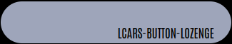

<p align="center">


</p>
<p align="center">
    <em>A collection of custom button-card templates for building LCARS styled dashboards in Home Assistant</em>
</p>
<p align="left">
	
	
  
<p>
<p align="center">
	<!-- default option, no dependency badges. -->
</p>


- [Overview](#overview)
    - [What is this?](#what-is-this)
    - [What it isn't...](#what-it-isnt)
    - [What it looks like...](#what-it-looks-like)
    - [What can it do...](#what-can-it-do)
- [Before You Begin](#before-you-begin)
  - [Get to know `custom-button-card`](#get-to-know-custom-button-card)
  - [Dependencies and Extras](#dependencies-and-extras)
- [Getting Started](#getting-started)
  - [Install CB-LCARS Templates](#install-cb-lcars-templates)
  - [HA-LCARS Theme - Setup and Customizations](#ha-lcars-theme---setup-and-customizations)
    - [Font](#font)
    - [Custom *Picard* Colors](#custom-picard-colors)
- [The Templates](#the-templates)
  - [Core Templates](#core-templates)
    - [Base Templates](#base-templates)
    - [Actions](#actions)
    - [Flare](#flare)
  - [LCARS Basic Shapes](#lcars-basic-shapes)
    - [LCARS Headers](#lcars-headers)
    - [LCARS Footers](#lcars-footers)
    - [LCARS Callouts](#lcars-callouts)
    - [LCARS Text Labels](#lcars-text-labels)
  - [LCARS Buttons](#lcars-buttons)
    - [Standard Buttons](#standard-buttons)
    - [Rounded Buttons](#rounded-buttons)
    - [Picard-Style Buttons](#picard-style-buttons)
    - [Picard-Style Text Modifiers](#picard-style-text-modifiers)
    - [Button Examples](#button-examples)
  - [LCARS Constructors](#lcars-constructors)
    - [Grids](#grids)
  - [LCARS Controls](#lcars-controls)
    - [Sliders](#sliders)
    - [Fully Built Controls](#fully-built-controls)
- [Dashboard Examples](#dashboard-examples)
    - [Row of sliders (Transporter controls? :grin:)](#row-of-sliders-transporter-controls-grin)
    - [Room Lighting Controls](#room-lighting-controls)
- [Acknowledgements \& Thanks](#acknowledgements--thanks)
- [License](#license)


<br>

#  Overview

### What is this?
\<ramble\>
<br>
Being a huge [trekkie|trekker] and avid home assistant user, when I came across the amazing [ha-lcars theme](https://github.com/th3jesta/ha-lcars) I was intrigued.  After spending some time playing with this theme and working on some dashboards - I was hooked.  I wanted to make a full LCARS tablet interface for my home.

Re-watching Picard at the time - and drooling over the new LCARS interfaces in season 3 - I decided that I really wanted that look for my dashboards.

Using the ha-lcars theme as the foundation - work began to try and build a library of highly configurable controls - attempting to achieve the style of the new LCARS.

As I don't have much (any?) experience with web/css stuff - it was decided to build this using existing cards if possible - and using [custom-button-card](https://github.com/custom-cards/button-card) as the foundation.

There are probably way better ways of doing things - open to any and all suggestions.  This is a learning project for me - so as I learn new techniques, ways of doing stuff, or just plain change my mind about something - I'm going back and revamping it.
<br>Expect breakage :)
<br>\</ramble\>
### What it isn't...

This is not a standalone theme.<br>
It is made with the intention of ha-lcars providing the theme styles, color variables, existing card-mod classes etc.<br>
It's also not an attempt to re-invent the wheel.  Where there are great components/cards out there that I felt would work in building this - those were used.<br>
As such, this isn't a fully standalone set of components.  For some controls you need to install other cards from HACS (all listed below of course.)

### What it looks like...

These are a couple examples of WIP dashboards.

'Home' screen is a good example of multiple templates in use.
 - `cb-lcars-label`  (clock)
 - `cb-lcars-button-grid`
 - `cb-lcars-button-picard` 
 - `cb-lcars-footer`
 - `cb-lcars-callout-right`
 - `cb-lcars-slider`  
 - etc.
  


<br>

**Lights** screen with selectable rooms.  Each room has a grid (`cb-lcars-grid`) of sliders (`cb-lcars-multimeter`) for the lights in that room.  `cb-lcars-multimeter` has panel mode set to `gauge` and the slider colors are set to match the color of the light entity (fully configurable)


<br>

A 'RED ALERT' color scheme is provided.  You can turn the complete interface into RED ALERT mode with a service call.


<br>

Another dashboard sample showing more Picard styles, along with `mini-graph-card` and `thermostat` cards.


<br>

Debug Mode: when building out multiple controls on top of  `cb-lcars-card-base` template as the canvas - enable debug to have the background change to a random color.  Allowing for easier visuals to debug sizes and placements.  It's hard when everything is black or transparent!


### What can it do...

Being based on custom button-card templates, the sky isn't even the limit.  With tweaks to this variable, or that variable you can have completely different looks on these controls with minimal amount of coding.  The idea was to have base template(s) to do the heavy lifting, and offer simple templates layered on top to to achieve the various components more easily.

In no particular order:

- Customizable variables/settings for just about everything:
   - default colors / per-instance colors
   - colors based on entity state
   - font sizes/weights
   - text positions
   - full icon customization
   - gradients for sliders with automatice step and shade calculations
   - really too much to list - you can customize just about anything you like
- Matching control colors to the light entity (buttons, sliders, gradients, etc.)
- Additional 'flare' such as animating button presses, blinking buttons
- Versatile 'grid' control (`cb-lcars-grid`) that is used to create many other controls.  Used in:
  - button panels/groups
  - gauges (the percent markers, tick marks, etc.)
  - sliders
  - can auto-calculate card/grid sizes, number of cells, etc.
- Automatic 'random' button labels in LCARS style (hex numbers)
- Optional: invocation of [lovelace-hue-like-light-card](https://github.com/Gh61/lovelace-hue-like-light-card) popups for light and scene controls
 

---


# Before You Begin

## Get to know `custom-button-card`

This collection of controls are implementations of `custom-button-card` [configuration templates](https://github.com/custom-cards/button-card?tab=readme-ov-file#configuration-templates).  It's important to familiarize yourself with how templates work - or you may go mad.

> :dizzy: tl;dr: 
> 
> - Templates are *additive* - last definition of a duplicated variable wins.
> - Variables are processed in *alphanumeric* order.  It is what it is.

## Dependencies and Extras

The following dependencies should be installed and working in your Home Assistant instance.  These are available in HACS - Please follow the instructions in the respective projects for details.  

| Custom Card    |  Required?   | Function    |
|----------------|--------------|-------------|
| [custom-button-card](https://github.com/custom-cards/button-card) | Required | Base Framework |
| [ha-lcars theme](https://github.com/th3jesta/ha-lcars) | Required | Provides base theme elements, styes, color variables, etc. |
| [my-cards/my-slider-v2](https://github.com/AnthonMS/my-cards) | Required | Provides slider function which is used in the slider/gauge controls. |
| [lovelace-layout-card](https://github.com/thomasloven/lovelace-layout-card) | Required | Provides the CSS grid-layout features used in the `cb-lcars-grid*` templates.  Also handy for the dashboard layout itself. |
| [lovelace-card-mod](https://github.com/thomasloven/lovelace-card-mod) | Required | Required for HA-LCARS.  Useful for modifying other card elements/styles to fit the theme (changing fonts, colors, remove backgrounds etc.) |
|  [lovelace-hue-like-light-card](https://github.com/Gh61/lovelace-hue-like-light-card) | Optional | Provides a Hue-style light and scene control popup card. |

<br>Extras for your dashboard creation:

  - [lovelace-animated-background](https://github.com/rbogdanov/lovelace-animated-background) - Allows for animated/video backgrounds on the dashboard (stars look great.)  Additionally, Home Assistant natively supports background images (can be configured in UI from 2024.6+)
  - [lovelace-wallpanel](https://github.com/j-a-n/lovelace-wallpanel) - Great panel-mode features - including hiding side/top bars, screensaver function (with cards support)


---

# Getting Started

## Install CB-LCARS Templates

Per custom-button-card documentation, template definitions are added to your dashboard's YAML file.

A valid YAML file of all the LCARS templates is provided as [cb-lcars-full.yaml](./cb-lcars-full.yaml)

1. Copy the full contents of [cb-lcars-full.yaml](./cb-lcars-full.yaml) into the YAML of your dashboard.
2. Create an input helper boolean in your Home Assistant instance named `input_boolean.lcars_ui_debug`.    This is mandatory as it is required by the template code which allows for using the visual debug option in `cb-lcars-card-base`.

## HA-LCARS Theme - Setup and Customizations

These components are built on top of, and are intended to extend the great ha-lcars theme.  These palettes have been created from multiple sources - and filled out with additional shades to create full palettes to select your colors from.

### Font
When setting up the font resource, we use a slightly updated Antonio font resouce string.<br>
This includes weights 100-700 allowing for more fine-grained control of the text as seen in Picard (some displays use really thin font, 100 or 200)

Simply substitute the following resource string when setting up ha-lcars:
`https://fonts.googleapis.com/css2?family=Antonio:wght@100..700&display=swap`

### Custom *Picard* Colors

 Copy the custom `Picard [cb-lcars]` and `Picard RED ALERT [cb-lcars]` definitions from [cb-lcars-lcars.yaml](ha-lcars-theme/cb-lcars-lcars.yaml) to your ha-lcars `lcars.yaml` file in Home Assistant (per the standard way of [adding custom themes to HA-LCARS](https://github.com/th3jesta/ha-lcars?tab=readme-ov-file#make-your-own-color-themes)).

<details closed><summary>Picard [cb-lcars]</summary>
Grays, Blues, and Oranges are the core colours.  Greens and Yellows added for additional options.


These are the colors used for the ha-lcars defined variables.


</details>

<details closed><summary>Picard II RED ALERT [cb-lcars]</summary>
RED ALERT theme will substitue color codes from the red spectrum in place of the original variable color codes.
<br>
These were derived by AI from the original palette.


</details>

---

# The Templates

## Core Templates

### Base Templates

<details closed><summary>Base Templates</summary>

| Template             | Description    |
| -------------------- | -------------- |
| [`cb-lcars-functions`](cb-lcars/cb-lcars-functions.yaml)| A libary of custom reuasable javascript functions that can be leveraged when building complex/dynamic cards.<br><br>These are functions that are stored in variables and will execute when used in other variable definitions with javascript. |
| [`cb-lcars-base`](doc/cb-lcars-base.md)      | This is the base template for cb-lcars.  This defines most variables and styles that are used by the rest of the library of tempalates.  This template is not meant to be used on its own, but rather can be included when building out new types of controls etc.<br><br>Please see [`cb-lcars-base`](doc/cb-lcars-base.md) for details.  |
| [`cb-lcars-card-base`](cb-lcars/cb-lcars-card-base.yaml) | This is a template that you can use on a foundational custom-button-card that is being used as a canvas to build more complex controls (eg. `cb-lcars-multimeter`) or dashboard components.  It will change the background color of the card when debug mode is enabled.<br><br>To use:<br>Create an input helper boolean in your Home Assistant instance named `input_boolean.lcars_ui_debug`<br>When toggled on, the card background will turn to a random color as a visual assist.<br><br> |
| [`cb-lcars-debug`](cb-lcars/cb-lcars-debug.yaml) | Adapted from a very nice template by [wfuphy](https://github.com/wfurphy/creative-button-card-templates?tab=readme-ov-file#debug)<br>This template can be added to enable console debug printing of any custom button card's objects (`variables`,`this`,`hass` etc. ).<br><br>To use:<br>Add `cb-lcars-debug` to the card's template list.  In the browser console, you will then have access to see the varibles defined etc.<br><br> |
</details>

### Actions

<details closed><summary>Actions</summary>

Some presets for actions to be assigned.  Anything can be defined as an action that is supported by `custom-button-card` - see its documentation for more details.

Of note in this list - if you like the style of Philips Hue interface, then `cb-lcars-actions-hue-*` is for you!

| Template                     | Description |
| ---------------------------- | ----------- |
| [`cb-lcars-actions-disable`](cb-lcars/cb-lcars-actions.yaml)   | Disables all actions for the button.  |
| [`cb-lcars-actions-toggle`](cb-lcars/cb-lcars-actions.yaml)    | Sets tap action to `toggle`, hold action to `more-info`, and double-tap to `more-info` |
| [`cb-lcars-actions-more-info`](cb-lcars/cb-lcars-actions.yaml) | Sets all actions to `more-info`           |
| [`cb-lcars-actions-hue-[tap\|hold]`](cb-lcars/cb-lcars-actions.yaml)       | Uses [lovelace-hue-like-light-card](https://github.com/Gh61/lovelace-hue-like-light-card) API to pop up the Hue-style light control dialog on `[tap\|hold]`<br><br>-<b>tap</b><br>`tap_action:` hue card<br>`double_tap_action: more-info`<br>`hold_action: toggle`<br><br><b>-hold</b><br>`tap_action: toggle` <br>`double_tap_action: more-info`<br>`hold_action:` hue card<br><br>TODO: instructions how to use this
</details>

### Flare

<details closed><summary>Flare</summary>

| Template                 | Description |
| ------------------------ | ----------- |
| [`cb-lcars-animate-press`](cb-lcars/cb-lcars-animate-press.yaml) | Adds an animation to the button when pressed.  |
| [`cb-lcars-state-blink`](cb-lcars/cb-lcars-state-blink.yaml)   | Causes the button to blink when active. <br><br>  |
</details>

---

## LCARS Basic Shapes

These are the basic shapes found in LCARS.  These are highly configurable - default styles are shown with some examples of how to configur them to look like other versions seen in Picard.

### LCARS Headers

<details open><summary>Header Templates</summary>

| Template       | Default Style          |
| -------------- | ---------------------- |
| [`cb-lcars-header`](cb-lcars/cb-lcars-header.yaml)              |               |
| [`cb-lcars-header-right`](cb-lcars/cb-lcars-header.yaml)        |         |
| [`cb-lcars-header-contained`](cb-lcars/cb-lcars-header.yaml)    |     |
| [`cb-lcars-header-open`](cb-lcars/cb-lcars-header.yaml)         |          |
| [`cb-lcars-header-picard`](cb-lcars/cb-lcars-header-picard.yaml)       |        |
| [`cb-lcars-header-picard-right`](cb-lcars/cb-lcars-header-picard.yaml) |  |
</details>
<details closed><summary>Examples</summary>

<table>
<tr>
<td>YAML</td> <td> Result </td>
</tr>

<tr>
<td>

```yaml
type: custom:button-card
template:
  - cb-lcars-header-picard-right
variables:
  card:
    width: 600px
    height: 170px
    border:
      top:
        right_radius: 120px
      inner:
        width: 70px
        factor: 0
  lcars:
    border:
      gap: 5px
  lcars_outer:
    card:
      border:
        top:
          size: 10px
        right:
          size: 155px
  lcars_inner:
    card:
      border:
        top:
          size: 10px
          right_radius: 160px
        right:
          size: 50px
        inner:
          factor: 1.3
```
</td>
<td>


</td>
</tr>

<tr>
<td>

```yaml
type: custom:button-card
template:
  - cb-lcars-header-picard-right
variables:
  card:
    height: 160px
    width: 400px
    border:
      top:
        right_radius: 90px
      inner:
        factor: 2
  lcars:
    border:
      gap: 4px
      factor: 4
      top:
        size: 20px
      right:
        size: 180px
  lcars_outer:
    card:
      border:
        right:
          size: 60px
        top:
          size: 60px
      color: var(--lcars-blue)
  lcars_inner:
    card:
      border:
        right:
          size: 0px
        top:
          size: 45px
        inner:
          factor: 0.7
      color: var(--lcars-card-top-color)
```
</td>
<td>


</td>
</tr>
</table>
</details>

### LCARS Footers

<details open><summary>Footer Templates</summary>

| Template       | Default Style          |
| -------------- | ---------------------- |
| [`cb-lcars-footer-base`](cb-lcars/cb-lcars-footer.yaml)         |     n/a                                                        |
| [`cb-lcars-footer`](cb-lcars/cb-lcars-footer.yaml)              |               |
| [`cb-lcars-footer-right`](cb-lcars/cb-lcars-footer.yaml)        | (cb-lcars/cb-lcars-footer.yaml)        |
| [`cb-lcars-footer-contained`](cb-lcars/cb-lcars-footer.yaml)    |     |
| [`cb-lcars-footer-open`](cb-lcars/cb-lcars-footer.yaml)         |          |
| [`cb-lcars-footer-picard`](cb-lcars/cb-lcars-footer-picard.yaml)       |        |
| [`cb-lcars-footer-picard-right`](cb-lcars/cb-lcars-footer-picard.yaml) |  |
</details>

<details closed><summary>Examples</summary>

<table>
<tr>
<td>YAML</td> <td> Result </td>
</tr>

<tr>
<td>

```yaml
type: custom:button-card
template:
  - cb-lcars-footer-picard
variables:
  card:
    height: 176px
    width: 350px
    border:
      bottom:
        left_radius: 160px
      inner:
        factor: 1.27
        width: 50px
  lcars:
    border:
      gap: 5px
      factor: 4
      bottom:
        size: 20px
      left:
        size: 180px
  lcars_outer:
    card:
      border:
        left:
          size: 45px
        bottom:
          size: 45px
  lcars_inner:
    card:
      border:
        left:
          size: 155px
        bottom:
          size: 45px
        inner:
          factor: 1.5
      color: var(--picard-light-gray)
```
</td>
<td>


</td>
</tr>

<tr>
<td>

```yaml
type: custom:button-card
template:
  - cb-lcars-footer-picard-right
variables:
  card:
    height: 180px
    width: 300px
    border:
      bottom:
        right_radius: 160px
      inner:
        factor: 1.4
        width: 50px
  lcars:
    border:
      gap: 5px
      bottom:
        size: 20px
      right:
        size: 180px
  lcars_outer:
    card:
      border:
        right:
          size: 45px
        bottom:
          size: 45px
      color: var(--lcars-ui-secondary)
  lcars_inner:
    card:
      border:
        right:
          size: 10px
        bottom:
          size: 10px
        inner:
          factor: 4
      color: var(--lcars-ui-primary)

```
</td>
<td>


</td>
</tr>


<tr>
<td>

```yaml
type: custom:button-card
template:
  - cb-lcars-footer-picard-right
variables:
  card:
    height: 170px
    width: 300px
    border:
      bottom:
        right_radius: 80px
      inner:
        factor: 1.6
        width: 50px
  lcars:
    border:
      gap: 5px
      bottom:
        size: 20px
      right:
        size: 180px
  lcars_outer:
    card:
      border:
        right:
          size: 130px
        bottom:
          size: 45px
      color: var(--lcars-ui-secondary)
  lcars_inner:
    card:
      border:
        right:
          size: 165px
        bottom:
          size: 0px
        inner:
          factor: 1
      color: var(--lcars-card-bottom-color)
```
</td>
<td>


</td>
</tr>

<tr>
<td>
Fun example of combining two of the cards together to create the bordered look.

```yaml
type: custom:button-card
template:
  - cb-lcars-card-base
styles:
  card:
    - width: 300px
    - height: 175px
    - border-radius: 0 !important
# CSS tranform the whole card if desired
    - transform: skew(-20deg)
 custom_fields:
    elbow:
      - position: absolute
      - bottom: 0px
      - right: 0px
    inner_elbow:
      - position: absolute
      - left: 0px
      - top: 0px
custom_fields:
  inner_elbow:
    card:
      type: custom:button-card
      template:
        - cb-lcars-footer-picard-right
      variables:
        card:
          height: 139px
          width: 100px
          border:
            inner:
              factor: 1
              width: 50px
            bottom:
              right_radius: 80px
        lcars:
          border:
            gap: 4px
        lcars_outer:
          card:
            color: transparent
            border:
              bottom:
                size: 20px
              right:
                size: 15px
        lcars_inner:
          card:
            color: var(--lcars-ui-secondary)
            border:
              bottom:
                size: 5px
                right_radius: 60px
              right:
                size: 5px
              inner:
                factor: 1
  elbow:
    card:
      type: custom:button-card
      template:
        - cb-lcars-footer-picard-right
      variables:
        card:
          height: 175px
          width: 500px
          border:
            bottom:
              right_radius: 80px
            inner:
              factor: 1.2
              width: 50px
        lcars:
          border:
            gap: 4px
        lcars_outer:
          card:
            color: var(--lcars-ui-secondary)
            border:
              bottom:
                size: 6px
              right:
                size: 6px
        lcars_inner:
          card:
            color: var(--lcars-card-bottom-color)
            border:
              bottom:
                size: 45px
              right:
                size: 205px
              inner:
                factor: 1

```
</td>
<td>


<br>


</td>
</tr>
</table>
</details>


### LCARS Callouts

<details open><summary>Callout Templates</summary>

| Template       | Default Style          |
| -------------- | ---------------------- |
| [`cb-lcars-callout-base`](cb-lcars/cb-lcars-callout.yaml)         |    n/a                                                          |
| [`cb-lcars-header-callout`](cb-lcars/cb-lcars-callout.yaml)       |        |
| [`cb-lcars-header-callout-right`](cb-lcars/cb-lcars-callout.yaml) |  |
| [`cb-lcars-footer-callout`](cb-lcars/cb-lcars-callout.yaml)       |        |
| [`cb-lcars-footer-callout-right`](cb-lcars/cb-lcars-callout.yaml) |  |
</details>
<details closed><summary>Examples</summary>

<table>
<tr>
<td>YAML</td> <td> Result </td>
</tr>

<tr>
<td>

```yaml
type: custom:button-card
template:
  - cb-lcars-header-callout
variables:
  card:
    height: 55px
    min_height: 45px
    width: 420px
    border:
      left:
        size: 25px
      top:
        size: 3px
      color: var(--picard-lightest-blue)
```
</td>
<td>


</td>
</tr>

<tr>
<td>

```yaml
type: custom:button-card
template:
  - cb-lcars-header-callout-right
variables:
  card:
    height: 80px
    width: 420px
    border:
      right:
        size: 5px
      top:
        size: 20px
      color: var(--picard-lightest-orange)
```
</td>
<td>


</td>
</tr>
</table>
</details>

### LCARS Text Labels

<details open><summary>Text/Label Templates</summary>

| Template       | Default Style          |
| -------------- | ---------------------- |
| [`cb-lcars-label`](cb-lcars/cb-lcars-label.yaml) | <br> |


</details>
<details closed><summary>Examples</summary>

<table>
<tr>
<td>YAML</td> <td> Result </td>
</tr>

<tr>
<td>

```yaml
type: custom:button-card
template: cb-lcars-label
label: engineering ii
variables:
  text:
    label:
      font_size: 42px
      font_weight: lighter
      color:
        default: var(--picard-light-orange)

```
</td>
<td>


</td>
</tr>

<tr>
<td>

```yaml
type: custom:button-card
template: cb-lcars-label
entity: sensor.patio_sensor_temperature
show_state: true
show_label: false
variables:
  card:
    height: 60px
  text:
    state:
      font_size: 60px
```
</td>
<td>


</td>
</tr>

<tr>
<td>

```yaml
type: custom:button-card
template: cb-lcars-label
label: cb-lcars
show_label: true
variables:
  text:
    label:
      font_size: 60px
      font_weight: lighter
      color:
        default: var(--picard-light-orange)
      padding:
        left: 40px
  card:
    height: 60px
    width: 490px
    border:
      left:
        size: 110px
      right:
        size: 40px
      color: var(--lcars-card-bottom-color)

```
</td>
<td>


</td>
</tr>
</table>
</details>

---

## LCARS Buttons

### Standard Buttons

<details open><summary>Button Templates</summary>

| Template       | Default Style          |
| -------------- | ---------------------- |
| [`cb-lcars-button-base`](cb-lcars/cb-lcars-button-base.yaml)<br>[`cb-lcars-button-square`](cb-lcars/cb-lcars-button-base.yaml) |  |

### Rounded Buttons

| Template       | Default Style          |
| -------------- | ---------------------- |
| [`cb-lcars-button-lozenge`](cb-lcars/cb-lcars-button-lozenge.yaml)<br>[`cb-lcars-button-lozenge-right`](cb-lcars/cb-lcars-button-lozenge.yaml) |  |
| [`cb-lcars-button-bullet`](cb-lcars/cb-lcars-button-bullet.yaml)<br>[`cb-lcars-button-bullet-right`](cb-lcars/cb-lcars-button-bullet.yaml)   |   |
| [`cb-lcars-button-capped`](cb-lcars/cb-lcars-button-capped.yaml)<br>[`cb-lcars-button-capped-right`](cb-lcars/cb-lcars-button-capped.yaml)   |   |
</details>


### Picard-Style Buttons

<details open><summary>Picard Button Templates</summary>

| Template       | Default Style          |
| -------------- | ---------------------- |
| [`cb-lcars-button-picard`](cb-lcars/cb-lcars-button-picard.yaml)<br>[`cb-lcars-button-picard-right`](cb-lcars/cb-lcars-button-picard.yaml)<br>                       |               |
| [`cb-lcars-button-picard-dense`](cb-lcars/cb-lcars-button-picard.yaml)<br>[`cb-lcars-button-picard-dense-right`](cb-lcars/cb-lcars-button-picard.yaml)               |         |
| [`cb-lcars-button-picard-filled`](cb-lcars/cb-lcars-button-picard-filled.yaml)<br>[`cb-lcars-button-picard-filled-right`](cb-lcars/cb-lcars-button-picard-filled.yaml)             |        |
| [`cb-lcars-button-picard-filled-dense`](cb-lcars/cb-lcars-button-picard-filled.yaml)<br>[`cb-lcars-button-picard-filled-dense-right`](cb-lcars/cb-lcars-button-picard-filled.yaml) |  |
| [`cb-lcars-button-picard-icon`](cb-lcars/cb-lcars-button-picard-icon.yaml)                                                        |          |
</details>

### Picard-Style Text Modifiers

<details open><summary>Picard Text Modifier Templates</summary>

| Template       | Default Style          |
| -------------- | ---------------------- |
| [`cb-lcars-button-picard-[label\|state\|name]-[east\|west\|ne\|nw\|se\|sw]`](cb-lcars/cb-lcars-button-text-mods.yaml) |  |
</details>

### Button Examples
<details closed><summary>Button Examples</summary>

<table>
<tr>
<td>YAML</td> <td> Result </td>
</tr>

<tr>
<td>

```yaml
type: custom:button-card
template:
  - cb-lcars-button-picard-filled
  - cb-lcars-button-picard-label-se
  - cb-lcars-button-picard-state-west
  - cb-lcars-button-picard-name-ne
entity: input_boolean.enable_verbal_notifications
label: lcars-button-picard-filled
show_icon: true
show_state: true
show_name: true
variables:
  text:
    label:
      font_size: 22px
      font_weight: bold
  icon:
    color:
      active: transparent
      inactive: transparent
      background:
        active: var(--picard-blue)
        inactive: transparent

```
</td>
<td>
Entity is 'on'


Entity is 'off'


</td>
</tr>

<tr>
<td>

```yaml
type: custom:button-card
template: cb-lcars-button-picard
entity: input_boolean.enable_verbal_notifications
label: lcars-button-picard
variables:
  text:
    color:
      'on': var(--picard-blue)
  card:
    color:
      active: var(--picard-blue)
```
</td>
<td>

Entity is 'on'


Entity is 'off'


</td>
</tr>

<tr>
<td>

```yaml
type: custom:button-card
entity: input_boolean.enable_verbal_notifications
template: cb-lcars-button-lozenge-right
label: lcars-button-lozenge-right
show_icon: true
icon: si:startrek
variables:
  card:
    color:
      background:
        inactive: var(--picard-orange)
        active: var(--picard-blue)
  icon:
    color:
      inactive: var(--picard-lightest-orange)
      active: var(--picard-lightest-blue)
```
</td>
<td>

Entity is 'on'


Entity is 'off'


</td>
</tr>
</table>
</details>


---

## LCARS Constructors

### Grids

<details open><summary>Grid Templates</summary>

| Template       | Default Style          |
| -------------- | ---------------------- |
| [`cb-lcars-grid`](cb-lcars/cb-lcars-grid.yaml)       | Versatile base grid control.<br>Other elements can be added into a grid such as buttons, sliders, icons, etc.       |
| [`cb-lcars-button-grid`](cb-lcars/cb-lcars-button-grid.yaml)       |        |
| [`cb-lcars-button-grid-icons`](cb-lcars/cb-lcars-button-grid-icons.yaml) |  |

</details>

<details closed><summary>Grid Examples</summary>

<table>

<tr>


<details closed><summary>YAML</summary>

```yaml
type: custom:button-card
template:
  - cb-lcars-button-grid
variables:
  button:
    template:
      - cb-lcars-button-lozenge
    variables:
      card:
        color:
          background:
            inactive: var(--lcars-blue)
        height: 65px
  grid:
    gap: 20px
    X: 2
    Y: 4
    buttons:
      -
      - label: custom-label
        template:
          - cb-lcars-button-picard-filled
          - cb-lcars-button-picard-label-ne
      - template:
          - cb-lcars-button-bullet-right
      - template:
          - cb-lcars-button-bullet
      -
      - entity: input_boolean.lcars_ui_debug
        show_name: true
        show_label: false
        show_icon: true
      -
      - variables:
          card:
            color:
              background:
                inactive: var(--picard-darkest-gray)

```
</details>
</tr>

---

<tr>


<details closed><summary>YAML</summary>

```yaml
      type: custom:button-card
      template: cb-lcars-button-grid
      variables:
        auto_calc_X: false
        grid:
          buttons:
            - entity: binary_sensor.patio_gate_home_security_intrusion
              label: patio gate
              variables:
                card:
                  color:
                    inactive: var(--picard-medium-light-blue)
                    active: var(--error-color)
            - entity: binary_sensor.front_door_home_security_intrusion
              label: door
            - entity: binary_sensor.front_window_home_security_intrusion
              label: window
            - entity: binary_sensor.office_window_home_security_intrusion
              label: office
            - entity: binary_sensor.bedroom_window_home_security_intrusion
              label: bedroom
          X: 5
          'Y': 1
          gap: 15px
        button:
          variables:
            card:
              width: 140px
              height: 55px
              color:
                active: var(--error-color)
                inactive: var(--picard-dark-gray)
                background:
                  active: transparent
                  inactive: transparent
            icon:
              color:
                active: null
                inactive: null
              background:
                active: null
                inactive: null
          template:
            - cb-lcars-button-picard
            - cb-lcars-actions-more-info
            - cb-lcars-state-blink
```
</details>
</tr>

---

<tr>


<details closed><summary>YAML</summary>

```yaml
type: custom:button-card
template:
  - cb-lcars-button-grid-icons
variables:
  button:
    variables:
      card:
        color:
          background:
            inactive: var(--warning-color)
            active: var(--picard-blue)
      icon:
        color:
          background:
            inactive: var(--warning-color)
            active: var(--picard-blue)
  grid:
    X: 4
    buttons:
      - entity: switch.living_room_recordings
      - entity: switch.living_room_detect
      - entity: switch.living_room_snapshots
      - entity: switch.living_room_push_notifications
        variables:
          icon:
            color:
              background:
                inactive: var(--picard-dark-blue)
                active: var(--picard-blue)
          card:
            color:
              background:
                inactive: var(--picard-dark-blue)
                active: var(--picard-blue)

```
</details>
</tr>
</table>
</details>


---
## LCARS Controls

### Sliders

<details open><summary>Slider/Meter/Gauge Templates)</summary>

| Template       | Default Style          |
| -------------- | ---------------------- |
| [`cb-lcars-meter`](cb-lcars/cb-lcars-meter.yaml)                   |                    |
| [`cb-lcars-meter-horizontal`](cb-lcars/cb-lcars-meter.yaml)        |         |
| [`cb-lcars-slider`](cb-lcars/cb-lcars-slider.yaml)                  |                   |
| [`cb-lcars-slider-gauge`](cb-lcars/cb-lcars-slider-gauge.yaml)            |             |
| [`cb-lcars-slider-horizontal`](cb-lcars/cb-lcars-slider.yaml)       |        |
| [`cb-lcars-slider-horizontal-gauge`](cb-lcars/cb-lcars-slider-gauge.yaml) |  |
</details>

<details closed><summary>Meter/Slider/Gauge Examples</summary>


Generally you will only use the `cb-lcars-slider` and `cb-lcars-slider-gauge` control.<br>
These styles apply there in the respective variables section as it is built with `cb-lcars-meter` and `cb-lcars-gauge` shown here for examples.

<table>
<tr>
<td><code>cb-lcars-slider</code> <code>cb-lcars-slider-gauge</code> <br>YAML</td> <td> Result </td>
</tr>

<tr>
<td>

```yaml
type: custom:button-card
template: cb-lcars-slider
variables:
  entity: light.desk
  slider:
    variables:
      mask_color: rgba(0,0,0,1)
```
</td>

<td>
<code>mask_color</code> controls the shade of the slider control that overlays the meter background.<br>
Default is semi-tranparent, but this example makes it opaque black.

 

</td>
</tr>

<tr>
<td>

```yaml
type: custom:button-card
template:
  - cb-lcars-slider-gauge
entity: light.tv
variables:
  card:
    height: 300px
```
</td>

<td>
Default <code>cb-lcars-slider-gauge</code> with a height specified.<br>
Gauge lines automatically calculate to adjust to the height specified.

 

</td>
</tr>

<tr>
<td>

```yaml
type: custom:button-card
template:
  - cb-lcars-slider-gauge
entity: light.tv
variables:
  card:
    height: 400px
    width: 50px
  slider:
    variables:
      color: var(--error-color)
      color_alpha: 0.7
      border_color: none
  meter:
    variables:
      button:
        variables:
          text:
            label:
              color:
                'on': var(--warning-color)
          card:
            color:
              active: var(--error-color)
```
</td>

<td>
<code>cb-lcars-slider-gauge</code> with a height and width specified.<br>
The slider is set to the <code>--error-color</code> variable, and given a 70% alpha.<br>
The gauge markers are also set to <code>--error-color</code> to match, and the labels are set to <code>--warning-color</code>.  This shows how each component can have different styles if desired.

 

</td>
</tr>
</table>
<br>

<table>
<tr>
<td><code>cb-lcars-slider-horizontal</code> <code>cb-lcars-slider-horizontal-gauge</code><br>YAML</td> <td> Result </td>
</tr>

<tr>
<td>

```yaml
type: custom:button-card
template: cb-lcars-slider-horizontal
entity: light.tv
variables:
  meter:
    variables:
      gradient_start_color: var(--picard-dark-blue)
      gradient_end_color: var(--picard-lightest-blue)
      button:
        template: cb-lcars-button-lozenge
  slider:
    variables:
      mask_color: rgba(0,255,0,0.7)
```
</td>

<td>
Horizontal slider setting a gradient start and end color, setting the the meter to the lozenge button style, and for example - changing the slider masking color to a transparent green.

 

</td>
</tr>

<tr>
<td>

```yaml
type: custom:button-card
template: cb-lcars-slider-horizontal
entity: light.tv
variables:
  card:
    height: 20px
  meter:
    variables:
      gradient_start_color: var(--picard-dark-blue)
      gradient_end_color: var(--picard-orange)
      _gradient:
        gap: 10px
      button:
        variables:
          card:
            width: 30px
            height: 20px
        template:
          - cb-lcars-button-lozenge
  slider:
    variables:
      mask_color: rgba(0,0,0,0.7)
```
</td>

<td>
Horizontal slider setting a 20px height, a custom gradient color and overriding the gradient gap to 10px.<br>
The lozenge style is used again, but set to a custom height and width to give a pill effect.

 

</td>
</tr>


<tr>
<td>

```yaml
type: custom:button-card
entity: light.tv
template: cb-lcars-slider-horizontal-gauge
```
</td>

<td>
Horizontal gauge with default settings.

 

</td>
</tr>

<tr>
<td>

```yaml
type: custom:button-card
entity: light.tv
template: cb-lcars-slider-horizontal-gauge
variables:
  entity_match_slider: true
  gauge:
    show_sub_meter: false

```
</td>

<td>
Horizontal gauge with the sub-meter (ticks) hidden, and the slider color matches the color of the light entity.  Slider will change color as the entity changes color.

 

</td>
</tr>

</table>


<br>
<table>
<tr>
<td><code>cb-lcars-meter</code><br>YAML</td> <td> Result </td>
</tr>

<tr>
<td>

```yaml
type: custom:button-card
template: cb-lcars-meter
variables:
  gradient_start_color: var(--picard-lightest-blue)
  gradient_end_color: var(--picard-dark-blue)

type: custom:button-card
template: cb-lcars-meter
variables:
  gradient_start_color: var(--picard-lightest-blue)
  gradient_end_color: var(--picard-dark-blue)
  button:
    variables:
      card:
        height: 15px
    template:
      - cb-lcars-button-picard-filled

type: custom:button-card
template: cb-lcars-meter
variables:
  gradient_start_color: var(--warning-color)
  gradient_end_color: var(--picard-lightest-gray)
  button:
    variables:
      card:
        height: 10px
    template:
      - cb-lcars-button-picard-filled
  _gradient:
    gap: 1px
    'Y': 18

type: custom:button-card
template:
  - cb-lcars-meter
variables:
  _gradient:
    'Y': 20
    gap: 1px
  gradient_start_color: var(--lcars-blue)
  gradient_end_color: var(--lcars-orange)
  button:
    variables:
      card:
        height: 10px

type: custom:button-card
template:
  - cb-lcars-meter
variables:
  _gradient:
    'Y': 20
    gap: 1px
  gradient_start_color: var(--lcars-blue)
  gradient_end_color: var(--lcars-orange)
  button:
    variables:
      card:
        height: 10px
        width: 10px

```
</td>
<td>

 

 


</td>
</tr>
</table>

</details>

### Fully Built Controls

<details open><summary>Control Templates</summary>

| Template       | Default Style          |
| -------------- | ---------------------- |
| [`cb-lcars-multimeter`](cb-lcars/cb-lcars-multimeter.yaml)             |               |
| [`cb-lcars-dpad`](cb-lcars/cb-lcars-dpad.yaml)                    |                     |
</details>

<details open><summary>Multimeter Examples</summary>

<table>
<tr>
<td><code>cb-lcars-multimeter</code><br>YAML</td> <td> Result </td>
</tr>

<tr>
<td>

```yaml
#default style
type: custom:button-card
template: cb-lcars-multimeter
variables:
  entity: light.tv

#set the button/frame to orange
type: custom:button-card
template: cb-lcars-multimeter
variables:
  entity: light.tv
  label: btn.orange
  header_button:
    variables:
      card:
        color:
          background:
            active: var(--picard-orange)

#match the button/frame color to the light entity
type: custom:button-card
template:
  - cb-lcars-multimeter
variables:
  entity: light.tv
  entity_match_header: true
  label: match ent.

#match button/frame and the gradient end to entity
type: custom:button-card
template:
  - cb-lcars-multimeter
variables:
  entity: light.tv
  entity_match_header: true
  entity_match_slider_end: true
  label: match sld end

#match button/fram and gradient start to entity
type: custom:button-card
template:
  - cb-lcars-multimeter
variables:
  entity: light.tv
  entity_match_header: true
  entity_match_slider_start: true
  label: match sld start

#default panel mode (slider) with label
type: custom:button-card
template: cb-lcars-multimeter
variables:
  entity: light.tv
  label: Slider

#panel mode: icons
type: custom:button-card
template: cb-lcars-multimeter
variables:
  entity: ''
  label: icons
  panel:
    mode: icons

#panel mode: gauge
type: custom:button-card
template: cb-lcars-multimeter
variables:
  entity: light.tv
  label: gauge
  panel:
    mode: gauge


```
</td>
<td>


</td>
</tr>


<tr>
<td>

```yaml
type: custom:button-card
template: cb-lcars-multimeter
entity: switch.living_room_recordings
variables:
  label: living room
  card:
    width: 360px
    height: 60px
  panel:
    mode: icons
    width: 215px
    height: 50px
    icon_grid:
      variables:
        button:
          variables:
            card:
              color:
                background:
                  inactive: var(--warning-color)
                  active: var(--picard-blue)
            icon:
              color:
                background:
                  inactive: var(--warning-color)
                  active: var(--picard-blue)
        grid:
          X: 4
          buttons:
            - entity: switch.living_room_recordings
            - entity: switch.living_room_detect
            - entity: switch.living_room_snapshots
            - entity: switch.living_room_push_notifications
              variables:
                icon:
                  color:
                    background:
                      inactive: var(--picard-dark-blue)
                      active: var(--picard-blue)
                card:
                  color:
                    background:
                      inactive: var(--picard-dark-blue)
                      active: var(--picard-blue)


```
</td>
<td>


</td>
</tr>
</table>
</details>

---

# Dashboard Examples

Here are a few examples from some WIP dashboards.
<br>
<br>

### Row of sliders (Transporter controls? :grin:)

This is an extract of a group of vertical sliders reminiscent of the transporter controls (to me anyway)


<details closed><summary>YAML</summary>

```yaml
type: custom:button-card
template:
  - cb-lcars-functions
  - cb-lcars-card-base
variables:
  entities:
    - light.living_room_ambient
    - light.corner_lamp
    - light.kitchen
styles:
  card:
    - height: 702px
    - width: 1223px
    - border-radius: 0 !important
  custom_fields:
    slider_grid:
      - position: absolute
      - top: 140px
      - right: 50px

    .
    .
    .
    
custom_fields:
  .
  .
  .
  
  slider_grid:
    card:
      type: custom:button-card
      template:
        - cb-lcars-grid
      variables:
        button:
          type: custom:button-card
          template:
            - cb-lcars-functions
            - cb-lcars-slider
          variables:
            entity: '[[[ return variables.entities[0] ]]]'
            card:
              height: 300px
              width: 63px
            entity_match_slider_end: true
            meter:
              variables:
                gradient_start_color: var(--picard-light-blue)
                button:
                  template: cb-lcars-button-lozenge
                  variables:
                    card:
                      width: 63px
                      height: 15px
                grid:
                  gap: 5px
            slider:
              variables:
                mask_color: rgba(0,0,0,0.85)
        grid:
          gap: 8px
          'Y': 1
          X: 3
          buttons:
            - variables:
                entity: '[[[ return variables.entities[0] ]]]'
                meter:
                  variables:
                    gradient_start_color: var(--picard-light-blue)
                    button:
                      template: cb-lcars-button-lozenge
                      variables:
                        card:
                          width: 63px
                          height: 15px
                  grid:
                    gap: 5px
            - variables:
                entity: '[[[ return variables.entities[1] ]]]'
            - variables:
                entity: '[[[ return variables.entities[2] ]]]'
            - variables:
                entity: '[[[ return variables.entities[3] ]]]'
            - variables:
                entity: '[[[ return variables.entities[4] ]]]'
            - variables:
                entity: '[[[ return variables.entities[5] ]]]'

```
</details>
<br>

### Room Lighting Controls

This is an example of a room picker that has a grid of lights in each room.<br>
Basically the room selector is an `input_select` that controls visibility of a card with the lights of each room in the content area between the header and footer.<br>
<br>
The room selector is a bit more complex as it's a grid which the small rectangle in the second column denotes the color/state of that room - so at a glance I know if lights are on in that room.


<details closed><summary>YAML</summary>

```yaml
type: custom:button-card
template:
  - cb-lcars-card-base
styles:
  card:
    - height: 702px
    - width: 1223px
    - border-radius: 0 !important
  custom_fields:
    group_selector:
      - position: absolute
      - top: 130px
      - left: 70px
    sliders_livingroom:
      - position: absolute
      - top: 130px
      - left: 275px
    sliders_kitchen:
      - position: absolute
      - top: 130px
      - left: 275px
    sliders_bathroom:
      - position: absolute
      - top: 130px
      - left: 275px
    sliders_office:
      - position: absolute
      - top: 130px
      - left: 275px
    sliders_bedroom:
      - position: absolute
      - top: 130px
      - left: 275px
    sliders_patio:
      - position: absolute
      - top: 130px
      - left: 275px
    sliders_others:
      - position: absolute
      - top: 130px
      - left: 275px
    inner_footer:
      - position: absolute
      - bottom: 35px
      - left: 110px
    inner_header:
      - position: absolute
      - top: 25px
      - left: 110px
custom_fields:
  .
  .
  .
  group_selector:
    card:
      type: custom:layout-card
      layout_type: custom:grid-layout
      cards:
        - type: custom:button-card
          template:
            - cb-lcars-button-picard-filled-dense
            - cb-lcars-animate-press
            - cb-lcars-actions-hue-hold
          variables:
            card:
              height: 55px
              color:
                active: var(--picard-medium-light-blue)
                inactive: var(--picard-medium-dark-gray)
                background:
                  active: var(--picard-medium-light-blue)
                  inactive: var(--picard-medium-dark-gray)
            action:
              hue_api: lcars-hue-living_room
          state:
            - id: state_on
              value: LIVING ROOM
            - id: state_off
              operator: '!='
              value: LIVING ROOM
          entity: input_select.lcars_ui_lightgroup_selector
          label: Living Room
          tap_action:
            action: call-service
            service: input_select.select_option
            data:
              entity_id: input_select.lcars_ui_lightgroup_selector
              option: LIVING ROOM
        - type: custom:button-card
          template:
            - cb-lcars-button-picard-filled-dense
            - cb-lcars-actions-hue-tap
          entity: light.living_room
          show_state: false
          variables:
            card:
              height: 55px
              color:
                background:
                  active: var(--button-card-light-color)
                  inactive: var(--picard-dark-gray)
            action:
              hue_api: lcars-hue-living_room
        - type: custom:button-card
          template:
            - cb-lcars-button-picard-filled-dense
            - cb-lcars-animate-press
            - cb-lcars-actions-hue-hold
          variables:
            card:
              height: 55px
              color:
                active: var(--picard-medium-light-blue)
                inactive: var(--picard-medium-dark-gray)
                background:
                  active: var(--picard-medium-light-blue)
                  inactive: var(--picard-medium-dark-gray)
            action:
              hue_api: lcars-hue-kitchen
          state:
            - id: state_on
              value: KITCHEN
            - id: state_off
              operator: '!='
              value: KITCHEN
          entity: input_select.lcars_ui_lightgroup_selector
          label: Kitchen
          tap_action:
            action: call-service
            service: input_select.select_option
            data:
              entity_id: input_select.lcars_ui_lightgroup_selector
              option: KITCHEN
        - type: custom:button-card
          template:
            - cb-lcars-button-picard-filled-dense
            - cb-lcars-actions-hue-tap
          entity: light.kitchen
          show_state: false
          variables:
            card:
              height: 55px
              color:
                background:
                  active: var(--button-card-light-color)
                  inactive: var(--picard-dark-gray)
            action:
              hue_api: lcars-hue-kitchen
        - type: custom:button-card
          template:
            - cb-lcars-button-picard-filled-dense
            - cb-lcars-animate-press
            - cb-lcars-actions-hue-hold
          variables:
            card:
              height: 55px
              color:
                active: var(--picard-medium-light-blue)
                inactive: var(--picard-medium-dark-gray)
                background:
                  active: var(--picard-medium-light-blue)
                  inactive: var(--picard-medium-dark-gray)
            action:
              hue_api: lcars-hue-bathroom
          state:
            - id: state_on
              value: BATHROOM
            - id: state_off
              operator: '!='
              value: BATHROOM
          entity: input_select.lcars_ui_lightgroup_selector
          label: BATHROOM
          tap_action:
            action: call-service
            service: input_select.select_option
            data:
              entity_id: input_select.lcars_ui_lightgroup_selector
              option: BATHROOM
        - type: custom:button-card
          template:
            - cb-lcars-button-picard-filled-dense
            - cb-lcars-actions-hue-tap
          entity: light.bathroom
          show_state: false
          variables:
            card:
              height: 55px
              color:
                background:
                  active: var(--button-card-light-color)
                  inactive: var(--picard-dark-gray)
            action:
              hue_api: lcars-hue-bathroom
        - type: custom:button-card
          template:
            - cb-lcars-button-picard-filled-dense
            - cb-lcars-animate-press
            - cb-lcars-actions-hue-hold
          variables:
            card:
              height: 55px
              color:
                active: var(--picard-medium-light-blue)
                inactive: var(--picard-medium-dark-gray)
                background:
                  active: var(--picard-medium-light-blue)
                  inactive: var(--picard-medium-dark-gray)
            action:
              hue_api: lcars-hue-bedroom
          state:
            - id: state_on
              value: BEDROOM
            - id: state_off
              operator: '!='
              value: BEDROOM
          entity: input_select.lcars_ui_lightgroup_selector
          label: BEDROOM
          tap_action:
            action: call-service
            service: input_select.select_option
            data:
              entity_id: input_select.lcars_ui_lightgroup_selector
              option: BEDROOM
        - type: custom:button-card
          template:
            - cb-lcars-button-picard-filled-dense
            - cb-lcars-actions-hue-tap
          entity: light.bedroom
          show_state: false
          variables:
            card:
              height: 55px
              color:
                background:
                  active: var(--button-card-light-color)
                  inactive: var(--picard-dark-gray)
            action:
              hue_api: lcars-hue-bedroom
        - type: custom:button-card
          template:
            - cb-lcars-button-picard-filled-dense
            - cb-lcars-animate-press
            - cb-lcars-actions-hue-hold
          variables:
            card:
              height: 55px
              color:
                active: var(--picard-medium-light-blue)
                inactive: var(--picard-medium-dark-gray)
                background:
                  active: var(--picard-medium-light-blue)
                  inactive: var(--picard-medium-dark-gray)
            action:
              hue_api: lcars-hue-office
          state:
            - id: state_on
              value: OFFICE
            - id: state_off
              operator: '!='
              value: OFFICE
          entity: input_select.lcars_ui_lightgroup_selector
          label: OFFICE
          tap_action:
            action: call-service
            service: input_select.select_option
            data:
              entity_id: input_select.lcars_ui_lightgroup_selector
              option: OFFICE
        - type: custom:button-card
          template:
            - cb-lcars-button-picard-filled-dense
            - cb-lcars-actions-hue-tap
          entity: light.office
          show_state: false
          variables:
            card:
              height: 55px
              color:
                background:
                  active: var(--button-card-light-color)
                  inactive: var(--picard-dark-gray)
            action:
              hue_api: lcars-hue-office
        - type: custom:button-card
          template:
            - cb-lcars-button-picard-filled-dense
            - cb-lcars-animate-press
            - cb-lcars-actions-hue-hold
          variables:
            card:
              height: 55px
              color:
                active: var(--picard-medium-light-blue)
                inactive: var(--picard-medium-dark-gray)
                background:
                  active: var(--picard-medium-light-blue)
                  inactive: var(--picard-medium-dark-gray)
            action:
              hue_api: lcars-hue-patio
          state:
            - id: state_on
              value: PATIO
            - id: state_off
              operator: '!='
              value: PATIO
          entity: input_select.lcars_ui_lightgroup_selector
          label: PATIO
          tap_action:
            action: call-service
            service: input_select.select_option
            data:
              entity_id: input_select.lcars_ui_lightgroup_selector
              option: PATIO
        - type: custom:button-card
          template:
            - cb-lcars-button-picard-filled-dense
            - cb-lcars-actions-hue-tap
          entity: light.patio
          show_state: false
          variables:
            card:
              height: 55px
              color:
                background:
                  active: var(--button-card-light-color)
                  inactive: var(--picard-dark-gray)
            action:
              hue_api: lcars-hue-patio
        - type: custom:button-card
          template:
            - cb-lcars-button-picard-filled-dense
            - cb-lcars-animate-press
            - cb-lcars-actions-hue-hold
          variables:
            card:
              height: 55px
              color:
                active: var(--picard-medium-light-blue)
                inactive: var(--picard-medium-dark-gray)
                background:
                  active: var(--picard-medium-light-blue)
                  inactive: var(--picard-medium-dark-gray)
          state:
            - id: state_on
              value: OTHERS
            - id: state_off
              operator: '!='
              value: OTHERS
          entity: input_select.lcars_ui_lightgroup_selector
          label: OTHERS
          tap_action:
            action: call-service
            service: input_select.select_option
            data:
              entity_id: input_select.lcars_ui_lightgroup_selector
              option: OTHERS
          hold_action:
            action: none
          double_tap_action:
            action: none
        - type: custom:button-card
          template:
            - cb-lcars-button-picard-filled-dense
            - cb-lcars-actions-hue-tap
          entity: light.table
          show_state: false
          variables:
            card:
              height: 55px
              color:
                background:
                  active: var(--button-card-light-color)
                  inactive: var(--picard-dark-gray)
      layout:
        grid-template-columns: 170px 25px
        grid-template-rows: auto
        grid-auto-rows: auto
        card_margin: 0
        padding: 0
        margin: '-4px -4px 0px -4px'
        grid-column-gap: 10px
  sliders_livingroom:
    card:
      type: conditional
      conditions:
        - condition: state
          entity: input_select.lcars_ui_lightgroup_selector
          state: LIVING ROOM
      card:
        type: custom:button-card
        template:
          - cb-lcars-grid
        variables:
          grid:
            auto_calc_X: false
            auto_calc_Y: false
            X: 1
            'Y': 7
            gap: 12px
            buttons:
              - entity: light.living_room
                variables:
                  label: All Lights
              - entity: light.corner_lamp
                variables:
                  label: corner lamp
              - entity: light.floor_lamp
                variables:
                  label: floor lamp
              - entity: light.tv
                variables:
                  label: tv
              - entity: light.fan
                variables:
                  label: fan
              - entity: light.media_lights
                variables:
                  label: media lights
              - entity: light.floor_strip
                variables:
                  label: floor strip
          button:
            type: custom:button-card
            template:
              - cb-lcars-multimeter
            variables:
              entity_match_slider: true
              header_button:
                variables:
                  card:
                    color:
                      background:
                        inactive: var(--picard-dark-gray)
                  text:
                    label:
                      font_size: 22px
              card:
                width: 800px
                height: 55px
              panel:
                height: 45px
                width: 650px
                mode: gauge
  sliders_kitchen:
    card:
      type: conditional
      conditions:
        - condition: state
          entity: input_select.lcars_ui_lightgroup_selector
          state: KITCHEN
      card:
        type: custom:button-card
        template:
          - cb-lcars-grid
        variables:
          grid:
            auto_calc_X: false
            auto_calc_Y: false
            X: 1
            'Y': 4
            gap: 12px
            buttons:
              - entity: light.kitchen
                variables:
                  label: All Lights
              - entity: light.overhead
                variables:
                  label: Overhead
              - entity: light.counter
                variables:
                  label: counter
              - entity: light.table
                variables:
                  label: dining table
          button:
            type: custom:button-card
            template:
              - cb-lcars-multimeter
            variables:
              entity_match_slider: true
              header_button:
                variables:
                  card:
                    color:
                      background:
                        inactive: var(--picard-dark-gray)
                  text:
                    label:
                      font_size: 22px
              card:
                width: 800px
                height: 55px
              panel:
                height: 45px
                width: 650px
                mode: gauge
.
.
.
...rest of the slider groups
```
</details>

---

# Acknowledgements & Thanks

A very sincere thanks to these projects and their authors, contributers and communities for doing what they do, and making it available.  It really does make this a fun hobby to tinker with.

[**ha-lcars theme**](https://github.com/th3jesta/ha-lcars) (the definitive LCARS theme for HA!)

[**custom-button-card**](https://github.com/custom-cards/button-card) 

[**my-cards/my-slider-v2**](https://github.com/AnthonMS/my-cards)

[**lovelace-layout-card**](https://github.com/thomasloven/lovelace-layout-card) 

[**lovelace-card-mod**](https://github.com/thomasloven/lovelace-card-mod) 

[**lovelace-hue-like-light-card**](https://github.com/Gh61/lovelace-hue-like-light-card) 

<br>
As well, some shout-outs and attributions to these great projects:
<br><br>

[LCARSlad London](https://twitter.com/lcarslad) for excellent LCARS images and diagrams for reference.

[meWho Titan.DS](https://www.mewho.com/titan) for such a cool interactive design demo and color reference.

[TheLCARS.com]( https://www.thelcars.com) a great LCARS design reference.

[wfurphy creative-button-card-templates](https://github.com/wfurphy/creative-button-card-templates) for debugging code template that dumps variables to the browswer console - super handy.

[lcars](https://github.com/joernweissenborn/lcars) for the SVG used inline in the dpad control.

---
#  License

This project uses the MIT License. For more details, refer to the [LICENSE](LICENSE) file.

---
