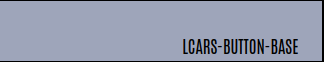

  

    <h1 align="center">HA-LCARDS (aka cb-lcars)</h1>

    <em>A collection of custom button-card templates for building LCARS styled dashboards for Home Assistant</em>

	
	
	
	
	

	<!-- default option, no dependency badges. -->

- [Overview](#overview)
    - [What is this?](#what-is-this)
    - [What it isn't...](#what-it-isnt)
    - [What it looks like...](#what-it-looks-like)
    - [What can it do...](#what-can-it-do)
  - [Dependencies](#dependencies)
- [Theme/Colors](#themecolors)
  - [HA-LCARS Theme](#ha-lcars-theme)
    - [Font](#font)
    - [Custom `Picard` Colors](#custom-picard-colors)
- [The Templates](#the-templates)
  - [Foundational Templates](#foundational-templates)
    - [Base Templates](#base-templates)
    - [Actions](#actions)
    - [Flare](#flare)
  - [LCARS Basic Shapes](#lcars-basic-shapes)
    - [LCARS Headers](#lcars-headers)
    - [LCARS Footers](#lcars-footers)
    - [LCARS Callouts](#lcars-callouts)
    - [LCARS Text Labels](#lcars-text-labels)
  - [LCARS Buttons](#lcars-buttons)
    - [Standard Buttons](#standard-buttons)
    - [Rounded Buttons](#rounded-buttons)
    - [Picard-Style Buttons](#picard-style-buttons)
    - [Picard-Style Text Modifiers](#picard-style-text-modifiers)
  - [LCARS Constructors](#lcars-constructors)
    - [Grids](#grids)
  - [LCARS Controls](#lcars-controls)
    - [Sliders](#sliders)
    - [Fully Built Controls](#fully-built-controls)
  - [License](#license)
  - [Acknowledgments](#acknowledgments)

 

#  Overview

### What is this?

Being a huge trekkie, and avid home assistant user, when I came across the amazing [ha-lcars theme](https://github.com/th3jesta/ha-lcars) I was intrigued.  After spending some time playing with this theme and working on some dashboards - I was hooked.  I wanted to make a full LCARS tablet interface for my home.

Re-watching Picard at the time - and drooling over the new LCARS interfaces in season 3 - I decided that I really wanted that look for my dashboards.

Using the ha-lcars theme as the foundation - work began to expand on it and to try and build a library of highly configurable controls - in the style of the new LCARS.

As I don't have much (any?) experience with web/css stuff - it was decided to build this using existing custom cards - using [custom-button-card](https://github.com/custom-cards/button-card) as the foundation.

There are probably way better ways of doing things - open to any and all suggestions.  This is a learning project for me - so as I learn new techniques or ways of doing stuff, I'm going back and revamping.

### What it isn't...

This is not a standalone theme.  It is made with the intention of ha-lcars providing the theme components, styles, color variables, and existing classes etc.
It's also not an attempt to re-invent the wheel.  Where there are great components/cards out there that I felt would work in building this - those were used.  Therefore, this isn't a standalone set of components either.  For some things you need to install other cards from HACS (all listed below of course.)

### What it looks like...

These are a couple examples of my WIP dashboards.

'Home' screen with weather forecasts, radar, quick access light controls (3 sliders on the right)

 

'Lights' screen with selectable rooms.  Each room has an array of sliders for the lights in that room.  In this screenshot, sliders were set to match the light color (configurable)

 

A 'RED ALERT' color scheme is provided.  You can turn the complete interface into RED ALERT mode with a service call.

 

Debug Mode: when building out multiple controls on top of  `cb-lcars-card-base` template as the canvas - enable debug to have the background change to a random color.  Allowing for easier visuals to debug sizes and placements.  It's hard when everything is black or transparent!

### What can it do...

Being based on custom button-card templates, the sky isn't even the limit.  With tweaks on this variable, or that variable you can have completely different looks on these controls.  The idea is to have a base template and offer simple templates layered on top to change it up.

In no particular order:

- Highly customizable settings for:
   - default colors / per-instance colors
   - colors based on state
   - font sizes/weights
   - text positions
   - full icon control
   - automatic gradient calculations
   - really too much to list - you can customize just about anything you like
- Matching control colors to the light entity (buttons, sliders, gradients, etc.)
- Additional 'flare' such as animating button presses, blinking buttons
- Versatile 'grid' control: auto-calculate card/grid sizes, cells, gauges etc.
- Automatic 'random' button labels in LCARS style (hex numbers)
- Optional: invocation of [lovelace-hue-like-light-card](https://github.com/Gh61/lovelace-hue-like-light-card) for light and scene controls
 

---
## Dependencies

[custom-button-card](https://github.com/custom-cards/button-card)
 

[ha-lcars theme](https://github.com/th3jesta/ha-lcars)

[my-cards/my-slider-v2](https://github.com/AnthonMS/my-cards)

[lovelace-layout-card](https://github.com/thomasloven/lovelace-layout-card)

[lovelace-hue-like-light-card](https://github.com/Gh61/lovelace-hue-like-light-card)

card-mod

acks:

https://github.com/wfurphy/creative-button-card-templates

# Theme/Colors

## HA-LCARS Theme

These components are built on top of, and are intended to extend the great ha-lcars theme.  These palettes have been created from multiple sources - and filled out with additional shades to create full palettes to select your colors from.

### Font
Using a slightly updated Antonio font resouce string. 
This adds weights 100-700 allowing for more fine-grained control of the text seen in Picard (some displays use really thin font)

Simply substitute the following resource string when setting up ha-lcars:
`https://fonts.googleapis.com/css2?family=Antonio:wght@100..700&display=swap`

### Custom `Picard` Colors

Simply add the custom `Picard II` and `Picard II RED ALERT` definitions from [lcars.yaml](ha-lcars/lcars.yaml) to your ha-lcars `lcars.yaml` file.

Picard II

Picard II RED ALERT

# The Templates

## Foundational Templates

Base Templates

### Base Templates

| Template             | Description    |
| -------------------- | -------------- |
| `cb-lcars-functions` | A libary of custom reuasable javascript functions that can be leveraged when building complex/dynamic cards. |
| `cb-lcars-base`      | This is the base template for cb-lcars.  This defines most variables and styles that are used by the rest of the library of tempalates.  This template is not meant to be used on its own, but rather can be included when building out new types of controls etc.  |
| `cb-lcars-card-base` | This is a foundational card that can be used when building complex controls.  It can be used when using a custom-button card as a 'canvas' with custom elements to build complex controls (eg. cb-lcars-multimeter)  Has some features such as changing the background color of the card when debug mode is enabled. |
| `cb-lcars-debug`     | Adapted from a very nice template by <insert name/link>  This template can be added to enable console debugging of any custom button card. |

Actions

### Actions

| Template                     | Description |
| ---------------------------- | ----------- |
| `cb-lcars-actions-disable`   | Disables all actions for the button.  |
| `cb-lcars-actions-toggle`    | Sets tap action to `toggle`, hold action to `more-info`, and double-tap to `more-info` |
| `cb-lcars-actions-more-info` | Sets all actions to `more-info`           |
| `cb-lcars-actions-hue-[tap\|hold]`       | Uses [lovelace-hue-like-light-card](https://github.com/Gh61/lovelace-hue-like-light-card) API to pop up the Hue-style light control dialog on `[tap\|hold]`  -<b>tap</b> `tap_action:` hue card `double_tap_action: more-info` `hold_action: toggle`  <b>-hold</b> `tap_action: toggle`  `double_tap_action: more-info` `hold_action:` hue card 

Flare

### Flare

| Template                 | Description |
| ------------------------ | ----------- |
| `cb-lcars-animate-press` | Adds an animation to the button when pressed. |
| `cb-lcars-state-blink`   | Causes the button to blink when active. |

---

## LCARS Basic Shapes

### LCARS Headers

Header Templates

| Template                       | Description                                                 |
| ------------------------------ | ----------------------------------------------------------- |
| [`cb-lcars-header`](cb-lcars/cb-lcars-header.yaml)              |               |
| [`cb-lcars-header-right`](cb-lcars/cb-lcars-header.yaml)        |         |
| [`cb-lcars-header-contained`](cb-lcars/cb-lcars-header.yaml)    |     |
| `cb-lcars-header-open`         |          |
| `cb-lcars-header-picard`       |        |
| `cb-lcars-header-picard-right` |  |

Examples

Yay!

### LCARS Footers

Footer Templates

| Template                       | Description                                                 |
| ------------------------------ | ----------------------------------------------------------- |
| `cb-lcars-footer-base`         |                                                             |
| `cb-lcars-footer`              |               |
| `cb-lcars-footer-right`        |         |
| `cb-lcars-footer-contained`    |     |
| `cb-lcars-footer-open`         |          |
| `cb-lcars-footer-picard`       |        |
| `cb-lcars-footer-picard-right` |  |

Examples

Yay!

### LCARS Callouts

Callout Templates

| Template                        | Description                                                  |
| ------------------------------- | ------------------------------------------------------------ |
| `cb-lcars-callout-base`         |                                                              |
| `cb-lcars-header-callout`       |        |
| `cb-lcars-header-callout-right` |  |
| `cb-lcars-footer-callout`       |        |
| `cb-lcars-footer-callout-right` |  |

Examples

Yay!

### LCARS Text Labels

Text/Label Templates

| Template         | Description |
| ---------------- | ----------- |
| `cb-lcars-label` |   |

Examples

Yay!

---

## LCARS Buttons

### Standard Buttons

Button Templates

| Template                                           | Example                                             |
| -------------------------------------------------- | --------------------------------------------------- |
| `cb-lcars-button-base` `cb-lcars-button-square` |  |

### Rounded Buttons
| Template                                                     | Description                                            |
| ------------------------------------------------------------ | ------------------------------------------------------ |
| `cb-lcars-button-lozenge` `cb-lcars-button-lozenge-right` |  |
| `cb-lcars-button-bullet` `cb-lcars-button-bullet-right`   |   |
| `cb-lcars-button-capped` `cb-lcars-button-capped-right`   |   |

### Picard-Style Buttons

Picard Button Templates

| Template                                                                             | Description                                                        |
| ------------------------------------------------------------------------------------ | ------------------------------------------------------------------ |
| `cb-lcars-button-picard` `cb-lcars-button-picard-right`                        |               |
| `cb-lcars-button-picard-dense` `cb-lcars-button-picard-dense-right`               |         |
| `cb-lcars-button-picard-filled` `cb-lcars-button-picard-filled-right`             |        |
| `cb-lcars-button-picard-filled-dense` `cb-lcars-button-picard-filled-dense-right` |  |
| `cb-lcars-button-picard-icon`                                                        |          |

### Picard-Style Text Modifiers

Picard Text Modifier Templates

| Template                                                                   | Description                                                    |
| -------------------------------------------------------------------------- | -------------------------------------------------------------- |
| `cb-lcars-button-picard-[label\|state\|name]-[east\|west\|ne\|nw\|se\|sw]` |  |

---

## LCARS Constructors

### Grids

Grid Templates

| Template                     | Description                                               |
| ---------------------------- | --------------------------------------------------------- |
| `cb-lcars-grid`       | Versatile base grid control. Other elements can be added into a grid such as buttons, sliders, icons, etc.       |
| `cb-lcars-button-grid`       |        |
| `cb-lcars-button-grid-icons` |  |

---
## LCARS Controls

### Sliders

Slider/Meter/Gauge Templates)

| Template                           | Description                                                     |
| ---------------------------------- | --------------------------------------------------------------- |
| `cb-lcars-meter`                   |                    |
| `cb-lcars-meter-horizontal`        |         |
| `cb-lcars-slider`                  |                   |
| `cb-lcars-slider-gauge`            |             |
| `cb-lcars-slider-horizontal`       |        |
| `cb-lcars-slider-horizontal-gauge` |  |

### Fully Built Controls

Control Templates

| Template                           | Description                                                     |
| ---------------------------------- | --------------------------------------------------------------- |
| `cb-lcars-multimeter`              |               |
| `cb-lcars-dpad`                    |                     |

---

##  License

This project is protected under the [SELECT-A-LICENSE](https://choosealicense.com/licenses) License. For more details, refer to the [LICENSE](https://choosealicense.com/licenses/) file.

---

##  Acknowledgments

- List any resources, contributors, inspiration, etc. here.

[**Return**](#-overview)

---
