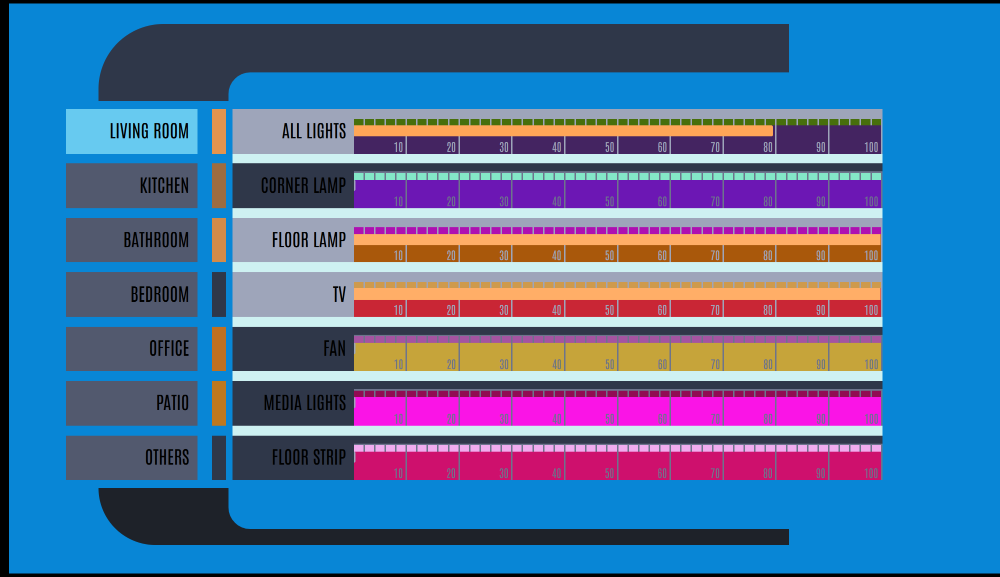
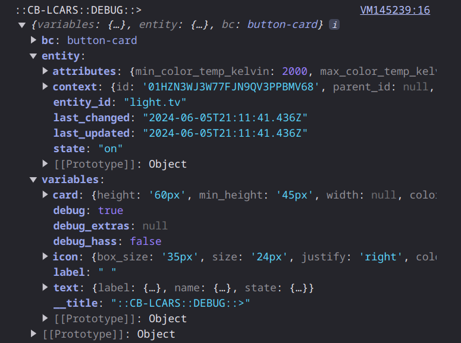

<p align="center">
    <em>A collection of custom button-card templates for building LCARS styled dashboards in Home Assistant</em>
</p>
<p align="center">
	
	
	
	
	
<p>
<p align="center">
	<!-- default option, no dependency badges. -->
</p>


- [Overview](#overview)
    - [What is this?](#what-is-this)
    - [What it isn't...](#what-it-isnt)
    - [What it looks like...](#what-it-looks-like)
    - [What can it do...](#what-can-it-do)
- [Before You Begin](#before-you-begin)
  - [Get to know `custom-button-card`](#get-to-know-custom-button-card)
  - [Dependencies and Extras](#dependencies-and-extras)
  - [HA-LCARS Theme Setup](#ha-lcars-theme-setup)
    - [Font](#font)
    - [Custom *Picard* Colors](#custom-picard-colors)
- [The Templates](#the-templates)
  - [Core Templates](#core-templates)
    - [Base Templates](#base-templates)
    - [Actions](#actions)
    - [Flare](#flare)
  - [LCARS Basic Shapes](#lcars-basic-shapes)
    - [LCARS Headers](#lcars-headers)
    - [LCARS Footers](#lcars-footers)
    - [LCARS Callouts](#lcars-callouts)
    - [LCARS Text Labels](#lcars-text-labels)
  - [LCARS Buttons](#lcars-buttons)
    - [Standard Buttons](#standard-buttons)
    - [Rounded Buttons](#rounded-buttons)
    - [Picard-Style Buttons](#picard-style-buttons)
    - [Picard-Style Text Modifiers](#picard-style-text-modifiers)
  - [LCARS Constructors](#lcars-constructors)
    - [Grids](#grids)
  - [LCARS Controls](#lcars-controls)
    - [Sliders](#sliders)
    - [Fully Built Controls](#fully-built-controls)
  - [Acknowledgements \& Thanks](#acknowledgements--thanks)
  - [License](#license)


<br>

#  Overview

### What is this?

Being a huge [trekkie|trekker] and avid home assistant user, when I came across the amazing [ha-lcars theme](https://github.com/th3jesta/ha-lcars) I was intrigued.  After spending some time playing with this theme and working on some dashboards - I was hooked.  I wanted to make a full LCARS tablet interface for my home.

Re-watching Picard at the time - and drooling over the new LCARS interfaces in season 3 - I decided that I really wanted that look for my dashboards.

Using the ha-lcars theme as the foundation - work began to try and build a library of highly configurable controls - attempting to achieve the style of the new LCARS.

As I don't have much (any?) experience with web/css stuff - it was decided to build this using existing cards if possible - and using [custom-button-card](https://github.com/custom-cards/button-card) as the foundation.

There are probably way better ways of doing things - open to any and all suggestions.  This is a learning project for me - so as I learn new techniques, ways of doing stuff, or just plain change my mind about something - I'm going back and revamping it.

### What it isn't...

This is not a standalone theme.  It is made with the intention of ha-lcars providing the theme components, styles, color variables, and existing classes etc.
It's also not an attempt to re-invent the wheel.  Where there are great components/cards out there that I felt would work in building this - those were used.  Therefore, this isn't a standalone set of components either.  For some things you need to install other cards from HACS (all listed below of course.)

### What it looks like...

These are a couple examples of WIP dashboards.

'Home' screen with weather forecasts, radar, quick access light controls (3 sliders on the right)  Page selection menu on the left, and security status on the top.


<br>

'Lights' screen with selectable rooms.  Each room has an array of sliders for the lights in that room.(`cb-lcars-grid` with default button set to `cb-lcars-multimeter` with panel in `gauge` mode)  In this screenshot, the guage slider colors were set to match the color of the light entity (fully configurable)


<br>

A 'RED ALERT' color scheme is provided.  You can turn the complete interface into RED ALERT mode with a service call.


<br>

Debug Mode: when building out multiple controls on top of  `cb-lcars-card-base` template as the canvas - enable debug to have the background change to a random color.  Allowing for easier visuals to debug sizes and placements.  It's hard when everything is black or transparent!


### What can it do...

Being based on custom button-card templates, the sky isn't even the limit.  With tweaks to this variable, or that variable you can have completely different looks on these controls with minimal amount of coding.  The idea was to have base template(s) to do the heavy lifting, and offer simple templates layered on top to to achieve the various components more easily.

In no particular order:

- Highly customizable settings for:
   - default colors / per-instance colors
   - colors based on entity state
   - font sizes/weights
   - text positions
   - full icon customization
   - gradients for sliders with automatice step and shade calculations
   - really too much to list - you can customize just about anything you like
- Matching control colors to the light entity (buttons, sliders, gradients, etc.)
- Additional 'flare' such as animating button presses, blinking buttons
- Versatile 'grid' control that is used to create many other controls.  Used in:
  - button panels/groups
  - gauges (the percent markers, tick marks, etc.)
  - sliders
  - can auto-calculate card/grid sizes, number of cells, etc.
- Automatic 'random' button labels in LCARS style (hex numbers)
- Optional: invocation of [lovelace-hue-like-light-card](https://github.com/Gh61/lovelace-hue-like-light-card) popups for light and scene controls
 

---


# Before You Begin

## Get to know `custom-button-card`

This collection of controls are implementations of `custom-button-card` [configuration templates](https://github.com/custom-cards/button-card?tab=readme-ov-file#configuration-templates).  It's important to familiarize yourself with how templates work - or you'll go mad.

tl;dr:
- Templates are 'additive' - last definition of a duplicated variable wins.
- Variables are processed in *alphanumeric* order.  It is what it is.

## Dependencies and Extras

The following dependencies should be installed and working in your Home Assistant instance.  These are available in HACS - Please follow the instructions in the respective projects for details.  

| Custom Card    |  Required?   | Function    |
|----------------|--------------|-------------|
| [custom-button-card](https://github.com/custom-cards/button-card) | Required | Base Framework |
| [ha-lcars theme](https://github.com/th3jesta/ha-lcars) | Required | Provides base theme elements, styes, color variables, etc. |
| [my-cards/my-slider-v2](https://github.com/AnthonMS/my-cards) | Required | Provides slider function which is used in the slider/gauge controls. |
| [lovelace-layout-card](https://github.com/thomasloven/lovelace-layout-card) | Required | Provides the CSS grid-layout features used in the `cb-lcars-grid*` templates.  Also handy for the dashboard layout itself. |
| [lovelace-card-mod](https://github.com/thomasloven/lovelace-card-mod) | Required | Required for HA-LCARS.  Useful for modifying other card elements/styles to fit the theme (changing fonts, colors, remove backgrounds etc.) |
|  [lovelace-hue-like-light-card](https://github.com/Gh61/lovelace-hue-like-light-card) | Optional | Provides a Hue-style light and scene control popup card. |

<br>Extras for your dashboard creation:

  - [lovelace-animated-background](https://github.com/rbogdanov/lovelace-animated-background) - Allows for animated/video backgrounds on the dashboard (stars look great.)  Additionally, Home Assistant natively supports background images (can be configured in UI from 2024.6+)
  - [lovelace-wallpanel](https://github.com/j-a-n/lovelace-wallpanel) - Great panel-mode features - including hiding side/top bars, screensaver function (with cards support)

## HA-LCARS Theme Setup

These components are built on top of, and are intended to extend the great ha-lcars theme.  These palettes have been created from multiple sources - and filled out with additional shades to create full palettes to select your colors from.

### Font
When setting up the font resource, we use a slightly updated Antonio font resouce string.<br>
This includes weights 100-700 allowing for more fine-grained control of the text as seen in Picard (some displays use really thin font, 100 or 200)

Simply substitute the following resource string when setting up ha-lcars:
`https://fonts.googleapis.com/css2?family=Antonio:wght@100..700&display=swap`

### Custom *Picard* Colors

 Add the custom `Picard II` and `Picard II RED ALERT` definitions from [lcars.yaml](ha-lcars/lcars.yaml) to your ha-lcars `lcars.yaml` file.

<details closed><summary>Picard II</summary>
Grays, Blues, and Oranges are the core colours.  Greens and Yellows added for additional options.


These are the colors used for the ha-lcars defined variables.


</details>

<details closed><summary>Picard II RED ALERT</summary>
RED ALERT theme will substitue color codes from the red spectrum in place of the original variable color codes.
<br>
These were derived by AI from the original palette.


</details>

---

# The Templates

## Core Templates

<details open><summary>Base Templates</summary>

### Base Templates

| Template             | Description    |
| -------------------- | -------------- |
| `cb-lcars-functions`| A libary of custom reuasable javascript functions that can be leveraged when building complex/dynamic cards.<br><br>These are functions that are stored in variables and will execute when used in other variable definitions with javascript. |
| [`cb-lcars-base`](doc/cb-lcars-base.md)      | This is the base template for cb-lcars.  This defines most variables and styles that are used by the rest of the library of tempalates.  This template is not meant to be used on its own, but rather can be included when building out new types of controls etc.<br><br>Please see [`cb-lcars-base`](doc/cb-lcars-base.md) for details.  |
| `cb-lcars-card-base` | This is a template that you can use on a foundational custom-button-card that is being used as a canvas to build more complex controls (eg. `cb-lcars-multimeter`) or dashboard components.  It will change the background color of the card when debug mode is enabled.<br><br>To use:<br>Create an input helper boolean in your Home Assistant instance named `input_boolean.lcars_ui_debug`<br>When toggled on, the card background will turn to a random color as a visual assist.<br><br> |
| `cb-lcars-debug`     | Adapted from a very nice template by [wfuphy](https://github.com/wfurphy/creative-button-card-templates?tab=readme-ov-file#debug)<br>This template can be added to enable console debug printing of any custom button card's objects (`variables`,`this`,`hass` etc. ).<br><br>To use:<br>Add `cb-lcars-debug` to the card's template list.  In the browser console, you will then have access to see the varibles defined etc.<br><br> |
</details>

<details closed><summary>Actions</summary>

### Actions
Some presets for actions to be assigned.  Anything can be defined as an action that is supported by `custom-button-card` - see its documentation for more details.

Of note in this list - if you like the style of Philips Hue interface, then `cb-lcars-actions-hue-*` is for you!

| Template                     | Description |
| ---------------------------- | ----------- |
| `cb-lcars-actions-disable`   | Disables all actions for the button.  |
| `cb-lcars-actions-toggle`    | Sets tap action to `toggle`, hold action to `more-info`, and double-tap to `more-info` |
| `cb-lcars-actions-more-info` | Sets all actions to `more-info`           |
| `cb-lcars-actions-hue-[tap\|hold]`       | Uses [lovelace-hue-like-light-card](https://github.com/Gh61/lovelace-hue-like-light-card) API to pop up the Hue-style light control dialog on `[tap\|hold]`<br><br>-<b>tap</b><br>`tap_action:` hue card<br>`double_tap_action: more-info`<br>`hold_action: toggle`<br><br><b>-hold</b><br>`tap_action: toggle` <br>`double_tap_action: more-info`<br>`hold_action:` hue card<br><br>TODO: instructions how to use this
</details>

<details closed><summary>Flare</summary>

### Flare

| Template                 | Description |
| ------------------------ | ----------- |
| `cb-lcars-animate-press` | Adds an animation to the button when pressed. |
| `cb-lcars-state-blink`   | Causes the button to blink when active. |
</details>

---

## LCARS Basic Shapes

### LCARS Headers

<details closed><summary>Header Templates</summary>

| Template       | Default Style          |
| -------------- | ---------------------- |
| [`cb-lcars-header`](cb-lcars/cb-lcars-header.yaml)              |               |
| [`cb-lcars-header-right`](cb-lcars/cb-lcars-header.yaml)        |         |
| [`cb-lcars-header-contained`](cb-lcars/cb-lcars-header.yaml)    |     |
| `cb-lcars-header-open`         |          |
| `cb-lcars-header-picard`       |        |
| `cb-lcars-header-picard-right` |  |
</details>
<details closed><summary>Examples</summary>


<table>
<tr>
<td>YAML</td> <td> Result </td>
</tr>

<tr>
<td>

```yaml
type: custom:button-card
template:
  - cb-lcars-footer-picard
variables:
  card:
    height: 176px
    width: 350px
    border:
      bottom:
        left_radius: 160px
      inner:
        factor: 1.27
        width: 50px
  lcars:
    border:
      gap: 5px
      factor: 4
      bottom:
        size: 20px
      left:
        size: 180px
  lcars_outer:
    card:
      border:
        left:
          size: 45px
        bottom:
          size: 45px
  lcars_inner:
    card:
      border:
        left:
          size: 155px
        bottom:
          size: 45px
        inner:
          factor: 1.5
      color: var(--picard-light-gray)
```
</td>
<td>


</td>
</tr>

<tr>
<td>

```yaml
type: custom:button-card
template:
  - cb-lcars-footer-picard-right
variables:
  card:
    height: 180px
    width: 300px
    border:
      bottom:
        right_radius: 160px
      inner:
        factor: 1.4
        width: 50px
  lcars:
    border:
      gap: 5px
      bottom:
        size: 20px
      right:
        size: 180px
  lcars_outer:
    card:
      border:
        right:
          size: 45px
        bottom:
          size: 45px
      color: var(--lcars-ui-secondary)
  lcars_inner:
    card:
      border:
        right:
          size: 10px
        bottom:
          size: 10px
        inner:
          factor: 4
      color: var(--lcars-ui-primary)

```
</td>
<td>


</td>
</tr>


<tr>
<td>

```yaml
type: custom:button-card
template:
  - cb-lcars-footer-picard-right
variables:
  card:
    height: 170px
    width: 300px
    border:
      bottom:
        right_radius: 80px
      inner:
        factor: 1.6
        width: 50px
  lcars:
    border:
      gap: 5px
      bottom:
        size: 20px
      right:
        size: 180px
  lcars_outer:
    card:
      border:
        right:
          size: 130px
        bottom:
          size: 45px
      color: var(--lcars-ui-secondary)
  lcars_inner:
    card:
      border:
        right:
          size: 165px
        bottom:
          size: 0px
        inner:
          factor: 1
      color: var(--lcars-card-bottom-color)
```
</td>
<td>


</td>
</tr>


<tr>
<td>

```yaml
type: custom:button-card
template:
  - cb-lcars-header-picard-right
variables:
  card:
    height: 160px
    width: 400px
    border:
      top:
        right_radius: 90px
      inner:
        factor: 2
  lcars:
    border:
      gap: 4px
      factor: 4
      top:
        size: 20px
      right:
        size: 180px
  lcars_outer:
    card:
      border:
        right:
          size: 60px
        top:
          size: 60px
      color: var(--lcars-blue)
  lcars_inner:
    card:
      border:
        right:
          size: 0px
        top:
          size: 45px
        inner:
          factor: 0.7
      color: var(--lcars-card-top-color)
```
</td>
<td>


</td>
</tr>


<tr>
<td>
Fun example of combining two of the cards together to create the bordered look.

```yaml
type: custom:button-card
template:
  - cb-lcars-card-base
styles:
  card:
    - width: 300px
    - height: 175px
    - border-radius: 0 !important
  custom_fields:
    elbow:
      - position: absolute
      - bottom: 0
      - right: 0
    inner_elbow:
      - position: absolute
      - left: 0px
      - top: 0px
custom_fields:
  inner_elbow:
    card:
      type: custom:button-card
      template:
        - cb-lcars-footer-picard-right
      variables:
        card:
          height: 139px
          width: 100px
          border:
            inner:
              factor: 1
              width: 50px
            bottom:
              right_radius: 80px
        lcars:
          border:
            gap: 4px
        lcars_outer:
          card:
            color: transparent
            border:
              bottom:
                size: 20px
              right:
                size: 15px
        lcars_inner:
          card:
            color: var(--lcars-ui-secondary)
            border:
              bottom:
                size: 5px
                right_radius: 60px
              right:
                size: 5px
              inner:
                factor: 1
  elbow:
    card:
      type: custom:button-card
      template:
        - cb-lcars-footer-picard-right
      variables:
        card:
          height: 175px
          width: 500px
          border:
            bottom:
              right_radius: 80px
            inner:
              factor: 1.2
              width: 50px
        lcars:
          border:
            gap: 4px
        lcars_outer:
          card:
            color: var(--lcars-ui-secondary)
            border:
              bottom:
                size: 6px
              right:
                size: 6px
        lcars_inner:
          card:
            color: var(--lcars-card-bottom-color)
            border:
              bottom:
                size: 45px
              right:
                size: 205px
              inner:
                factor: 1

```
</td>
<td>


</td>
</tr>


</table>


</details>

### LCARS Footers
<details closed><summary>Footer Templates</summary>

| Template       | Default Style          |
| -------------- | ---------------------- |
| `cb-lcars-footer-base`         |                                                             |
| `cb-lcars-footer`              |               |
| `cb-lcars-footer-right`        |         |
| `cb-lcars-footer-contained`    |     |
| `cb-lcars-footer-open`         |          |
| `cb-lcars-footer-picard`       |        |
| `cb-lcars-footer-picard-right` |  |
</details>

<details closed><summary>Examples</summary>
Yay!
</details>


### LCARS Callouts
<details closed><summary>Callout Templates</summary>

| Template                        | Description                                                  |
| ------------------------------- | ------------------------------------------------------------ |
| `cb-lcars-callout-base`         |                                                              |
| `cb-lcars-header-callout`       |        |
| `cb-lcars-header-callout-right` |  |
| `cb-lcars-footer-callout`       |        |
| `cb-lcars-footer-callout-right` |  |
</details>
<details closed><summary>Examples</summary>
Yay!
</details>


### LCARS Text Labels

<details closed><summary>Text/Label Templates</summary>

| Template         | Description |
| ---------------- | ----------- |
| `cb-lcars-label` | <br> |


</details>
<details closed><summary>Examples</summary>
Yay!
</details>

---

## LCARS Buttons

### Standard Buttons

<details closed><summary>Button Templates</summary>

| Template                                           | Example                                             |
| -------------------------------------------------- | --------------------------------------------------- |
| `cb-lcars-button-base`<br>`cb-lcars-button-square` |  |

### Rounded Buttons
| Template                                                     | Description                                            |
| ------------------------------------------------------------ | ------------------------------------------------------ |
| `cb-lcars-button-lozenge`<br>`cb-lcars-button-lozenge-right` |  |
| `cb-lcars-button-bullet`<br>`cb-lcars-button-bullet-right`   |   |
| `cb-lcars-button-capped`<br>`cb-lcars-button-capped-right`   |   |
</details>

### Picard-Style Buttons

<details closed><summary>Picard Button Templates</summary>

| Template                                                                             | Description                                                        |
| ------------------------------------------------------------------------------------ | ------------------------------------------------------------------ |
| `cb-lcars-button-picard`<br>`cb-lcars-button-picard-right`<br>                       |               |
| `cb-lcars-button-picard-dense`<br>`cb-lcars-button-picard-dense-right`               |         |
| `cb-lcars-button-picard-filled`<br>`cb-lcars-button-picard-filled-right`             |        |
| `cb-lcars-button-picard-filled-dense`<br>`cb-lcars-button-picard-filled-dense-right` |  |
| `cb-lcars-button-picard-icon`                                                        |          |
</details>

### Picard-Style Text Modifiers

<details closed><summary>Picard Text Modifier Templates</summary>

| Template                                                                   | Description                                                    |
| -------------------------------------------------------------------------- | -------------------------------------------------------------- |
| `cb-lcars-button-picard-[label\|state\|name]-[east\|west\|ne\|nw\|se\|sw]` |  |
</details>

---

## LCARS Constructors

### Grids

<details closed><summary>Grid Templates</summary>

| Template                     | Description                                               |
| ---------------------------- | --------------------------------------------------------- |
| `cb-lcars-grid`       | Versatile base grid control.<br>Other elements can be added into a grid such as buttons, sliders, icons, etc.       |
| `cb-lcars-button-grid`       |        |
| `cb-lcars-button-grid-icons` |  |

</details>

---
## LCARS Controls

### Sliders

<details closed><summary>Slider/Meter/Gauge Templates)</summary>

| Template                           | Description                                                     |
| ---------------------------------- | --------------------------------------------------------------- |
| `cb-lcars-meter`                   |                    |
| `cb-lcars-meter-horizontal`        |         |
| `cb-lcars-slider`                  |                   |
| `cb-lcars-slider-gauge`            |             |
| `cb-lcars-slider-horizontal`       |        |
| `cb-lcars-slider-horizontal-gauge` |  |
</details>


### Fully Built Controls

<details closed><summary>Control Templates</summary>

| Template                           | Description                                                     |
| ---------------------------------- | --------------------------------------------------------------- |
| `cb-lcars-multimeter`              |               |
| `cb-lcars-dpad`                    |                     |
</details>

---

## Acknowledgements & Thanks

A very sincere thanks to the above projects and their authors and contributoers for doing what they do, and making it available.  It really does make this a fun hobby to tinker with.

As well, some shout-outs and attributions to these great projects:


[LCARSlad London](https://twitter.com/lcarslad) for excellent LCARS images and diagrams for reference.

[meWho Titan.DS](https://www.mewho.com/titan) for such a cool interactive design demo and color reference.

[TheLCARS.com]( https://www.thelcars.com) a great LCARS design reference.

[wfurphy creative-button-card-templates](https://github.com/wfurphy/creative-button-card-templates) for debugging code template that dumps variables to the browswer console - super handy.

[lcars](https://github.com/joernweissenborn/lcars) for the SVG used inline in the dpad control.

---
##  License

This project uses the MIT License. For more details, refer to the [LICENSE](LICENSE) file.

---
