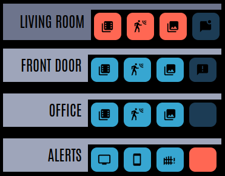
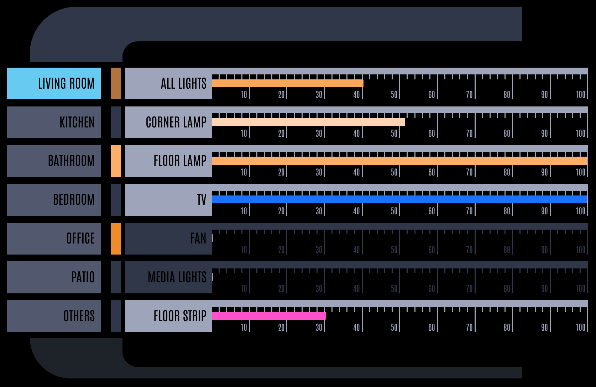

***
Note: This project is under reconstruction.  The goal is to move towards consuming these templates as custom cards.  This will take some time - but you can still use the below from the original version.
***

<p align="center">


</p>
<p align="center">
    <em>A collection of custom cards for building LCARS styled dashboards in Home Assistant</em>
</p>
<p align="left">
	
	
  
<p>
<p align="center">
	<!-- default option, no dependency badges. -->
</p>


- [Overview](#overview)
    - [What is this?](#what-is-this)
    - [What it isn't...](#what-it-isnt)
    - [What it can look like...](#what-it-can-look-like)
    - [What can be done...](#what-can-be-done)
- [Make it so!](#make-it-so)
    - [1. Dependencies and Extras](#1-dependencies-and-extras)
    - [2. HA-LCARS Theme - Setup and Customizations](#2-ha-lcars-theme---setup-and-customizations)
      - [Font](#font)
      - [Customized *CB-LCARS* Color Scheme](#customized-cb-lcars-color-scheme)
    - [3. Install CB-LCARS from HACS](#3-install-cb-lcars-from-hacs)
    - [4. Boldly Go...](#4-boldly-go)
      - [New Dashboard w/Strategy](#new-dashboard-wstrategy)
      - [Engage!](#engage)
- [TODO - Organize this...](#todo---organize-this)
  - [Actions](#actions)
  - [Flare](#flare)
  - [LCARS Basic Shapes](#lcars-basic-shapes)
    - [LCARS Elbows](#lcars-elbows)
      - [Headers](#headers)
      - [Footers](#footers)
      - [LCARS Callouts](#lcars-callouts)
    - [LCARS Text Labels](#lcars-text-labels)
      - [Text/Labels](#textlabels)
  - [LCARS Buttons](#lcars-buttons)
    - [Standard Buttons](#standard-buttons)
    - [Rounded Buttons](#rounded-buttons)
    - [Picard-Style Buttons](#picard-style-buttons)
    - [Button Examples](#button-examples)
- [Screenshots](#screenshots)
      - [Row of sliders (Transporter controls? :grin:)](#row-of-sliders-transporter-controls-grin)
      - [Room Selector with Sliders for Lights](#room-selector-with-sliders-for-lights)
- [Acknowledgements \& Thanks](#acknowledgements--thanks)
- [License](#license)


<br>

#  Overview

### What is this?
This is a set of custom cards to build yourself an LCARS-inspired Home Assistant dashboard.
<br>
- Inspired by, and meant to be used side-by-side with the amazing [ha-lcars-theme](https://github.com/th3jesta/ha-lcars)
- Provides a (growing) library of elements found in LCARS interfaces like:
  - Buttons
  - Sliders/Guages
  - 'Elbows'
  - That d-pad thing
  - etc.
- Designed with HA 'Sections' or other grid layouts in mind.  YMMV with other layouts.
- Collaborative - There are likely way better ways of doing some things - open to any and all suggestions, comments, etc.
- WIP - learn, break, iterate (and probably break again.)
<br>

### What it isn't...

- This is not a standalone theme - it provides lovelace dashboard cards.
<br>The intention is to use [ha-lcars-theme](https://github.com/th3jesta/ha-lcars) to provide the base theme styles, color variables, etc.
- It is not a fully standalone set of components (at present.)<br>
For some controls you need to install other cards from HACS (all requirements listed below)
- Professional work.<br>As this is my first crack at an HA custom card - it's a WIP and as I learn, updates and optimaztions will be made.  Hobbyist here, not a pro.
- A complete set of bugless components to fit every use-case you can imagine.  Maybe in the next-class starship :P


### What it can look like...


<br>


<br>


<br>


<br>


### What can be done...


In no particular ordeer:
- Customizable variables/settings for just about everything:
   - default colors / per-instance colors
   - colors based on entity state
   - font sizes/weights
   - text positions
   - full icon customization
   - gradients for sliders with automatice step and shade calculations
   - really too much to list - you can customize just about anything you like
- Matching control colors to the light entity (buttons, sliders, gradients, etc.)
- Additional 'flare' such as animating button presses, blinking buttons
- Automatic 'random' button labels in LCARS style (hex numbers)
- Optional: invocation of [lovelace-hue-like-light-card](https://github.com/Gh61/lovelace-hue-like-light-card) popups for light and scene controls


---


# Make it so!

---

> :dizzy: tl;dr: Express Startup Sequence
>
> - Clear All Moorings and Open Starbase Doors
>   - Install 'required' dependencies from HACS
> - Thrusters Ahead, Take Us Out
>   - Setup HA-LCARS theme (notes below)
>   - Add font (customized URL)
>   - Add CB-LCARS custom style to HA-LCARS theme
> - Bring Warp Core Online, Engines to Full Power
>   - Install CB-LCARS from HACS
> - Plot Course
>   - Create new dashboard and jumpstart with strategy
>   - Take Control and...
> - Engage!
>


---


### 1. Dependencies and Extras

The following should be installed and working in your Home Assistant instance - these are available in HACS
<br><b>Please follow the instructions in the respective project documentation for installation details. </b>

| Custom Card    |  Required?   | Function    |
|----------------|--------------|-------------|
| [custom-button-card](https://github.com/custom-cards/button-card) | Required | Base Framework |
| [ha-lcars theme](https://github.com/th3jesta/ha-lcars) | Required | Provides base theme elements, styes, color variables, etc. |
| [my-cards/my-slider-v2](https://github.com/AnthonMS/my-cards) | Required | Provides slider function which is used in the slider/gauge controls. |
| [lovelace-layout-card](https://github.com/thomasloven/lovelace-layout-card) | Required | Used internally by some cards.<br><br>Also handy for the ultimate in dashboard layout customization! |
| [lovelace-card-mod](https://github.com/thomasloven/lovelace-card-mod) | Recommended | Not strictly needed for CB-LCARS, but is used by HA-LCARS at the time of writing.<br><br>Very useful for modifying the elements/styles of other cards to fit the theme (overriding fonts, colors, remove backgrounds etc.) |
|  [lovelace-hue-like-light-card](https://github.com/Gh61/lovelace-hue-like-light-card) | Optional | Provides ability to use a Hue-style light and scene control popup card over the native HA light controls. |


<br>

### 2. HA-LCARS Theme - Setup and Customizations

#### Font
When setting up the font resource, we use a slightly updated Antonio font resouce string.<br>
This includes weights 100-700 allowing for more fine-grained control of the text as seen in Picard (some displays use really thin font, 100 or 200)

Simply substitute the following resource string when setting up ha-lcars:
`https://fonts.googleapis.com/css2?family=Antonio:wght@100..700&display=swap`

#### Customized *CB-LCARS* Color Scheme

 Copy the custom `LCARS Picard [cb-lcars]` definition from [cb-lcars-lcars.yaml](ha-lcars-theme/cb-lcars-lcars.yaml) to your HA-LCARS `lcars.yaml` file in Home Assistant (per instructions for [adding custom themes to HA-LCARS](https://github.com/th3jesta/ha-lcars?tab=readme-ov-file#make-your-own-color-themes)).

Set `LCARS Picard [cb-lcars]` as the active theme.

<details closed><summary>Picard [cb-lcars]</summary>
Grays, Blues, and Oranges are the core colours.  Greens and Yellows added for additional options.


These are the colors used for the ha-lcars defined variables.


</details>

<br>

### 3. Install CB-LCARS from HACS

1. Add CB-LCARS git repository as a custom repo in HACS.
2. Install CB-LCARS from HACS like any other project.

<br>

### 4. Boldly Go...

CB-LCARS (currently) requires the `custom-button-card` templates to be added do the dashboard config.

The easiest way to begin is to start with a new dashboard, and activate the **CB-LCARS Dashboard Strategy**
After this, simply take control and go wild.

#### New Dashboard w/Strategy
1.  Create a new empty dashboard in Home Assistant (`New Dashboard From Scratch`)
2.  Navigate to the new dashboard - enter *edit mode -> Raw Configuration Editor* (from menu at top right)
3.  Clear the existing default yaml code, and replace with the strategy:
```yaml
strategy:
  type: custom:cb-lcars
```
1.  Save the configuration and exit the yaml editor.
2.  The new dashboard configuarion elements should begin to load.
3.  Before editing, click "Done" at the top to exit edit mode and refresh page if necessary.

The base dashboard configuration is now available on this dashboard via the strategy.
You can now "Take Control" and begin your LCARS adventure!

#### Engage!
1. Click on the pencil at the top right to entire edit mode.
2. A dialog will pop up with information on the strategy.
3. Click the 3 dots in the top right and choose *Take Control*
4. On the next dialog just click **Take Control**  *(do not choose to start with an empty dashboard!)*


---
---
---

# TODO - Organize this...

## Actions


Of note in this list - if you like the style of Philips Hue interface, then `cb-lcars-actions-hue-*` is for you!

| Template                     | Description |
| ---------------------------- | ----------- |
| [`cb-lcars-actions-hue-[tap\|hold]`](cb-lcars/cb-lcars-actions.yaml)       | Uses [lovelace-hue-like-light-card](https://github.com/Gh61/lovelace-hue-like-light-card) API to pop up the Hue-style light control dialog on `[tap\|hold]`<br><br>-<b>tap</b><br>`tap_action:` hue card<br>`double_tap_action: more-info`<br>`hold_action: toggle`<br><br><b>-hold</b><br>`tap_action: toggle` <br>`double_tap_action: more-info`<br>`hold_action:` hue card<br><br>TODO: instructions how to use this
</details>

## Flare

<details closed><summary>Flare</summary>

| Template                 | Description |
| ------------------------ | ----------- |
| [`cb-lcars-animate-press`](cb-lcars/cb-lcars-animate-press.yaml) | Adds an animation to the button when pressed.  |
| [`cb-lcars-state-blink`](cb-lcars/cb-lcars-state-blink.yaml)   | Causes the button to blink when active. <br><br>  |
</details>

---

## LCARS Basic Shapes

These are the basic shapes found in LCARS.  These are highly configurable - default styles are shown with some examples of how to configur them to look like other versions seen in Picard.

### LCARS Elbows

#### Headers

| Template       | Default Style          |
| -------------- | ---------------------- |
| [`cb-lcars-header`](cb-lcars/cb-lcars-header.yaml)              |               |
| [`cb-lcars-header-right`](cb-lcars/cb-lcars-header.yaml)        |         |
| [`cb-lcars-header-contained`](cb-lcars/cb-lcars-header.yaml)    |     |
| [`cb-lcars-header-open`](cb-lcars/cb-lcars-header.yaml)         |          |
| [`cb-lcars-header-picard`](cb-lcars/cb-lcars-header-picard.yaml)       |        |
| [`cb-lcars-header-picard-right`](cb-lcars/cb-lcars-header-picard.yaml) |  |


#### Footers

| Template       | Default Style          |
| -------------- | ---------------------- |
| [`cb-lcars-footer-base`](cb-lcars/cb-lcars-footer.yaml)         |     n/a                                                        |
| [`cb-lcars-footer`](cb-lcars/cb-lcars-footer.yaml)              |               |
| [`cb-lcars-footer-right`](cb-lcars/cb-lcars-footer.yaml)        | (cb-lcars/cb-lcars-footer.yaml)        |
| [`cb-lcars-footer-contained`](cb-lcars/cb-lcars-footer.yaml)    |     |
| [`cb-lcars-footer-open`](cb-lcars/cb-lcars-footer.yaml)         |          |
| [`cb-lcars-footer-picard`](cb-lcars/cb-lcars-footer-picard.yaml)       |        |
| [`cb-lcars-footer-picard-right`](cb-lcars/cb-lcars-footer-picard.yaml) |  |
</details>


#### LCARS Callouts

| Template       | Default Style          |
| -------------- | ---------------------- |
| [`cb-lcars-callout-base`](cb-lcars/cb-lcars-callout.yaml)         |    n/a                                                          |
| [`cb-lcars-header-callout`](cb-lcars/cb-lcars-callout.yaml)       |        |
| [`cb-lcars-header-callout-right`](cb-lcars/cb-lcars-callout.yaml) |  |
| [`cb-lcars-footer-callout`](cb-lcars/cb-lcars-callout.yaml)       |        |
| [`cb-lcars-footer-callout-right`](cb-lcars/cb-lcars-callout.yaml) |  |


### LCARS Text Labels

#### Text/Labels

| Template       | Default Style          |
| -------------- | ---------------------- |
| [`cb-lcars-label`](cb-lcars/cb-lcars-label.yaml) | <br><br>

 |

---

## LCARS Buttons

### Standard Buttons

<details open><summary>Button Templates</summary>

| Template       | Default Style          |
| -------------- | ---------------------- |
| [`cb-lcars-button-base`](cb-lcars/cb-lcars-button-base.yaml)<br>[`cb-lcars-button-square`](cb-lcars/cb-lcars-button-base.yaml) |  |

### Rounded Buttons

| Template       | Default Style          |
| -------------- | ---------------------- |
| [`cb-lcars-button-lozenge`](cb-lcars/cb-lcars-button-lozenge.yaml)<br>[`cb-lcars-button-lozenge-right`](cb-lcars/cb-lcars-button-lozenge.yaml) |  |
| [`cb-lcars-button-bullet`](cb-lcars/cb-lcars-button-bullet.yaml)<br>[`cb-lcars-button-bullet-right`](cb-lcars/cb-lcars-button-bullet.yaml)   |   |
| [`cb-lcars-button-capped`](cb-lcars/cb-lcars-button-capped.yaml)<br>[`cb-lcars-button-capped-right`](cb-lcars/cb-lcars-button-capped.yaml)   |   |
</details>


### Picard-Style Buttons

<details open><summary>Picard Button Templates</summary>

| Template       | Default Style          |
| -------------- | ---------------------- |
| [`cb-lcars-button-picard`](cb-lcars/cb-lcars-button-picard.yaml)<br>[`cb-lcars-button-picard-right`](cb-lcars/cb-lcars-button-picard.yaml)<br>                       |               |
| [`cb-lcars-button-picard-dense`](cb-lcars/cb-lcars-button-picard.yaml)<br>[`cb-lcars-button-picard-dense-right`](cb-lcars/cb-lcars-button-picard.yaml)               |         |
| [`cb-lcars-button-picard-filled`](cb-lcars/cb-lcars-button-picard-filled.yaml)<br>[`cb-lcars-button-picard-filled-right`](cb-lcars/cb-lcars-button-picard-filled.yaml)             |        |
| [`cb-lcars-button-picard-filled-dense`](cb-lcars/cb-lcars-button-picard-filled.yaml)<br>[`cb-lcars-button-picard-filled-dense-right`](cb-lcars/cb-lcars-button-picard-filled.yaml) |  |
| [`cb-lcars-button-picard-icon`](cb-lcars/cb-lcars-button-picard-icon.yaml)                                                        |          |
</details>


### Button Examples


---


---

# Screenshots


 

 





#### Row of sliders (Transporter controls? :grin:)


#### Room Selector with Sliders for Lights


---

# Acknowledgements & Thanks

A very sincere thanks to these projects and their authors, contributers and communities for doing what they do, and making it available.  It really does make this a fun hobby to tinker with.

[**ha-lcars theme**](https://github.com/th3jesta/ha-lcars) (the definitive LCARS theme for HA!)

[**custom-button-card**](https://github.com/custom-cards/button-card)

[**my-cards/my-slider-v2**](https://github.com/AnthonMS/my-cards)

[**lovelace-layout-card**](https://github.com/thomasloven/lovelace-layout-card)

[**lovelace-card-mod**](https://github.com/thomasloven/lovelace-card-mod)

[**lovelace-hue-like-light-card**](https://github.com/Gh61/lovelace-hue-like-light-card)

<br>
As well, some shout-outs and attributions to these great projects:
<br><br>

[lovelace-animated-background](https://github.com/rbogdanov/lovelace-animated-background) - Allows for animated/video backgrounds on the dashboard (stars look great.)  Additionally, Home Assistant natively supports background images (can be configured in UI from 2024.6+)

[lovelace-wallpanel](https://github.com/j-a-n/lovelace-wallpanel) - Great panel-mode features - including hiding side/top bars, screensaver function (with cards support)

[LCARSlad London](https://twitter.com/lcarslad) for excellent LCARS images and diagrams for reference.

[meWho Titan.DS](https://www.mewho.com/titan) for such a cool interactive design demo and color reference.

[TheLCARS.com]( https://www.thelcars.com) a great LCARS design reference.

[wfurphy creative-button-card-templates](https://github.com/wfurphy/creative-button-card-templates) for debugging code template that dumps variables to the browswer console - super handy.

[lcars](https://github.com/joernweissenborn/lcars) for the SVG used inline in the dpad control.

---
#  License

This project uses the MIT License. For more details, refer to the [LICENSE](LICENSE) file.

---
