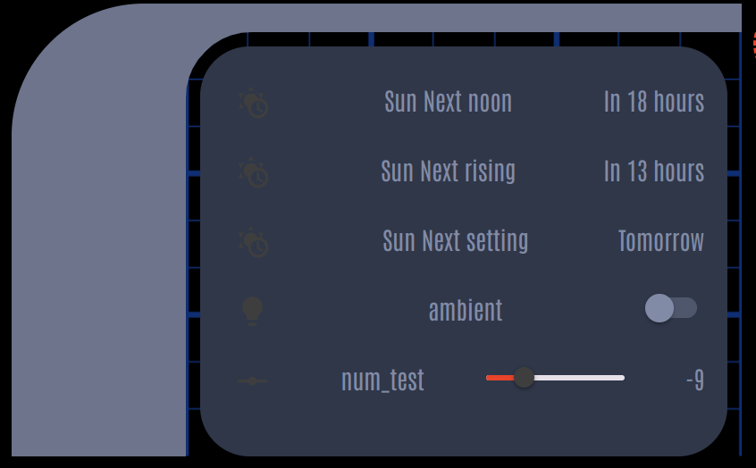
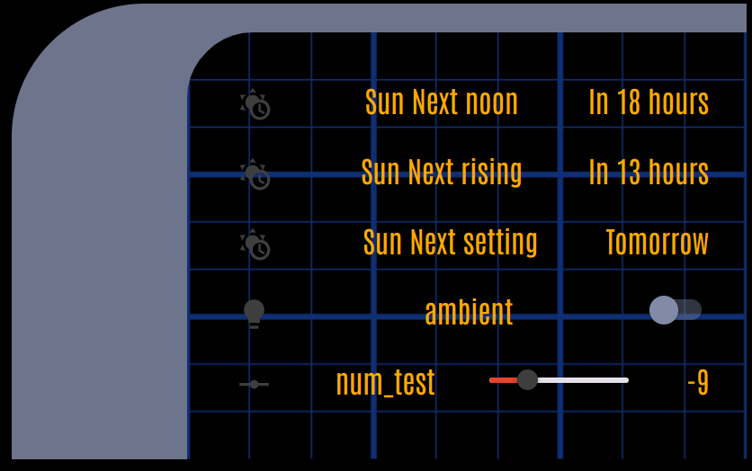
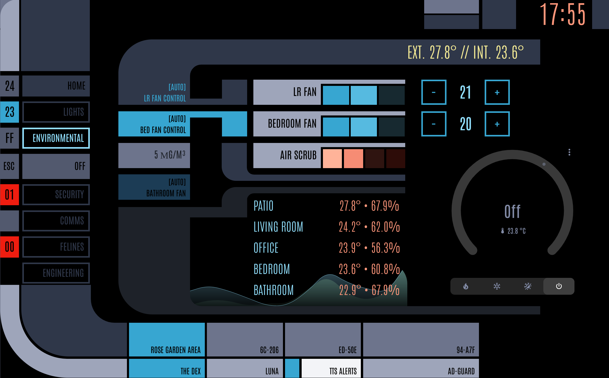

***
**Note:**

This project is active development.


Functionality and configurations may change over time until stabilized.  Things may break - so you may not want to use this on your primary dashboard just yet.
***

<p align="center">


</p>
<p align="center">
    <em>A collection of custom cards for building LCARS styled dashboards in Home Assistant</em>
</p>
<p align="left">
	
	
  
<p>
<p align="center">
	<!-- default option, no dependency badges. -->
</p>


- [Installation - Make it so!](#installation---make-it-so)
    - [1. Dependencies and Extras](#1-dependencies-and-extras)
    - [2. HA-LCARS Theme - Setup and Customizations](#2-ha-lcars-theme---setup-and-customizations)
      - [Font](#font)
      - [Customized *CB-LCARS* Color Scheme](#customized-cb-lcars-color-scheme)
    - [3. Install CB-LCARS from HACS](#3-install-cb-lcars-from-hacs)
    - [4. Engage!](#4-engage)
    - [Breaking Changes (Coming from _original_ project prior to Jan 2025)](#breaking-changes-coming-from-original-project-prior-to-jan-2025)
- [Overview](#overview)
    - [What is this?](#what-is-this)
    - [What it isn't...](#what-it-isnt)
    - [What can be done...](#what-can-be-done)
- [States](#states)
- [Joining with a Symbiont](#joining-with-a-symbiont)
    - [Imprinting](#imprinting)
      - [User card-mod styles](#user-card-mod-styles)
- [CB-LCARS Cards](#cb-lcars-cards)
  - [LCARS Elbows](#lcars-elbows)
    - [`type: custom:cb-lcars-elbow-card`](#type-customcb-lcars-elbow-card)
    - [`type: custom:cb-lcars-double-elbow-card`](#type-customcb-lcars-double-elbow-card)
  - [LCARS Buttons](#lcars-buttons)
    - [`type: custom:cb-lcars-button-card`](#type-customcb-lcars-button-card)
  - [LCARS Multimeter (Sliders/Gauges)](#lcars-multimeter-slidersgauges)
    - [`type:cb-lcars-multimeter-card`](#typecb-lcars-multimeter-card)
      - [Ranges](#ranges)
  - [LCARS Label (Stylized Text)](#lcars-label-stylized-text)
    - [`type:cb-lcars-label-card`](#typecb-lcars-label-card)
  - [LCARS DPAD](#lcars-dpad)
    - [`type:cb-lcars-dpad-card`](#typecb-lcars-dpad-card)
- [Animations and Effects](#animations-and-effects)
  - [Custom Animations](#custom-animations)
    - [Data Cascade \& GEO Array](#data-cascade--geo-array)
    - [Pulsewave](#pulsewave)
- [Screenshots and Examples](#screenshots-and-examples)
  - [Example: Tablet Dashboard](#example-tablet-dashboard)
  - [Example: Room Selector with Multimeter Light Controls](#example-room-selector-with-multimeter-light-controls)
  - [Control Samples](#control-samples)
    - [Button Samples](#button-samples)
    - [Sliders/Gauges](#slidersgauges)
    - [Row of sliders (Transporter controls? :grin:)](#row-of-sliders-transporter-controls-grin)
  - [Some Dashboard possibilities...](#some-dashboard-possibilities)
- [Acknowledgements \& Thanks](#acknowledgements--thanks)
- [License](#license)


<br>

---


# Installation - Make it so!

[](https://my.home-assistant.io/redirect/hacs_repository/?owner=snootched&repository=cb-lcars)


> :dizzy: tl;dr: Express Startup Sequence
>
> - _Clear All Moorings and Open Starbase Doors_
>   - Install 'required' dependencies from HACS
> - _Thrusters Ahead, Take Us Out_
>   - Setup HA-LCARS theme (notes below)
>   - Add font (customized URL)
>   - Add CB-LCARS custom style to HA-LCARS theme
> - _Bring Warp Core Online, Engines to Full Power_
>   - Install CB-LCARS from HACS
> - _Engage!_
>


---

### 1. Dependencies and Extras

The following should be installed and working in your Home Assistant instance - these are available in HACS
<br><b>Please follow the instructions in the respective project documentation for installation details. </b>

| Custom Card                                                                 |  Required?  | Function    |
|-----------------------------------------------------------------------------|-------------|-------------|
| [ha-lcars theme](https://github.com/th3jesta/ha-lcars)                      | Required    | Provides base theme elements, styes, color variables, etc. |
| [my-slider-v2](https://github.com/AnthonMS/my-cards)                      | Required    | Provided slider function in Multimeter card. |
| [lovelace-card-mod](https://github.com/thomasloven/lovelace-card-mod)       | Required | CB-LCARS requires card-mod for using the _host imprint_ feature on symbiont cards.  It is also required by HA-LCARS theming at the time of writing.<br><br>Very useful for modifying the elements/styles of other cards to fit the theme (overriding fonts, colors, remove backgrounds etc.) |
| | |
| [lovelace-layout-card](https://github.com/thomasloven/lovelace-layout-card) | Optional    | No longer used internally but it's handy for the ultimate in dashboard layout customization! |


<br>

### 2. HA-LCARS Theme - Setup and Customizations

#### Font
When adding the font resource, use a slightly updated Antonio font resouce string.<br>

This will include weights 100-700 allowing for more thinner/lighter text as seen in Picard (some displays use really thin font, 100 or 200)

Substitute the following resource string when setting up font in HA-LCARS theme:
`https://fonts.googleapis.com/css2?family=Antonio:wght@100..700&display=swap`

_(Note: if the font is missing, the card will attempt to load it dynamically from the above URL.)_


#### Customized *CB-LCARS* Color Scheme

 *Ideally, add and use this cb-lcars profile into your HA-LCARS theme.  If not, the additional color definitions will be made available to use at runtime by the cards.*

 Copy the custom `LCARS Picard [cb-lcars]` definition from [cb-lcars-lcars.yaml](ha-lcars-theme/cb-lcars-lcars.yaml) to your HA-LCARS `lcars.yaml` file in Home Assistant (per instructions for [adding custom themes to HA-LCARS](https://github.com/th3jesta/ha-lcars?tab=readme-ov-file#make-your-own-color-themes)).

Set `LCARS Picard [cb-lcars]` as the active theme.

<details closed><summary>Picard [cb-lcars]</summary>
Grays, Blues, and Oranges are the core colours.  Greens and Yellows added for additional options.


These are the colors used for the ha-lcars defined variables.


</details>

<br>

### 3. Install CB-LCARS from HACS

1. Add CB-LCARS git repository as a custom repo in HACS.
2. Install CB-LCARS from HACS like any other project.


### 4. Engage!

Add CB-LCARS cards to your dashboard just like any other card.

<br>

### Breaking Changes (Coming from _original_ project prior to Jan 2025)

If you have used the original versions of CB-LCARS whereby you had to copy the button card templates from github into your lovelace dashboard yaml code - you _will_ run into errors with the latest versions.

If you can - it's advisable to start with a fresh dashboard.

<br>

<details closed><summary>To Retrofit</summary>
If you choose to retrofit an existing dashboard, it is necessary to remove those old templates from your dashboard file, and update any card configs that are broken by variable changes.

The old `cblcars_card_templates:` should no longer be in your dashboard file (unless you are _intentially_ trying to override the templates that come with the distribution)

```yaml
cblcars_card_templates:      <-- this section should be removed
  template_name:
```

Card config structure also changed slightly from original.
Everything that was in `cblcars_card_config:` section, has been moved up one level.

```yaml
cblcars_card_config:
  variables:
    label: "my label"

would become:

variables:
  label: "my label"
```
If you are coming from previous version and run into any quirks - please try on a blank dashboard to see if it resolves it.
</details>

---

<br>

#  Overview

### What is this?
This is a set of custom cards to build yourself an LCARS-inspired Home Assistant dashboard.

These cards are built upon `custom-button-card` with some enhancements to base function and internal template management.

<br>

- Inspired by, and meant to be used side-by-side with the amazing [ha-lcars-theme](https://github.com/th3jesta/ha-lcars)
- Provides a (growing) library of elements found in LCARS interfaces like:
  - Buttons
  - Sliders/Guages
  - 'Elbows'
  - That d-pad thing
  - Animations
  - etc.
- Designed with HA 'Sections' or other grid layouts in mind.  YMMV with other layouts.
- Collaborative - There are likely way better ways of doing some things - open to any and all suggestions, comments, etc.
- WIP - learn, break, iterate (and probably break again.)
<br>

### What it isn't...

- This is not a standalone theme - it provides lovelace dashboard cards.
<br>The intention is to use [ha-lcars-theme](https://github.com/th3jesta/ha-lcars) to provide the base theme styles, color variables, etc.
- It is not a fully standalone set of components (at present.)<br>
For some controls you need to install other cards from HACS (all requirements listed below)
- Professional work.<br>As this is my first crack at an HA custom card - it's a WIP and as I learn, updates and optimaztions will be made.  Hobbyist here, not a pro.
- A complete set of bugless components to fit every use-case you can imagine.  Maybe in the next-class starship :P


<br>


### What can be done...


In no particular ordeer:
- Customizable variables/settings for just about everything:
   - default colors / per-instance colors
   - colors based on entity state
   - font sizes/weights
   - text positions
   - full icon customization
   - gradients for sliders with automatice step and shade calculations
   - really too much to list - you can customize just about anything you like
- Matching control colors to the light entity (buttons, sliders, gradients, etc.)
- Additional 'flare' such as animations, button presses, blinking buttons
- Automatic 'random' button labels in LCARS style (hex numbers)
- Optional: invocation of [lovelace-hue-like-light-card](https://github.com/Gh61/lovelace-hue-like-light-card) popups for light and scene controls


---

# States

The cards support changing the styles/colors of independent components based on the state of the entity.

If no entity is defined (no state), `default` will be used.  If the entity is unavailable or unknown, then `unavailable` will be used.

Each of these is configurable in the UI editor for the cards.

State styles can be applied to components such as:
- Borders
- Backgrounds
- Text
- Buttons
- etc.


| Entity State Value           |  State Variable Name   |
|------------------------------|------------------------|
| N/A - no entity assigned     | `default:`             |
| `on` `open` `locked`         | `active:`              |
| `off` `closed` `unlocked`    | `inactive:`            |
| Number (zero): `0`           | `zero:`                |
| Number (non-zero)            | `non_zero:`            |
| `heat` (hvac/climate entity) | `hvac_heat:`           |
| `cool` (hvac/climate entity) | `hvac_cool:`           |
| `unavailable` `unkown`       | `unavailable:`         |


Example of configuration (editiable via UI):
```yaml
variables:
  text:
    label:
      color:
        default: var(--primary-text-color)
        active: var(--lcars-ui-secondary)
        inactive: var(--lcars-ui-tertiary)
        zero: var(--lcars-green)
        non_zero: var(--lcars-blue)
        hvac_heat: var(--lcars-orange)
        hvac_cool: var(--lcars-blue)
        unavailable: var(--lcars-card-button-unavailable)
  card:
    color:
      default: var(--lcars-card-top-color, var(--picard-dark-gray))
      active: var(--lcars-ui-secondary)
      inactive: var(--lcars-ui-tertiary)
      zero: var(--lcars-green)
      non_zero: var(--lcars-blue)
      hvac_heat: var(--lcars-orange)
      hvac_cool: var(--lcars-blue)
      unavailable: var(--lcars-card-button-unavailable)
      background:
        default: var(--lcars-card-top-color, var(--picard-dark-gray))
        active: var(--lcars-ui-secondary)
        inactive: var(--lcars-ui-tertiary)
        zero: var(--lcars-green)
        non_zero: var(--lcars-blue)
        hvac_heat: var(--lcars-orange)
        hvac_cool: var(--lcars-blue)
        unavailable: var(--lcars-card-button-unavailable)
```

# Joining with a Symbiont

CB-LCARS has graduated the Initiate program and can become a host to a symbiont card.  Once joined, this enables you to imprint some CB-LCARS styling to your other cards.  Most common case would be with the Elbow card to add LCARS borders - but much more is possible.

Just supply your symbiont card configuration into the editor and it will inset the the symbiont into the CB-LCARS host card.  Once joined, you can adjust settings, imprint host styles onto the symbiont, and even supply your own card-mod configuration to the symbiont.

### Imprinting

Currently, imprinting will apply the host background colors and text font, size, and colors to the symbiont.  This feature uses some basic card-mod targated primarily to ha-card.

You can supply your own card-mod configuration which will append to the host configuration.  You can also override any host styling with your card-mod config.

<br>

#### User card-mod styles
You can provide additional card-mod styles that will be appended to the host imprinted styles.
Card-mod templating is supported and the host card's host card's `variables:` block and `entity` are made available to the symbiont.  These can be accessed with standard card-mod jinja templating.

```yaml
Example accessing the host card's card default color.

variables:
  symbiont:
    enabled: true
    imprint_host: true
    symbiont_user_style: |
      ha-card {
        background: {{ config.variables.card.color.default }} !important;
      }
```

<br>

**Example - Entities Card**

A regular entities card will join with a host CB-LCARS Elbow card and have the host styles imprinted (font, font color, background)






---

# CB-LCARS Cards

For reference - these are the cards found in CB-LCARS.
They are highly configurable - and some default styles are shown.

Additional style possibilities can be found in the screenshots section.

Settings are available in the UI editor.


<br>

## LCARS Elbows


### `type: custom:cb-lcars-elbow-card`


| `cblcars_card_type:`                                            | Default Style          |
| --------------------------------------------------------------- | ---------------------- |
| [`cb-lcars-header`](src/cb-lcars/cb-lcars-header.yaml)              |               |
| [`cb-lcars-header-right`](src/cb-lcars/cb-lcars-header.yaml)        |         |
| [`cb-lcars-header-contained`](src/cb-lcars/cb-lcars-header.yaml)    |     |
| [`cb-lcars-header-open`](src/cb-lcars/cb-lcars-header.yaml)         |          |


| `cblcars_card_type:`                                            | Default Style          |
| --------------------------------------------------------------- | ---------------------- |
| [`cb-lcars-footer`](src/cb-lcars/cb-lcars-footer.yaml)              |               |
| [`cb-lcars-footer-right`](src/cb-lcars/cb-lcars-footer.yaml)        |  |
| [`cb-lcars-footer-contained`](src/cb-lcars/cb-lcars-footer.yaml)    |     |
| [`cb-lcars-footer-open`](src/cb-lcars/cb-lcars-footer.yaml)         |          |

| `cblcars_card_type:`                                              | Default Style          |
| ----------------------------------------------------------------- | ---------------------- |
| [`cb-lcars-header-callout`](src/cb-lcars/cb-lcars-callout.yaml)       |        |
| [`cb-lcars-header-callout-right`](src/cb-lcars/cb-lcars-callout.yaml) |  |
| [`cb-lcars-footer-callout`](src/cb-lcars/cb-lcars-callout.yaml)       |        |
| [`cb-lcars-footer-callout-right`](src/cb-lcars/cb-lcars-callout.yaml) |  |

<br>

### `type: custom:cb-lcars-double-elbow-card`

| `cblcars_card_type:`                                                   | Default Style          |
| ---------------------------------------------------------------------- | ---------------------- |
| [`cb-lcars-header-picard`](src/cb-lcars/cb-lcars-header-picard.yaml)       |        |
| [`cb-lcars-header-picard-right`](src/cb-lcars/cb-lcars-header-picard.yaml) |  |
| [`cb-lcars-footer-picard`](src/cb-lcars/cb-lcars-footer-picard.yaml)       |        |
| [`cb-lcars-footer-picard-right`](src/cb-lcars/cb-lcars-footer-picard.yaml) |  |

<br>

## LCARS Buttons

### `type: custom:cb-lcars-button-card`

| `cblcars_card_type:`                                                                 | Default Style          |
| ------------------------------------------------------------------------------------ | ---------------------- |
| [`cb-lcars-button-lozenge`](src/cb-lcars/cb-lcars-button-lozenge.yaml)                   |  |
| [`cb-lcars-button-bullet`](src/cb-lcars/cb-lcars-button-bullet.yaml)                     |   |
| [`cb-lcars-button-capped`](src/cb-lcars/cb-lcars-button-capped.yaml)                     |   |
| [`cb-lcars-button-picard`](src/cb-lcars/cb-lcars-button-picard.yaml)                     |               |
| [`cb-lcars-button-picard-dense`](src/cb-lcars/cb-lcars-button-picard.yaml)               |         |
| [`cb-lcars-button-picard-filled`](src/cb-lcars/cb-lcars-button-picard-filled.yaml)       |        |
| [`cb-lcars-button-picard-filled-dense`](src/cb-lcars/cb-lcars-button-picard-filled.yaml) |  |
| [`cb-lcars-button-picard-icon`](src/cb-lcars/cb-lcars-button-picard-icon.yaml)           |          |

<br>

## LCARS Multimeter (Sliders/Gauges)

### `type:cb-lcars-multimeter-card`

- Supports interactive (entity) mode, or non-interactive (sensor) mode.
  - Mode is determined automatically by the assigned entity
- Run in Slider or Guage mode
- Horizontal or Vertical orientation
- Configurable multi-modal slider control:
  - Light: brightness, temperature, hue, saturation
  - Media Player: volume, seek
  - (uses my-slider-v2 custom card internally)
- Fully configurable borders, label/text, slider
- Color match [border|slider|gauge|gradient start/end etc.] to entity color
- Configurable min, max, gauge increments, slider step size
  - Min/Max/Units are automatically obtained from the entity (if supported)
- Show/Hide Units, Override unit
- Configurable Subticks
  - Show/Hide
  - Size
  - Count (number of subticks per segement)
- Ranges: now supporting background colors set with ranges
- Picard style option in vertical mode


#### Ranges

Background color in gauge mode can be segmented into ranges.
This can currently be done in the yaml configuration of multimeter.

 

```yaml
type: custom:cb-lcars-multimeter-card
variables:
  gauge:
    ranges:
      - from: 0
        to: 30
        color: var(--picard-darkest-yellow)
      - from: 30
        to: 75
        color: var(--picard-darkest-green
      - from: 75
        to: 100
        color: var(--picard-darkest-orange)
```

<br>

## LCARS Label (Stylized Text)

### `type:cb-lcars-label-card`


- Card for creating labels/text
- Full graphical customization
- Pre-configured label templates for various looks seen in LCARS
  - Library is growing...

| `cblcars_card_type:`        | Styles          |
| -------------- | ---------------------- |
| [`cb-lcars-label`](src/cb-lcars/cb-lcars-label.yaml) |  |
| [`cb-lcars-label-picard`](src/cb-lcars/cb-lcars-label-presets.yaml) | <br> |

<br>

## LCARS DPAD

### `type:cb-lcars-dpad-card`

- Card-wide active/inactive colors
- Per-segment active/inactive colors
- Assignable entity per segment
- Assignable actions/controls per segment (deafult `toggle`)


TODOs:
- update/remove ripple effect
- add 'match entity color' for active state

<br>

---

# Animations and Effects

The cards support a growing library of animations and effects that can be applied to the card.  Animations can appear as "backgrounds" for a card giving a really fun effect.

Animations are _highly_ customizable and can be edited via UI.  Each animation has a dedicated configuration tab with details.

Just about every option can be configured to create a multitude of looks from the same animation component - please explore!

For those that really want to tinker - see below :)


<br>

| template ||
|----------|----------------|
| [`cb-lcars-animation-cascade`](src/cb-lcars/cb-lcars-animation-cascade.yaml) |  |
| [`cb-lcars-animation-pulsewave`](src/cb-lcars/cb-lcars-animation-pulsewave.yaml) |  |
[`cb-lcars-animation-bg-grid`](src/cb-lcars/cb-lcars-animation-bg-grid.yaml) | |
[`cb-lcars-animation-geo-array`](src/cb-lcars/cb-lcars-animation-geo-array.yaml) | Can be used as an inset animation recreating some of the LCARS panel effects.  Animations are similar to Data Cascade  |


## Custom Animations

<details><summary>Custom Animation Settings</summary>

For some of the animations, you can provide custom pattern and keyframes definitions to the animation elements, should you desire.

Examples are below.  More details to come, but for now know:
- `custom_pattern` and `custom_keyframes` are provided as text blocks
- Available for Data Cascade and Pulsewave
- Embedded variables are not currently supported

### Data Cascade & GEO Array
```yaml
template:
  - cb-lcars-animation-cascade
variables:
  animation:
    cascade:
      pattern: custom
      custom_pattern: |
        [
          { "duration": 1, "delay": 0.1 },
          { "duration": 1.5, "delay": 0.2 },
          { "duration": 2, "delay": 0.3 },
          { "duration": 2.5, "delay": 0.4 },
          { "duration": 3, "delay": 0.5 },
          { "duration": 3.5, "delay": 0.6 },
          { "duration": 4, "delay": 0.7 },
          { "duration": 4.5, "delay": 0.8 }
        ]
      custom_keyframes: |
        @keyframes colorchange {
          0% {color: #ff0000}
          25% {color: #00ff00}
          50% {color: #0000ff}
          75% {color: #ffff00}
          80% {color: #ff00ff}
          90% {color: #00ffff}
          100% {color: #ffffff}
        }
```

### Pulsewave

```yaml
template:
  - cb-lcars-animation-pulsewave
variables:
  animation:
    pulsewave:
      line_angle: 15
      scale_line_heights: true
      pattern: custom
      custom_pattern: |
        [
          "animateLine3 13s 0.2s infinite",
          "animateLine2 13s 0.3s infinite",
          "animateLine3 13s 0.4s infinite",
          "animateLine3 13s 0.5s infinite",
          "animateLine2 13s 0.6s infinite",
          "animateLine2 13s 0.7s infinite",
          "animateLine2 13s 0.8s infinite",
          "animateLine1 13s 0.9s infinite",
          "animateLine1 1s 1s infinite",
          "animateLine2 1s 0.8s infinite",
          "animateLine2 1s 0.7s infinite",
          "animateLine2 1s 0.6s infinite",
          "animateLine3 1s 0.5s infinite",
          "animateLine3 1s 0.4s infinite",
          "animateLine2 1s 0.3s infinite",
          "animateLine2 1s 0.2s infinite"
        ]
      custom_keyframes: |
        @keyframes animateLine1 {
          0% { height: 50px; }
          50% { height: 25px; }
          100% { height: 50px; }
        }
        @keyframes animateLine2 {
          0% { height: 100px; }
          50% { height: 50px; }
          100% { height: 100px; }
        }
        @keyframes animateLine3 {
          0% { height: 75px; }
          50% { height: 37.5px; }
          100% { height: 75px; }
        }
```
</details>

TODOs:
- add alternative text data sources (sensors?)


---

# Screenshots and Examples

Below are some example dashboards and controls.  Also a collection of screenshots and snippets of potential variations of the controls.

<br>

## Example: Tablet Dashboard

Example of a WIP dasboard sized for a Samsung Tab A9.

This makes use of custom layouts to create the main dashboard with a header bar, left sidebar, footer bar, and a content area.

The left sidebar uses an `input_select` helper to specify which 'page' is to be displayed in the content area.  Then conditions are used to show/hide the panes of the content.

Source: [`dashboard-tablet.yaml`](examples/dashboard-tablet.yaml)


## Example: Room Selector with Multimeter Light Controls

Example of a custom controls panel that has a room selector sidebar (similar to the tablet dashboard example using `input_select` helpers.)

Each room then has a grid of multimeter controls for the lights in each room.

For fun, the small block to the right of each room button will change colour to match the entity colour for the room's light group.

This example shows now to use the base card as a canvas and add more cards on top.  This code can be condensed if desired using things like the custom template card - and there are probably many otherways to get the same results.

Source: [`lightselector.yaml`](examples/lightselector.yaml)


## Control Samples

### Button Samples


### Sliders/Gauges

   


### Row of sliders (Transporter controls? :grin:)


## Some Dashboard possibilities...


<br>


<br>


<br>



---

# Acknowledgements & Thanks

A very sincere thanks to these projects and their authors, contributers and communities for doing what they do, and making it available.  It really does make this a fun hobby to tinker with.

[**ha-lcars theme**](https://github.com/th3jesta/ha-lcars) (the definitive LCARS theme for HA!)

[**custom-button-card**](https://github.com/custom-cards/button-card)

[**my-cards/my-slider-v2**](https://github.com/AnthonMS/my-cards)

[**lovelace-layout-card**](https://github.com/thomasloven/lovelace-layout-card)

[**lovelace-card-mod**](https://github.com/thomasloven/lovelace-card-mod)

[**lovelace-hue-like-light-card**](https://github.com/Gh61/lovelace-hue-like-light-card)

<br>
As well, some shout-outs and attributions to these great projects:
<br><br>

[lovelace-animated-background](https://github.com/rbogdanov/lovelace-animated-background) - Allows for animated/video backgrounds on the dashboard (stars look great.)  Additionally, Home Assistant natively supports background images (can be configured in UI from 2024.6+)

[lovelace-wallpanel](https://github.com/j-a-n/lovelace-wallpanel) - Great panel-mode features - including hiding side/top bars, screensaver function (with cards support)

[LCARSlad London](https://twitter.com/lcarslad) for excellent LCARS images and diagrams for reference.

[meWho Titan.DS](https://www.mewho.com/titan) for such a cool interactive design demo and color reference.

[TheLCARS.com]( https://www.thelcars.com) a great LCARS design reference, and the base reference for Data Cascade and Pulsewave animations.

[wfurphy creative-button-card-templates](https://github.com/wfurphy/creative-button-card-templates) for debugging code template that dumps variables to the browswer console - super handy.

[lcars](https://github.com/joernweissenborn/lcars) for the SVG used inline in the dpad control.

---
#  License

This project uses the MIT License. For more details, refer to the [LICENSE](LICENSE) file.

---
