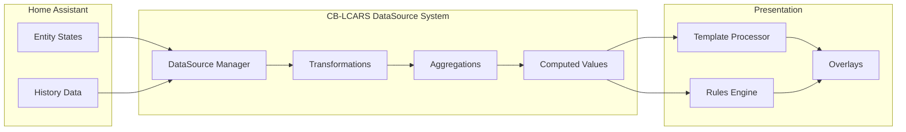
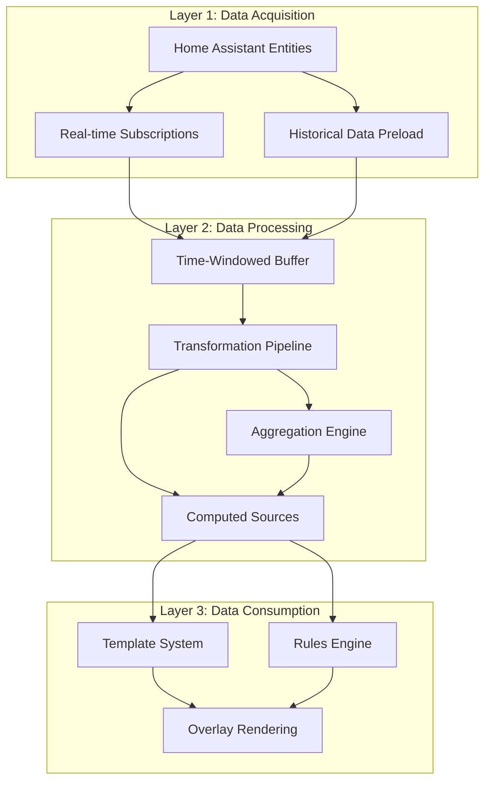
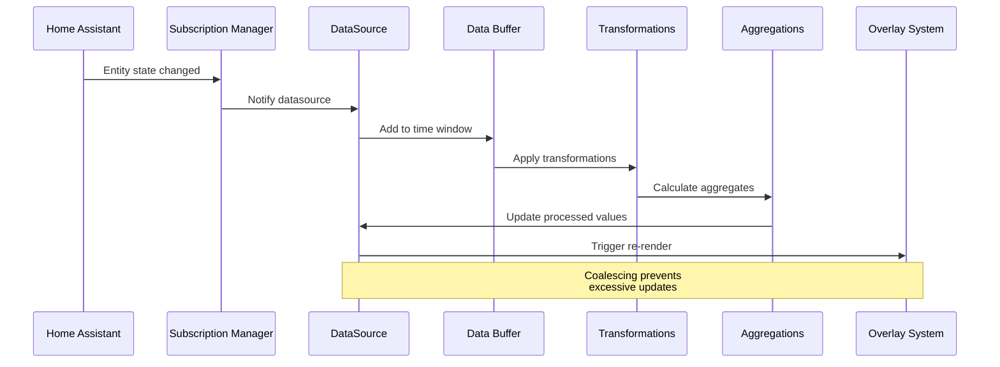
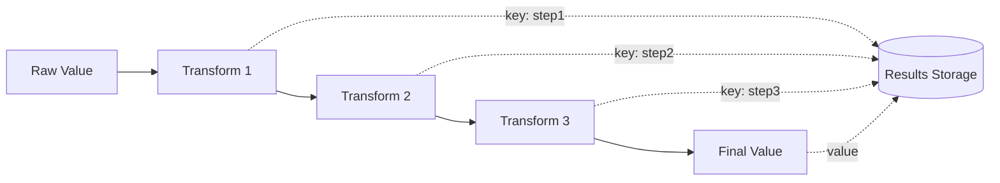
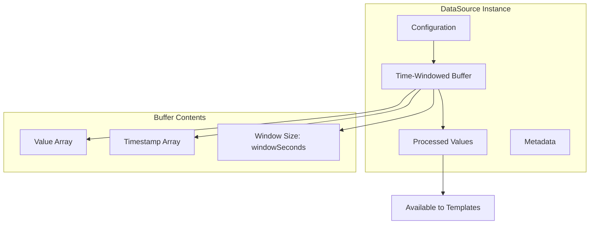

# Data Architecture & DataSource System

> **CB-LCARS is data-driven at its core**
> Understanding how data flows from Home Assistant through the datasource system to overlays is fundamental to using CB-LCARS effectively.

---

## 🎯 Core Concept

**Everything in CB-LCARS is driven by data.** The datasource system sits at the heart of the architecture, transforming Home Assistant entity states into processed, aggregated, and computed values that power dynamic overlays.



---

## 🏗️ Architecture Overview

### Three-Layer Data Flow



### Layer Responsibilities

**Layer 1: Data Acquisition**
- Subscribe to Home Assistant entity state changes
- Preload historical data for time-series analysis
- Handle entity availability and state validation
- Manage subscription lifecycle

**Layer 2: Data Processing**
- Maintain time-windowed data buffers (default 60s, configurable)
- Apply transformation pipelines (unit conversion, scaling, smoothing)
- Calculate aggregations (averages, min/max, rates, trends)
- Generate computed values from multiple sources

**Layer 3: Data Consumption**
- Process templates with datasource values
- Evaluate rules engine conditions
- Provide values for overlay rendering
- Support dot-notation access (`datasource.value`, `datasource.aggregates.avg`)

---

## 📊 DataSource Types

### 1. Entity Sources

Direct subscriptions to Home Assistant entities with optional processing.

```yaml
data_sources:
  temperature:
    type: entity
    entity: sensor.outdoor_temperature
    transformations:
      - type: unit_conversion
        from: "°F"
        to: "°C"
    aggregations:
      - type: moving_average
        window: 300  # 5 minutes
```

**Features:**
- Real-time state updates
- Historical data preloading
- Attribute access
- Transformation pipelines
- Aggregation windows

### 2. Computed Sources

Derived values from other datasources using expressions.

```yaml
data_sources:
  heat_index:
    type: computed
    expression: "0.5 * (temp + 61.0 + ((temp-68.0)*1.2) + (humidity*0.094))"
    dependencies:
      temp: temperature
      humidity: humidity_sensor
```

**Features:**
- Multi-source calculations
- JavaScript expressions
- Automatic dependency tracking
- Reactive updates

### 3. Aggregated Sources

Statistical analysis over time windows.

```yaml
data_sources:
  power_stats:
    type: entity
    entity: sensor.power_consumption
    aggregations:
      - type: moving_average
        window: 3600
        key: "hourly_avg"
      - type: rate_of_change
        window: 300
        key: "trend"
```

**Aggregation Types:**
- Moving averages (simple, exponential)
- Min/Max tracking
- Rate of change
- Trend detection
- Duration tracking

---

## 🔄 Data Flow Lifecycle



### Detailed Flow Steps

1. **State Change Detection**
   - Home Assistant entity state changes
   - Subscription manager notifies datasource
   - Raw value captured with timestamp

2. **Buffering**
   - Value added to time-windowed buffer
   - Old values outside window removed
   - Buffer size maintained (default 60s)

3. **Transformation**
   - Pipeline processors applied in order
   - Unit conversions, scaling, smoothing
   - Results keyed for template access

4. **Aggregation**
   - Statistical calculations over buffer
   - Moving averages, rates, trends
   - Results keyed for template access

5. **Emission**
   - Coalescing window prevents rapid updates
   - Minimum emit interval enforced
   - Maximum delay ensures freshness

6. **Consumption**
   - Templates resolved with datasource values
   - Rules evaluated with dot-notation access
   - Overlays rendered with processed data

---

## 🎨 Template Integration

### Accessing DataSource Values

Datasources expose values through dot notation in templates:

```yaml
overlays:
  - id: temp_display
    type: text
    content: "{temperature.value}°C"  # Current value

  - id: avg_display
    type: text
    content: "{temperature.aggregates.avg}°C"  # Average

  - id: trend_display
    type: text
    content: "Trend: {temperature.aggregates.trend}"  # Trend
```

### DataSource Properties

**Base Properties:**
- `.value` - Current processed value
- `.raw` - Original entity state
- `.timestamp` - Last update time
- `.available` - Data availability boolean

**Transformation Results:**
- `.transformations.<key>` - Named transformation output
- Example: `.transformations.celsius`

**Aggregation Results:**
- `.aggregates.<key>` - Named aggregation output
- Example: `.aggregates.hourly_avg`

---

## 🔧 Rules Engine Integration

Datasources can be used in rules engine conditions:

```yaml
data_sources:
  temperature:
    type: entity
    entity: sensor.temp
    aggregations:
      - type: moving_average
        window: 600
        key: "avg"

overlays:
  - id: warning_text
    type: text
    content: "High Temp!"
    rules:
      - conditions:
          - datasource: temperature.aggregates.avg
            operator: ">"
            value: 25
        properties:
          style:
            fill: var(--lcars-red)
```

---

## 🎯 Transformation Pipeline

Transformations are applied sequentially, with each transformation's output available to the next:



### Available Transformations

**Unit Conversions:**
- Temperature (°F ↔ °C ↔ K)
- Distance (mi ↔ km ↔ m ↔ ft)
- Speed (mph ↔ km/h ↔ m/s)
- Volume (gal ↔ L ↔ mL)
- Pressure (psi ↔ bar ↔ kPa)
- 50+ predefined conversions

**Scaling:**
- Linear scaling
- Non-linear (exponential, logarithmic, power)
- Clamping
- Normalization

**Smoothing:**
- Simple moving average
- Exponential moving average (EMA)
- Weighted moving average

**Statistical:**
- Standard deviation
- Percentile calculations
- Z-score normalization

**Device-Specific:**
- Brightness (0-255 ↔ 0-100%)
- Volume levels
- Signal strength (dBm ↔ %)
- Battery levels

---

## 📈 Aggregation Engine

Aggregations calculate statistics over time-windowed data:

```yaml
data_sources:
  sensor_stats:
    type: entity
    entity: sensor.data
    windowSeconds: 3600  # 1 hour buffer
    aggregations:
      - type: moving_average
        window: 600        # 10 min average
        key: "avg_10min"

      - type: min_max
        window: 1800       # 30 min min/max
        key: "range_30min"

      - type: rate_of_change
        window: 300        # 5 min rate
        key: "trend_5min"
```

### Aggregation Types

| Type | Output | Use Case |
|------|--------|----------|
| `moving_average` | Single value | Smooth fluctuations |
| `exponential_average` | Single value | Recent values weighted more |
| `min_max` | `{min, max}` | Range tracking |
| `rate_of_change` | Rate value | Trend detection |
| `trend_detection` | Direction/strength | Directional changes |
| `duration_tracker` | Duration value | Time in state |

---

## 🔍 Computed Sources

Combine multiple datasources with JavaScript expressions:

```yaml
data_sources:
  # Source datasources
  temp_f:
    type: entity
    entity: sensor.temperature

  humidity:
    type: entity
    entity: sensor.humidity

  # Computed heat index
  heat_index:
    type: computed
    expression: >
      0.5 * (temp + 61.0 + ((temp - 68.0) * 1.2) + (humid * 0.094))
    dependencies:
      temp: temp_f
      humid: humidity
```

**Features:**
- Automatic dependency tracking
- Reactive updates (recomputes when dependencies change)
- Full JavaScript expression support
- Access to Math library functions

---

## ⚡ Performance Optimization

### Coalescing & Throttling

Prevent excessive updates with smart timing:

```yaml
data_sources:
  fast_sensor:
    type: entity
    entity: sensor.high_frequency
    minEmitMs: 100      # Min 100ms between emissions
    coalesceMs: 50      # Batch updates within 50ms
    maxDelayMs: 500     # Force emit after 500ms
```

**Coalescing:** Batches rapid updates into single emission
**Throttling:** Enforces minimum time between emissions
**Max Delay:** Ensures data freshness

### Window Management

Configure buffer sizes for memory efficiency:

```yaml
data_sources:
  memory_efficient:
    type: entity
    entity: sensor.data
    windowSeconds: 60        # Small window for recent data only
    aggregations:
      - type: moving_average
        window: 30           # Aggregate over 30s only
```

**Best Practices:**
- Use smallest window that meets requirements
- Historical preload only when needed
- Consider update frequency vs. window size

---

## 🗂️ Memory Model



**Memory Characteristics:**
- Runtime-only storage (no persistence)
- Fixed-size circular buffers
- Automatic cleanup of old values
- Efficient timestamp-based lookups

---

## 🔗 System Integration

### With Overlay System

```yaml
data_sources:
  cpu_temp:
    type: entity
    entity: sensor.cpu_temperature

overlays:
  - id: cpu_display
    type: text
    content: "CPU: {cpu_temp.value}°C"
    rules:
      - conditions:
          - datasource: cpu_temp.value
            operator: ">"
            value: 70
        properties:
          style:
            fill: var(--lcars-red)
```

### With Animation System

Datasource values can drive animations:

```yaml
animations:
  - selector: "[data-overlay-id='indicator']"
    trigger:
      type: datasource_change
      datasource: cpu_temp
      threshold: 5  # Trigger on 5° change
    keyframes:
      - fill: var(--lcars-orange)
```

---

## 📚 Key Files

**Core Implementation:**
- `src/msd/datasource/DataSourceManager.js` - Main manager
- `src/msd/datasource/DataSourceMixin.js` - Entity subscriptions
- `src/msd/datasource/processors/` - Transformation processors
- `src/msd/datasource/aggregations/` - Aggregation engines

**Integration Points:**
- `src/msd/utils/TemplateProcessor.js` - Template resolution
- `src/msd/rules/RulesEngine.js` - Rules evaluation
- `src/msd/SystemsManager.js` - Orchestration

---

## 🔗 Related Documentation

### Architecture
- [Architecture Overview](../overview.md)
- [Systems Manager](../components/systems-manager.md)
- [Template Processor](../subsystems/template-processor.md)
- [Rules Engine](../subsystems/rules-engine.md)

### User Documentation
- [DataSource Configuration Guide](../../user-guide/configuration/datasources.md)
- [DataSource Transformations Reference](../../user-guide/configuration/datasource-transformations.md)
- [DataSource Aggregations Reference](../../user-guide/configuration/datasource-aggregations.md)
- [Computed Sources Guide](../../user-guide/configuration/computed-sources.md)
- [DataSource Examples](../../user-guide/examples/datasource-examples.md)

---

**Last Updated:** October 26, 2025
**Version:** 2025.10.1-fuk.42-69
