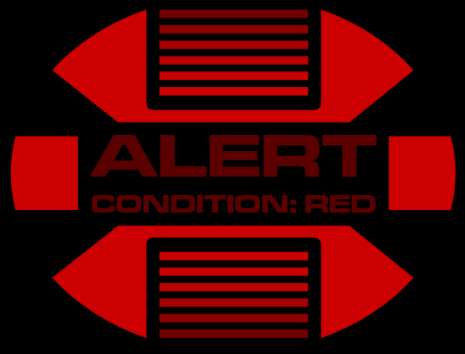
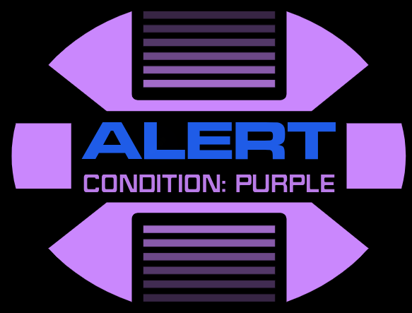

# CB-LCARS Animation: ALERT

ALERT provides a highly customizable animated alert symbol for LCARS.  Supporting dynamic presets (aka alert conditions,) colours, text, and animation settings and more.


This template renders an animated alert symbol with configurable options like text, colours, animation settings, fonts, etc

It supports both built-in and user-defined presets - and even dynamic preset selection based on entity state or attribute.  This allows you to have a dynamic alert configuration that is responsive to your smart home devices.


---

## Configuration

### Basic Usage

```yaml
type: custom:button-card
template:
  - cb-lcars-animation-alert
variables:
  animation:
    alert:
      preset: condition_red
      alert_text: "ALERT"
      sub_text: "Critical!"
```

---

## Variables Reference

All variables are set under `variables.animation.alert`

| Variable                | Type      | Default         | Description                                             |
|-------------------------|-----------|-----------------|---------------------------------------------------------|
| `preset`                | string    | `default`       | Name of alert preset to use (see below)                 |
| `alert_text`            | string    | `alert`         | Main alert text (top line)                              |
| `sub_text`              | string    | `condition`     | Subtext below the main alert text                       |
| `size`                  | string    | `standard`      | Alert symbol size: `standard` or `condensed`            |
| `padding`               | object    | `{}`            | Padding for the SVG container (top, right, bottom, left)|
| `enable_bar_animation`  | bool      | `true`          | Enable animated bars effect                             |
| `animation_duration`    | number    | `2`             | Duration of bar animation (seconds)                     |
| `enable_blink`          | bool      | `true`          | Enable blinking effect for text                         |
| `blink_duration`        | number    | `4`             | Duration of blink animation (seconds)                   |
| `blink_delay`           | number    | `2`             | Delay before blink animation starts (seconds)           |
| `color`                 | object    | `{}`            | Colour settings for bars and shape (see below)          |
| `text`                  | object    | `{}`            | Text style settings for `alert_text` and `sub_text` (see below)  |
| `custom_alert_presets`  | object    | `{}`            | User-defined alert presets (see below)                  |
| `alert_presets`         | object    | `{}`            | Built-in alert presets (see below)                      |
| `range`                 | object    | `{}`            | Range-based dynamic preset selection (see below)        |
| **Advanced/Internal Use**   |       |                 |                                                         |
| `black_box_x`           | number    | `18`            | X position of the text background box                   |
| `black_box_y`           | number    | `37`            | Y position of the text background box                   |
| `black_box_width`       | number    | `64`            | Width of the text background box                        |
| `black_box_height`      | number    | `32`            | Height of the text background box                       |
| `alert_text_box_height` | number    | `18`            | Height of the main alert text box                       |
| `sub_text_box_height`   | number    | `14`            | Height of the subtext box                               |
| `text_box_gap`          | number    | `4`             | Gap between alert text and subtext                      |

---

## Colour Options (`color`)

Variables under `variables.animation.alert.color`

| Variable         | Type   | Default                    | Description                       |
|------------------|--------|----------------------------|-----------------------------------|
| `bars.default`   | string | `var(--lcars-ui-primary)`  | Colour for animated bars           |
| `bars.animation_base` | string | `var(--lcars-ui-quaternary)` | Base colour for bar animation  |
| `bars.animation_flash`| string | `var(--lcars-alert-blue)`     | Flash colour for bar animation |
| `shape.default`  | string | `var(--lcars-ui-primary)`  | Colour for alert shape             |

---

## Text Style Options (`text`)

Variables under `variables.animation.alert.text.alert_text` and `sub_text`

| Variable         | Type   | Default                    | Description                       |
|------------------|--------|----------------------------|-----------------------------------|
| `font_size`      | number | `14` (alert), `6` (sub)    | Font size                         |
| `font_weight`    | number | `500` (alert), `200` (sub) | Font weight                       |
| `font_family`    | string | see code                   | Font family                       |
| `align`          | string | `center`                   | Text alignment: `left`, `center`, `right` |
| `transform`      | string | `uppercase`                | Text transform (e.g., uppercase)  |
| `stretch`        | bool   | `true` (alert), `false` (sub) | Stretch text to fit box        |
| `color.default`  | string | see code                   | Text colour                       |

---

## Presets

You can use built-in presets or define your own under `custom_alert_presets`. Presets can override any variable, including colours and text.

**Built-in presets include:**
- `condition_red`
- `condition_blue`
- `condition_green`
- `condition_yellow`
- `condition_grey`
- `condition_black`

Example:
```yaml
variables:
  animation:
    alert:
      preset: condition_blue
```

**Custom preset example:**
```yaml
variables:
  animation:
    alert:
      custom_alert_presets:
        my_custom:
          alert_text: "MY ALERT"
          color:
            bars:
              default: var(--lcars-orange)
              animation_flash: var(--lcars-yellow)
            shape:
              default: var(--lcars-orange)
```

---

## Dynamic Preset Selection (`range`)

You can select a preset dynamically based on an entity's state or attribute value using the `range` option.
For convenience, `brightness` attribute will automatically be converted from `0-255` to `0-100%`
For string values, you can use the `equals` operator to match.

Operators:

- `from:`
- `to:`
- `equals:`

Example:
```yaml
variables:
  animation:
    alert:
      range:
        enabled: true
        ranges:
          - equals: 0
            preset: condition_gray
          - from: 1
            to: 50
            preset: condition_green
          - from: 50
            to: 80
            preset: condition_yellow
          - from: 80
            to: 100
            preset: condition_red
```

---

## Example Configurations

1. Use a builtin preset (`condition_red` for Red Alert)



```yaml
type: custom:button-card
template:
  - cb-lcars-animation-alert
variables:
  animation:
    alert:
      preset: condition_red
```


2. Manually specify the default settings (do not use a preset)


```yaml
type: custom:button-card
template:
  - cb-lcars-animation-alert
variables:
  animation:
    alert:
      color:
        shape:
          default: var(--lcars-african-violet)
        bars:
          animation_base: var(--lcars-african-violet)
          animation_flash: var(--lcars-alert-blue)
      text:
        alert_text:
          stretch: true
          font_family: cb-lcars_microgramma
          color:
            default: var(--lcars-alert-blue)
        sub_text:
          stretch: false
          font_family: cb-lcars_jeffries
          color:
            default: var(--lcars-african-violet)
      sub_text: "condition: purple"
      enable_bar_animation: true
      animation_duration: 4
      enable_blink: true
      blink_duration: 3
```


3. Customize properties of a builtin preset


```yaml
type: custom:button-card
template:
  - cb-lcars-animation-alert
variables:
  animation:
    alert:
      preset: condition_black
      custom_alert_presets:
        condition_black:
          alert_text: black
          sub_text: alert
          text:
            alert_text:
              font_size: 12
            sub_text:
              font_size: 10
```

4. Provide your own preset(s)


```yaml
type: custom:button-card
template:
  - cb-lcars-animation-alert
variables:
  animation:
    alert:
      preset: my_condition
      custom_alert_presets:
        my_condition:
          alert_text: alert
          sub_text: critical
          text:
            alert_text:
              color:
                default: var(--picard-light-blue)
            sub_text:
              color:
                default: var(--picard-orange)
          color:
            shape:
              default: var(--picard-blue)
            bars:
              animation_base: var(--picard-moonlight)
              animation_flash: var(--picard-orange)
          animation_duration: 1
          blink_duration: 1
```

---

## File Location


---

## See Also

- CB-LCARS [README](../README.md)
- Other Animation Templates

---

**Tip:** For advanced usage, refer to the comments and code in the YAML file for further customization options.
