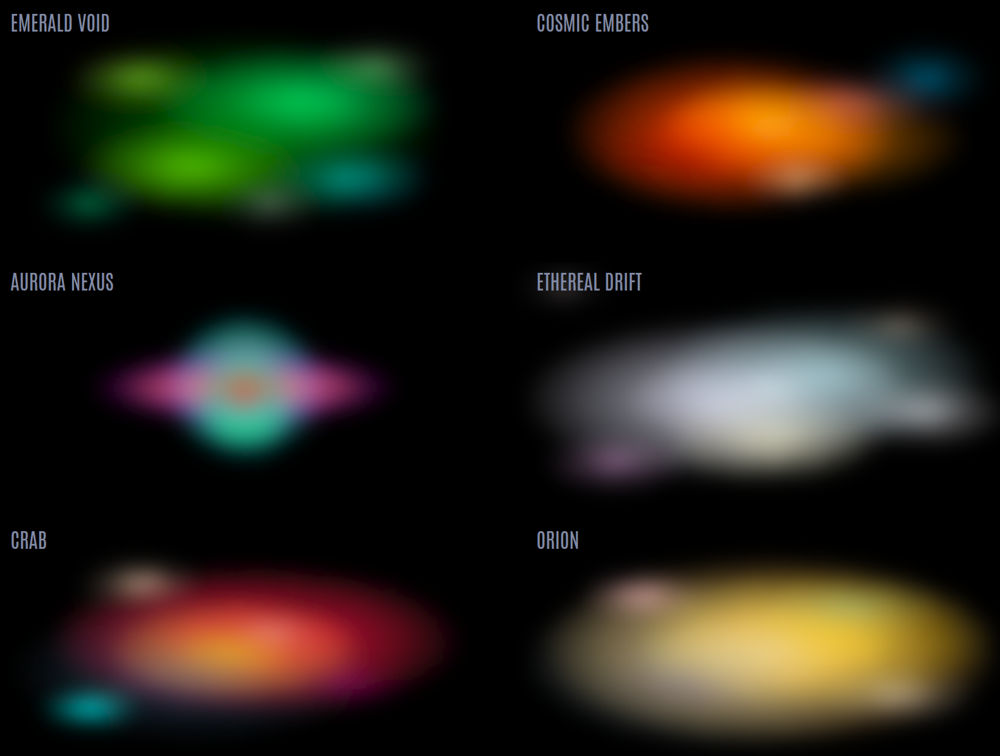

# CB-LCARS Animation: GRID

GRID is a highly customizable animated background supporting multiple foreground and background styles including grids, honeycombs, starfields, nebula effects, and much more.

---

## Overview

This template provides a flexible multi-layered animation for the card's background.

Both the foreground and background layers support independent animation styles such as scrolling or zooming.

The forground layer (GRID), supports rectangular, hexagonal, diagonal, and the "bracket" grid patterns.
The background layer supports animated backgrounds such as starfields and nebulae.

Here is an example that utilized the bracket-style for the grid layer, and the starfield for the background layer.  A symbiont card was added to get the additional nebula layer effect.


<details closed><summary>Example's YAML</summary>

```yaml
type: custom:cb-lcars-elbow-card
cblcars_card_type: cb-lcars-header
template:
  - cb-lcars-animation-bg-grid
enable_resize_observer: true
show_label: true
styles:
  name:
    - z-index: 4
  label:
    - z-index: 4
variables:
  label: CB-LCARS
  text:
    label:
      justify: center
      align_items: center
      color:
        default: var(--picard-light-blue)
      font_size: "48"
      padding:
        top: 0
        bottom: 30
        left: 0
        right: 0
      font_weight: 300
    name:
      font_size: "18"
      font_weight: 200
      justify: center
      align_items: center
      padding:
        top: 44
        right: 0
        left: 0
        bottom: 0
      color:
        default: var(--picard-light-yellow)
  animation:
    bg_grid:
      grid:
        preset: bracket
        bracket_width: 5
        bracket_gap: 33
        bracket_height: 43
        bracket_color: var(--picard-yellow)
        bracket_fill: none
        bracket_radius: 7
      background_pattern: stars
      stars:
        count: 150
        color:
          - var(--picard-black-cherry)
          - var(--picard-dark-blue)
          - var(--picard-moonlight)
        max_radius: 0.5
      background_zoom:
        scale_to: 5
        layers: 6
        opacity_fade_in: 17
        opacity_fade_out: 95
      background_speed: 3
      background_effect: zoom
      grid_effect: zoom
      grid_zoom:
        scale_to: 3
        layers: 3
        opacity_fade_out: 15
        opacity_fade_in: 5
      grid_speed: 8
  card:
    color:
      default: var(--picard-dark-gray)
    border:
      top:
        left_radius: 0
        size: 15
      left:
        size: 110
      right:
        size: 110
      bottom:
        size: 15
  symbiont:
    enabled: true
show_name: true
name: Cards for Home Assistant
custom_fields:
  symbiont:
    card:
      type: custom:cb-lcars-elbow-card
      template:
        - cb-lcars-animation-bg-grid
      cblcars_card_type: cb-lcars-header-open
      enable_resize_observer: true
      show_label: false
      variables:
        animation:
          bg_grid:
            grid:
              preset: none
            background_pattern: nebula
            nebula:
              blur: true
              blur_level: 4
              nebula_effect: true
              animate: true
              animation_duration: 3
              preset: cosmic_embers
            background_effect: zoom
            background_zoom:
              scale_to: 1.6
              scale_from: 0.5
              layers: 1
            background_speed: 10
            grid_speed: 0
            color:
              fill: transparent
        card:
          border:
            left:
              size: 0
            right:
              size: 0
            top:
              size: 0
          color:
            background:
              default: transparent
```
</details>
---

## Configuration

### Basic Usage

```yaml
type: custom:button-card
template:
  - cb-lcars-animation-bg-grid
variables:
  animation:
    bg_grid:
      # ...your customizations here...
```

---

### Bracket Grid Options (`grid` with `preset: bracket`)

| Variable           | Type    | Default                        | Description                                      |
|--------------------|---------|--------------------------------|--------------------------------------------------|
| `bracket_width`    | number  | `5`                            | Width of bracket lines (%)                      |
| `bracket_radius`   | number  | `7`                            | Corner radius for brackets (px)                  |
| `bracket_color`    | string  | `var(--lcars-yellow)`          | Bracket line color                               |
| `bracket_gap`      | number  | `35`                           | Gap from edge to bracket (%)                    |
| `bracket_fill`     | string  | `rgba(128,128,128,0.08)`       | Fill color between brackets                      |
| `bracket_height`   | number  | `20`                           | Height of brackets (%)                          |

> **Note:** These options are only used when `preset: bracket` is set in the `grid` configuration.

---

## Variables Reference

All variables are set under `variables.animation.bg_grid`.

### Top-Level Options

| Variable                | Type      | Default         | Description                                                                                 |
|-------------------------|-----------|-----------------|---------------------------------------------------------------------------------------------|
| `direction`             | string    | `left`          | Animation direction: `left`, `right`, `up`, `down`                                          |
| `speed`                 | number    | `30`            | Default animation speed (seconds) for scroll/zoom                                           |
| `background_pattern`    | string    | `none`          | Background pattern: `none`, `stars`, `nebula`, `fill`                                       |
| `background_effect`     | string    | `auto`          | Animation effect for background: `auto`, `scroll`, `zoom`, `none`                           |
| `background_speed`      | number    | `null`          | Speed for background animation (overrides global `speed`)                                   |
| `background_zoom`       | object    | `{}`            | Zoom animation config for background (see below)                                            |
| `grid_effect`           | string    | `auto`          | Animation effect for grid: `auto`, `scroll`, `zoom`, `none`                                 |
| `grid_speed`            | number    | `null`          | Speed for grid animation (overrides global `speed`)                                         |
| `grid_zoom`             | object    | `{}`            | Zoom animation config for grid (see below)                                                  |

---

### Grid Options (`grid`)

| Variable             | Type    | Default | Description                                      |
|----------------------|---------|---------|--------------------------------------------------|
| `num_major_rows`     | number  | `3`     | Number of major rows                             |
| `num_minor_rows`     | number  | `3`     | Minor rows between major rows                    |
| `num_major_cols`     | number  | `3`     | Number of major columns                          |
| `num_minor_cols`     | number  | `3`     | Minor columns between major columns              |
| `line_width_major`   | number  | `4`     | Stroke width for major grid lines                |
| `line_width_minor`   | number  | `1`     | Stroke width for minor grid lines                |
| `border_lines`       | bool    | `true`  | Show border lines                                |
| `preset`             | string  | `rect`  | Grid pattern: `rect`, `hex`, `diagonal`, `bracket`|
| `hex_radius`         | number  | auto    | (Hex grid) Radius of hexagons                    |

See [Bracket Grid Options](#bracket-grid-options-grid-with-preset-bracket) for additional options when using `preset: bracket`.

---

### Colour Options (`color`)

| Variable   | Type   | Default                    | Description                       |
|------------|--------|----------------------------|-----------------------------------|
| `line`     | string | `var(--picard-dark-gray)`  | Colour for grid lines             |
| `fill`     | string | `transparent` or user-set  | Fill colour for grid cells        |

---

### Starfield Options (`stars`)

| Variable         | Type    | Default | Description                                 |
|------------------|---------|---------|---------------------------------------------|
| `count`          | number  | `150`   | Number of stars                             |
| `seed`           | number  | `1`     | Seed for random star placement              |
| `min_radius`     | number  | `0.2`   | Minimum star radius                         |
| `max_radius`     | number  | `0.9`   | Maximum star radius                         |
| `min_brightness` | number  | `0.2`   | Minimum star brightness (opacity)           |
| `max_brightness` | number  | `1.0`   | Maximum star brightness (opacity)           |
| `pattern_width`  | number  | `200`   | Width of star pattern tile                  |
| `pattern_height` | number  | `200`   | Height of star pattern tile                 |
| `color`          | string/array | `#fff` | Colour(s) for stars (hex, rgb, CSS var)      |

---

### Nebula Options (`nebula`)

| Variable             | Type    | Default   | Description                                                      |
|----------------------|---------|-----------|------------------------------------------------------------------|
| `preset`             | string  | `default` | Name of nebula preset (see `nebula_presets`)                     |
| `nebula_effect`      | bool    | `true`    | Enable SVG turbulence/displacement effect                        |
| `base_frequency`     | number  | `1`       | Turbulence base frequency                                        |
| `num_octaves`        | number  | `3`       | Turbulence octaves                                               |
| `scale`              | number  | `40`      | Displacement scale                                               |
| `seed`               | number  | `2`       | Turbulence seed                                                  |
| `blur`               | bool    | `true`    | Apply Gaussian blur                                              |
| `blur_level`         | number  | `8`       | Blur strength (stdDeviation for blur)                            |
| `animate`            | bool    | `true`    | Animate turbulence                                               |
| `animation_duration` | number  | `20`      | Animation duration (seconds)                                     |

#### Nebula Layers (`nebula_layers`)
- Array of custom nebula layer objects (used if `preset: custom`):
  - `color`: string (hex/rgb/CSS var)
  - `cx`: number (center x, 0-100)
  - `cy`: number (center y, 0-100)
  - `rx`: number (x radius)
  - `ry`: number (y radius)
  - `opacity_stops`: array (e.g. `[1, 0.3, 0]`)

#### Nebula Presets (`nebula_presets`)
- Object mapping preset names to arrays of nebula layer objects (see above for structure).
- Presets included: `orion`, `crab`, `cosmic_embers`, `iridescent_drift`, `emerald_void`, `ethereal_drift`, `aurora_nexus`.

---

### Zoom Animation Options (`background_zoom`, `grid_zoom`)

| Variable           | Type    | Default | Description                                      |
|--------------------|---------|---------|--------------------------------------------------|
| `layers`           | number  | `3`     | Number of zoom layers                            |
| `scale_from`         | number  | `1`     | Initial scale factor for zoom                      |
| `scale_to`         | number  | `2`     | Final scale factor for zoom                      |
| `speed`            | number  | `speed` | Animation duration (seconds)<br>Defaults to global `speed`                  |
| `opacity_fade_in`  | number  | `10`    | % of animation for fade-in                       |
| `opacity_fade_out` | number  | `80`    | % of animation for fade-out                      |

---

## Example Configurations

### Example 1: Animated Nebula with Zoom

```yaml
type: custom:button-card
template:
  - cb-lcars-animation-bg-grid
variables:
  animation:
    bg_grid:
      direction: right
      speed: 20
      background_pattern: nebula
      background_effect: zoom
      background_zoom:
        layers: 4
        scale_to: 2.5
        speed: 30
      grid_effect: scroll
      grid_speed: 15
      grid:
        num_major_rows: 4
        num_minor_rows: 2
        num_major_cols: 4
        num_minor_cols: 2
        line_width_major: 3
        line_width_minor: 1
        border_lines: true
        preset: hex
        hex_radius: 18
      color:
        line: var(--picard-yellow)
        fill: var(--picard-dark-gray)
      nebula:
        preset: orion
        nebula_effect: true
        base_frequency: 0.8
        num_octaves: 4
        scale: 50
        seed: 5
        blur: true
        blur_level: 8
        animate: true
        animation_duration: 25
```

### Example 2: Animated Starfield with Bracket Grid

```yaml
type: custom:button-card
template:
  - cb-lcars-animation-bg-grid
variables:
  animation:
    bg_grid:
      direction: left
      speed: 25
      background_pattern: stars
      background_effect: scroll
      grid_effect: scroll
      grid:
        preset: bracket
        bracket_width: 8
        bracket_radius: 16
        bracket_color: var(--lcars-orange)
        bracket_gap: 40
        bracket_fill: rgba(255,179,0,0.15)
        bracket_height: 60
      color:
        line: var(--picard-dark-gray)
        fill: var(--picard-black)
      stars:
        count: 200
        seed: 42
        min_radius: 0.3
        max_radius: 1.2
        color: [#fff, #ffd700, #add8e6]
```

---

## Grid Presets

- **rect** (default): Standard grid with major/minor lines.
- **hex**: Honeycomb pattern, with major/minor hexes.
- **diagonal**: Hatched/diagonal lines.
- **bracket**: LCARS-style brackets at left/right edges.

---

## Background Patterns

- **none**: No background, just grid.
- **stars**: Animated starfield (customizable).
- **nebula**: Animated nebula clouds (customizable, supports presets and custom layers).
- **fill**: Solid fill colour.

---

## Nebula: Custom Layers

You can define your own nebula effect by specifying `preset: custom` and providing an array of `nebula_layers`. Each layer is an object describing an ellipse and its color/opacity stops.

### Custom Nebula Layers Example

```yaml
type: custom:button-card
template:
  - cb-lcars-animation-bg-grid
variables:
  animation:
    bg_grid:
      background_pattern: nebula
      nebula:
        preset: custom
        nebula_layers:
          - color: "#ff69b4"
            cx: 50
            cy: 40
            rx: 40
            ry: 25
            opacity_stops: [1, 0.5, 0]
          - color: "var(--lcars-cyan)"
            cx: 60
            cy: 60
            rx: 30
            ry: 18
            opacity_stops: [0.8, 0.3, 0]
          - color: "#fff"
            cx: 40
            cy: 55
            rx: 15
            ry: 10
            opacity_stops: [0.5, 0]
        nebula_effect: true
        blur: true
        blur_level: 10
        animate: true
        animation_duration: 18
```

**nebula_layers fields:**
- `color`: Fill color (hex, rgb, or CSS var)
- `cx`, `cy`: Center position (0-100, as % of width/height)
- `rx`, `ry`: Radii (ellipse size, in % of width/height)
- `opacity_stops`: Array of opacity values (e.g. `[1, 0.3, 0]`).
  Each value represents the opacity at a specific percentage along the gradient or animation:
  - The first value is the opacity at the center (0%),
  - The last value is the opacity at the edge (100%),
  - Any values in between are distributed evenly.
  This allows you to control how the nebula fades from the center outward, or over the course of the animation.

You can add as many layers as you like for complex nebula effects.

---

## Animation Effects

- **scroll**: Infinite scrolling effect (directional).
- **zoom**: Infinite zoom effect (multiple layers).
- **none**: Static background/grid.

---

## Advanced

- Both grid and background can be animated independently.
- All colours support CSS variables for theme integration.
- Nebula and starfield backgrounds are fully customizable and tile seamlessly.
- Bracket grid supports custom color, fill, and sizing.

---

## Presets

Several nebula presets are included (`orion`, `crab`, `cosmic_embers`, `iridescent_drift`, `emerald_void`, `ethereal_drift`, `aurora_nexus`). You can also define your own custom nebula layers (see [Nebula: Custom Layers](#nebula-custom-layers)).


---

## File Location


---

## See Also

- CB-LCARS 
- Other Animation Templates

---

**Tip:** For more advanced usage, refer to the comments and code in the YAML file for further customization options.