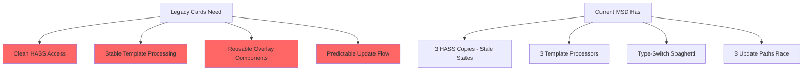

After deep analysis of all proposals and current state, here's my **comprehensive strategic recommendation**:

---

## 🎯 **EXECUTIVE SUMMARY: Feature Freeze + Aggressive Refactor**

**Recommendation: APPROVE THE AGGRESSIVE REFACTOR PATH**

**Why:**
1. You're **unreleased** - no users to break
2. Current architecture has **3-4 competing mechanisms** for same operations
3. HASS freshness issues are **root cause** of multiple bugs
4. Scattered code makes **any new feature painful**
5. Legacy card migration **requires** clean architecture

**Timeline:** 4-6 weeks total cleanup → then feature development

---

## 📊 **CRITICAL REALIZATION**

Your two new proposals (legacy card migration) **cannot succeed** on current architecture because:



**If you try to migrate legacy cards to current MSD:**
- ❌ They'll inherit HASS staleness bugs
- ❌ Template processing will be inconsistent
- ❌ Overlay updates will have race conditions
- ❌ Every new card type adds to type-switch mess

**You MUST fix architecture FIRST.**

---

## 🏗️ **UNIFIED ROADMAP: Architecture First, Then Features**

### **Phase 0: Feature Freeze + Remove Dead Code (3 days)**

#### **Goal:** Clean slate before refactor

```yaml
tasks:
  - name: "Remove sparkline/historybar overlays"
    files:
      - src/msd/overlays/SparklineOverlayRenderer.js (DELETE)
      - src/msd/overlays/HistoryBarOverlayRenderer.js (DELETE)
      - ModelBuilder subscription code for sparkline (DELETE)
    test: "Verify no broken references"

  - name: "Remove deprecated methods"
    files:
      - SystemsManager._updateTextOverlaysForDataSourceChanges (DELETE)
      - AdvancedRenderer legacy update methods (MARK DEPRECATED)
    test: "No functional changes"

  - name: "Document current state"
    deliverable: "Architecture debt document (already created above)"
```

**Outcome:** Clean codebase, documented technical debt

---

### **Phase 1: HASS Architecture Fix (1 week) 🔥 CRITICAL**

#### **Goal:** Single source of truth for HASS - fixes root cause

```javascript
// NEW: SystemsManager HASS management (REPLACES 3 copies)
export class SystemsManager {
  constructor() {
    this._hass = null; // SINGLE source of truth
  }

  ingestHass(hass) {
    this._hass = hass;
    this._propagateHassToSystems(hass); // Immediate, ordered propagation
  }

  _propagateHassToSystems(hass) {
    // ORDER MATTERS:
    // 1. DataSourceManager (provides entity values)
    if (this.dataSourceManager) {
      this.dataSourceManager.ingestHass(hass);
    }

    // 2. RulesEngine (evaluates conditions)
    if (this.rulesEngine) {
      this.rulesEngine.ingestHass(hass);
    }

    // 3. Controls (direct HASS access)
    if (this.controlsRenderer) {
      this.controlsRenderer.setHass(hass);
    }

    // 4. Overlays update automatically via DataSource subscriptions
  }

  getHass() {
    return this._hass; // Single getter, always fresh
  }
}
```

**Files to modify:**

```yaml
SystemsManager.js:
  REMOVE:
    - _originalHass (line 15)
    - _currentHass (line 16)
    - _previousRuleStates (line 17)
    - _createEntityChangeHandler (lines 420-670) # 250-line monster
    - setupDirectHassSubscription (lines 200-250)
    - All setTimeout delays (10ms, 25ms hacks)

  ADD:
    - _hass (single source)
    - ingestHass(hass) (simple propagation)
    - _propagateHassToSystems(hass) (ordered updates)

DataSourceManager.js:
  ADD:
    - ingestHass(hass) method
    - Track entity_id → source mappings

RulesEngine.js:
  ADD:
    - ingestHass(hass) method
    - _findAffectedRules(hass) (smart dirty tracking)
```

**Tests:**
```yaml
- name: "HASS propagation order"
  test: "DataSourceManager updates before RulesEngine"

- name: "No stale HASS"
  test: "Controls always see latest state"

- name: "No update delays"
  test: "All updates complete in same tick"
```

**Outcome:**
- ✅ Single HASS source
- ✅ No race conditions
- ✅ No stale states
- ✅ ~400 lines removed

---

### **Phase 2: Template Processing Consolidation (3 days)**

#### **Goal:** Single template processor for all overlays

```javascript
// NEW: src/msd/utils/TemplateProcessor.js
export class TemplateProcessor {
  static TEMPLATE_REGEX = /\{([^}:]+)(?::([^}]+))?\}/g;

  /**
   * Extract DataSource references from content
   * @param {string} content - Content with {datasource.path} templates
   * @returns {Array<string>} DataSource IDs referenced
   */
  static extractReferences(content) {
    const refs = new Set();
    const matches = content.matchAll(this.TEMPLATE_REGEX);

    for (const match of matches) {
      const path = match[1].trim();
      const sourceId = path.split('.')[0]; // Get datasource ID
      refs.add(sourceId);
    }

    return Array.from(refs);
  }

  /**
   * Process template string with DataSource values
   * @param {string} content - Template content
   * @param {DataSourceManager} dsManager - DataSource manager
   * @returns {string} Processed content
   */
  static processTemplate(content, dsManager) {
    return content.replace(this.TEMPLATE_REGEX, (match, path, format) => {
      const [sourceId, ...pathParts] = path.split('.');
      const source = dsManager.getDataSource(sourceId);

      if (!source) return match; // Keep original if not found

      let value = source.getValue(pathParts.join('.'));
      return format ? this.formatValue(value, format) : value;
    });
  }

  /**
   * Format value according to format specifier
   * @param {*} value - Value to format
   * @param {string} format - Format specifier (e.g., ".1f", "°C")
   * @returns {string} Formatted value
   */
  static formatValue(value, format) {
    // Decimal precision: ".2f" → 2 decimal places
    const precisionMatch = format.match(/^\.(\d+)f$/);
    if (precisionMatch) {
      return Number(value).toFixed(parseInt(precisionMatch[1]));
    }

    // Unit suffix: "°C", "kW", etc.
    if (format.startsWith('°') || /^[a-zA-Z]+$/.test(format)) {
      return `${value}${format}`;
    }

    return String(value);
  }
}
```

**Replace usage in:**

```yaml
AdvancedRenderer.js:
  REMOVE: _processTextTemplate (lines 900-950)
  REPLACE_WITH: TemplateProcessor.processTemplate

BaseOverlayUpdater.js:
  REMOVE: _contentReferencesChangedDataSources (lines 150-200)
  REPLACE_WITH: TemplateProcessor.extractReferences

ModelBuilder.js:
  REMOVE: _extractDataSourceReferences (lines 320-350)
  REPLACE_WITH: TemplateProcessor.extractReferences
```

**Tests:**
```yaml
- name: "Template extraction"
  input: "Temp: {temp.value:.1f}°C"
  expect_refs: ["temp"]

- name: "Template processing"
  input: "Power: {power.current:.2f}kW"
  expect_output: "Power: 3.45kW"

- name: "Format specifiers"
  test_cases:
    - format: ".1f" → "3.4"
    - format: ".2f" → "3.45"
    - format: "°C" → "23°C"
```

**Outcome:**
- ✅ Single template implementation
- ✅ Consistent behavior everywhere
- ✅ ~300 lines removed
- ✅ Format specifiers work in all contexts

---

### **Phase 3: Overlay Runtime API Foundation (1 week)**

#### **Goal:** Instance-based overlays with clean lifecycle

```javascript
// NEW: src/msd/overlays/OverlayBase.js
import { BaseRenderer } from '../renderer/BaseRenderer.js';
import { TemplateProcessor } from '../utils/TemplateProcessor.js';

export class OverlayBase extends BaseRenderer {
  constructor(overlay, systemsManager) {
    super(systemsManager.themeManager);
    this.overlay = overlay;
    this.systems = systemsManager;
    this.element = null;
    this._subscriptions = [];
    this._animationScope = null;
  }

  /**
   * Initialize overlay instance
   * Called once when overlay is first created
   * @param {Element} mountEl - Mount element (shadowRoot)
   */
  async initialize(mountEl) {
    this.mountEl = mountEl;

    // Extract DataSource references from overlay config
    const refs = this._extractDataSourceReferences();

    // Subscribe to each DataSource
    for (const sourceId of refs) {
      this._registerSubscription(
        this.systems.dataSourceManager.subscribe(
          sourceId,
          this._onDataUpdate.bind(this)
        )
      );
    }

    // Create animation scope if needed
    if (this.overlay.animations) {
      this._animationScope = window.cblcars.anim.createScope();
    }
  }

  /**
   * Render overlay (returns markup string)
   * @param {Object} overlay - Overlay config
   * @param {Object} anchors - Available anchors
   * @param {Array} viewBox - ViewBox dimensions
   * @param {Element} svgContainer - SVG container element
   * @returns {string} SVG markup
   */
  render(overlay, anchors, viewBox, svgContainer) {
    throw new Error('Subclass must implement render()');
  }

  /**
   * Update overlay when data changes
   * @param {Element} overlayElement - DOM element to update
   * @param {Object} overlay - Updated overlay config
   * @param {Object} sourceData - Changed data
   * @returns {boolean} True if DOM was updated
   */
  update(overlayElement, overlay, sourceData) {
    throw new Error('Subclass must implement update()');
  }

  /**
   * Compute attachment points for line anchoring
   * @param {Object} overlay - Overlay config
   * @param {Object} anchors - Available anchors
   * @param {Element} container - Container element
   * @param {Array} viewBox - ViewBox dimensions
   * @returns {Object|null} Attachment points
   */
  computeAttachmentPoints(overlay, anchors, container, viewBox) {
    return null; // Override if overlay supports line attachment
  }

  /**
   * Cleanup overlay resources
   */
  destroy() {
    // Cleanup subscriptions
    this._cleanupSubscriptions();

    // Cleanup animations
    if (this._animationScope) {
      this._animationScope.destroy();
      this._animationScope = null;
    }

    this.element = null;
  }

  // Protected methods

  /**
   * Handle DataSource updates
   * @protected
   */
  _onDataUpdate(data) {
    if (this.element) {
      this.update(this.element, this.overlay, data);
    }
  }

  /**
   * Extract DataSource references from overlay config
   * @protected
   */
  _extractDataSourceReferences() {
    const refs = new Set();

    // Check source property
    if (this.overlay.source) {
      refs.add(this.overlay.source);
    }

    // Check template content
    if (this.overlay.content) {
      const templateRefs = TemplateProcessor.extractReferences(this.overlay.content);
      templateRefs.forEach(ref => refs.add(ref));
    }

    return Array.from(refs);
  }

  /**
   * Register subscription for cleanup
   * @protected
   */
  _registerSubscription(unsubscribe) {
    this._subscriptions.push(unsubscribe);
  }

  /**
   * Cleanup all subscriptions
   * @protected
   */
  _cleanupSubscriptions() {
    this._subscriptions.forEach(unsub => unsub());
    this._subscriptions = [];
  }
}
```

**Static Shim for Backward Compatibility:**

```javascript
// NEW: src/msd/overlays/OverlayAdapter.js
/**
 * Adapter that wraps static renderers to work with OverlayBase interface
 * Allows gradual migration without breaking existing overlays
 */
export class OverlayAdapter extends OverlayBase {
  constructor(overlay, systemsManager, staticRenderer) {
    super(overlay, systemsManager);
    this.staticRenderer = staticRenderer;
  }

  async initialize(mountEl) {
    await super.initialize(mountEl);
    // Static renderers don't need initialization
  }

  render(overlay, anchors, viewBox, svgContainer) {
    // Delegate to static renderer
    return this.staticRenderer.render(overlay, anchors, viewBox, svgContainer);
  }

  update(overlayElement, overlay, sourceData) {
    // Delegate to static renderer's update method
    if (this.staticRenderer.update) {
      return this.staticRenderer.update(overlayElement, overlay, sourceData);
    }
    return false;
  }

  computeAttachmentPoints(overlay, anchors, container, viewBox) {
    if (this.staticRenderer.computeAttachmentPoints) {
      return this.staticRenderer.computeAttachmentPoints(overlay, anchors, container, viewBox);
    }
    return null;
  }
}
```

**Update AdvancedRenderer:**

```javascript
// MODIFIED: src/msd/renderer/AdvancedRenderer.js

renderOverlay(overlay, anchors, viewBox, svgContainer) {
  const renderer = this._getOverlayRenderer(overlay.type);

  // Check if renderer is instance-based (extends OverlayBase)
  if (renderer instanceof OverlayBase) {
    // NEW PATH: Instance-based overlay
    if (!renderer.element) {
      const markup = renderer.render(overlay, anchors, viewBox, svgContainer);
      renderer.element = this._parseMarkupToElement(markup);
    }
    return renderer.element.outerHTML;
  } else {
    // OLD PATH: Static renderer (with shim)
    const adapter = new OverlayAdapter(overlay, this.systems, renderer);
    return adapter.render(overlay, anchors, viewBox, svgContainer);
  }
}
```

**Tests:**
```yaml
- name: "Instance overlay lifecycle"
  test: "initialize → render → update → destroy"

- name: "Static renderer compatibility"
  test: "Old renderers still work via adapter"

- name: "Subscription cleanup"
  test: "destroy() removes all subscriptions"
```

**Outcome:**
- ✅ Instance-based overlay foundation
- ✅ Backward compatible via static shim
- ✅ Clean lifecycle management
- ✅ Ready for overlay migration

---

### **Phase 4: Migrate Core Overlays (1 week)**

#### **Goal:** Convert 3 overlays to prove pattern

**Priority Order:**
1. **TextOverlay** (simplest, most common)
2. **ButtonOverlay** (interactive, tests event handling)
3. **StatusGridOverlay** (complex, tests grid layout)

**Example: TextOverlay Migration**

```javascript
// NEW: src/msd/overlays/TextOverlay.js
import { OverlayBase } from './OverlayBase.js';
import { TemplateProcessor } from '../utils/TemplateProcessor.js';

export class TextOverlay extends OverlayBase {
  render(overlay, anchors, viewBox, svgContainer) {
    const pos = this._resolvePosition(overlay.position, anchors, viewBox);
    const style = this._resolveStyle(overlay.style);

    // Process template content
    const content = TemplateProcessor.processTemplate(
      overlay.content,
      this.systems.dataSourceManager
    );

    return `
      <text
        id="${overlay.id}"
        x="${pos.x}"
        y="${pos.y}"
        ${this._styleToAttributes(style)}
      >${content}</text>
    `;
  }

  update(overlayElement, overlay, sourceData) {
    // Process template with fresh data
    const newContent = TemplateProcessor.processTemplate(
      overlay.content,
      this.systems.dataSourceManager
    );

    if (overlayElement.textContent !== newContent) {
      overlayElement.textContent = newContent;
      return true; // DOM changed
    }

    return false; // No change
  }

  computeAttachmentPoints(overlay, anchors, container, viewBox) {
    // Get text element bounding box
    const element = container.querySelector(`#${overlay.id}`);
    if (!element) return null;

    const bbox = element.getBBox();

    return {
      top: { x: bbox.x + bbox.width / 2, y: bbox.y },
      bottom: { x: bbox.x + bbox.width / 2, y: bbox.y + bbox.height },
      left: { x: bbox.x, y: bbox.y + bbox.height / 2 },
      right: { x: bbox.x + bbox.width, y: bbox.y + bbox.height / 2 },
      center: { x: bbox.x + bbox.width / 2, y: bbox.y + bbox.height / 2 }
    };
  }
}
```

**Remove from ModelBuilder:**

```yaml
ModelBuilder.js:
  REMOVE:
    - _subscribeTextOverlaysToDataSources (lines 280-310)
    - _subscribeTextOverlayToDataSource (lines 312-335)
    - All text overlay subscription logic
```

**Tests:**
```yaml
- name: "Text overlay renders"
  input: { content: "Temp: {temp.value:.1f}°C" }
  expect: "Temp: 23.4°C"

- name: "Text overlay updates"
  action: "Change temp.value"
  expect: "DOM updates with new value"

- name: "Attachment points"
  expect: "5 points (top, bottom, left, right, center)"
```

**Outcome:**
- ✅ 3 core overlays migrated
- ✅ Pattern validated
- ✅ Ready for remaining overlays

---

### **Phase 5: Complete Overlay Migration (1 week)**

#### **Goal:** Migrate all remaining overlays

**Remaining overlays:**
- ApexChartsOverlay
- LineOverlay
- StatusGridOverlay (if not done in Phase 4)
- ControlOverlay
- Any custom overlays

**For each overlay:**
1. Create `src/msd/overlays/{Type}Overlay.js`
2. Extend `OverlayBase`
3. Implement lifecycle methods
4. Move update logic from `BaseOverlayUpdater`
5. Update tests

**Remove deprecated code:**

```yaml
DELETE:
  - ModelBuilder._subscribeOverlaysToDataSources
  - ModelBuilder subscription methods
  - SystemsManager._createEntityChangeHandler (250 lines!)
  - BaseOverlayUpdater type-specific updaters
  - AdvancedRenderer.updateOverlayData switch statement

TOTAL CODE REMOVED: ~1200 lines
```

**Tests:**
```yaml
- name: "All overlays use OverlayBase"
  test: "No static renderers remain"

- name: "No duplicate subscriptions"
  test: "Each overlay subscribes exactly once"

- name: "Clean updates"
  test: "Single update path for all overlays"
```

**Outcome:**
- ✅ All overlays instance-based
- ✅ ~1200 lines removed
- ✅ Single update mechanism
- ✅ Architecture clean

---

### **Phase 6: Validation & Documentation (3 days)**

#### **Goal:** Ensure stability before feature work

**Validation:**
```yaml
- name: "Performance benchmarks"
  test: "Render time ≤ baseline"

- name: "Memory leaks"
  test: "No subscriptions leak"

- name: "HASS freshness"
  test: "Controls always see latest state"

- name: "Template processing"
  test: "Consistent across all overlays"

- name: "Update race conditions"
  test: "No duplicate updates"
```

**Documentation:**
```yaml
docs/architecture/:
  - hass-management.md (HASS propagation flow)
  - overlay-lifecycle.md (OverlayBase pattern)
  - template-processing.md (TemplateProcessor guide)
  - migration-guide.md (How to convert overlay to OverlayBase)

docs/tutorials/:
  - creating-overlays.md (Step-by-step overlay creation)
  - debugging-overlays.md (Common issues & solutions)
```

**Outcome:**
- ✅ Validated architecture
- ✅ Documented patterns
- ✅ Ready for feature work

---

## 🚀 **AFTER Cleanup: Feature Development Can Resume**

### **Now You Can Safely Do:**

#### **1. Appendix C (Global Alert System) - 1 week**
With clean architecture:
```yaml
rules:
  - id: red_alert
    condition: "{{ input_select.ship_alert == 'red_alert' }}"
    actions:
      - target: "all:"  # Bulk selector works cleanly
        patch:
          style:
            color: "var(--lcars-red)"
            animation: "pulse 1s infinite"
```

**Why it's now easy:**
- ✅ Single HASS source (no stale states)
- ✅ Rules evaluate consistently
- ✅ Overlays update via instance.update()
- ✅ No race conditions

---

#### **2. Proposal 01 (Statistics & Cache) - 1 week**
With clean architecture:
```javascript
// DataSourceManager now has single ingestion point
export class DataSourceManager {
  async loadHistoricalData(sourceId, range) {
    // Check cache first
    const cached = await this._checkCache(sourceId, range);
    if (cached) return cached;

    // Fetch statistics or history
    const data = await this._fetchData(sourceId, range);

    // Cache for next time
    await this._cacheData(sourceId, range, data);

    return data;
  }
}
```

**Why it's now easy:**
- ✅ Single data ingestion point
- ✅ No competing update paths
- ✅ Clean cache integration

---

#### **3. Proposal 02 (Advanced Charts) - 2 weeks**
With clean architecture:
```javascript
// Sankey overlay extends OverlayBase cleanly
export class SankeyOverlay extends OverlayBase {
  async initialize(mountEl) {
    await super.initialize(mountEl);

    // Lazy-load d3-sankey
    this.d3Sankey = await import('d3-sankey');

    // Initialize D3 simulation
    this._initializeSankey();
  }

  update(overlayElement, overlay, sourceData) {
    // Update sankey with new flow data
    this._updateSankeyData(sourceData);
    return true;
  }
}
```

**Why it's now easy:**
- ✅ Instance state for D3 simulations
- ✅ Clean lifecycle (initialize/update/destroy)
- ✅ No interference with other overlays

---

#### **4. Legacy Card Migration - 3 weeks**
With clean architecture:
```javascript
// Legacy cards can now cleanly use MSD components
export class ButtonCardMigration {
  constructor(config, hass) {
    // Use MSD's clean HASS management
    this.systemsManager = new SystemsManager();
    this.systemsManager.ingestHass(hass); // Always fresh

    // Use MSD's template processing
    this.content = TemplateProcessor.processTemplate(
      config.content,
      this.systemsManager.dataSourceManager
    );

    // Use MSD's overlay rendering
    this.overlay = new ButtonOverlay(config, this.systemsManager);
  }
}
```

**Why it's now possible:**
- ✅ Reusable components (not tightly coupled)
- ✅ Clean APIs (not internal spaghetti)
- ✅ No HASS staleness inherited
- ✅ Template processing works consistently

---

## 📋 **FINAL ROADMAP (Gantt-Style)**

```yaml
Phase 0: Feature Freeze + Dead Code Removal
  Duration: 3 days
  Dependencies: None
  Deliverables:
    - Sparkline/historybar removed
    - Deprecated methods removed
    - Architecture debt documented

Phase 1: HASS Architecture Fix 🔥
  Duration: 1 week
  Dependencies: Phase 0
  Deliverables:
    - Single HASS source
    - Ordered propagation
    - ~400 lines removed

Phase 2: Template Processing Consolidation
  Duration: 3 days
  Dependencies: Phase 1
  Deliverables:
    - TemplateProcessor utility
    - ~300 lines removed

Phase 3: Overlay Runtime API Foundation
  Duration: 1 week
  Dependencies: Phase 2
  Deliverables:
    - OverlayBase class
    - Static shim adapter
    - Lifecycle management

Phase 4: Migrate Core Overlays
  Duration: 1 week
  Dependencies: Phase 3
  Deliverables:
    - TextOverlay migrated
    - ButtonOverlay migrated
    - StatusGridOverlay migrated

Phase 5: Complete Overlay Migration
  Duration: 1 week
  Dependencies: Phase 4
  Deliverables:
    - All overlays migrated
    - ~1200 lines removed
    - Single update path

Phase 6: Validation & Documentation
  Duration: 3 days
  Dependencies: Phase 5
  Deliverables:
    - Performance validated
    - Architecture documented
    - Migration guide written

---

TOTAL DURATION: 4-6 weeks

THEN: Feature development resumes with clean foundation
```

---

## ✅ **DECISION MATRIX**

| Approach | Timeline | Risk | Code Quality | Feature Velocity After |
|----------|----------|------|--------------|------------------------|
| **Status Quo** | N/A | 🔴 High (bugs from tech debt) | 🔴 Poor (scattered) | 🔴 Slow (fighting architecture) |
| **Gradual Cleanup** | 6-8 weeks | 🟡 Medium | 🟡 Better | 🟡 Moderate |
| **Aggressive Refactor** | 4-6 weeks | 🟢 Low (unreleased) | 🟢 Excellent | 🟢 Fast |

---

## 🎯 **MY STRONG RECOMMENDATION**

**DO THE AGGRESSIVE REFACTOR** because:

1. ✅ **You're unreleased** - best time to break things
2. ✅ **Fixes root causes** - HASS staleness, race conditions, duplicate code
3. ✅ **Enables features** - Proposals 01, 02, Appendix C, legacy migration
4. ✅ **Faster timeline** - 4-6 weeks vs 6-8 weeks gradual
5. ✅ **Better end state** - clean architecture, maintainable code

**Feature freeze for 4-6 weeks is worth it** because:
- Current architecture blocks feature work anyway
- Every new feature adds to technical debt
- Legacy card migration requires clean foundation
- You'll move 10x faster afterward

---

## 🚨 **CONCRETE NEXT STEPS**

**Week 1 (Starting Monday):**
```bash
# Day 1-2: Remove dead code
- Delete sparkline/historybar
- Remove deprecated methods
- Commit: "Phase 0: Remove dead code"

# Day 3-5: HASS architecture fix
- Implement single HASS source in SystemsManager
- Update DataSourceManager.ingestHass()
- Update RulesEngine.ingestHass()
- Remove _originalHass, _currentHass, _createEntityChangeHandler
- Commit: "Phase 1: Fix HASS architecture"
```

**Week 2:**
```bash
# Day 1-2: Template processor
- Create TemplateProcessor.js
- Replace usage in 3 files
- Commit: "Phase 2: Consolidate template processing"

# Day 3-5: Overlay foundation
- Create OverlayBase.js
- Create OverlayAdapter.js (static shim)
- Update AdvancedRenderer
- Commit: "Phase 3: Add OverlayBase foundation"
```

**Week 3-4: Overlay migration**
**Week 5-6: Validation & docs**

---

## 💬 **QUESTIONS TO FINALIZE**

1. **Approve aggressive refactor?** (Yes/No/Modify)
2. **Approve feature freeze?** (4-6 weeks)
3. **Start with Phase 0 next week?** (Remove dead code)
4. **Who reviews PRs?** (Architecture changes need careful review)

**I recommend:**
- ✅ YES to aggressive refactor
- ✅ YES to feature freeze
- ✅ START Phase 0 Monday
- ✅ I can draft initial PRs for your review

**Shall I start with Phase 0 (dead code removal) PR?**