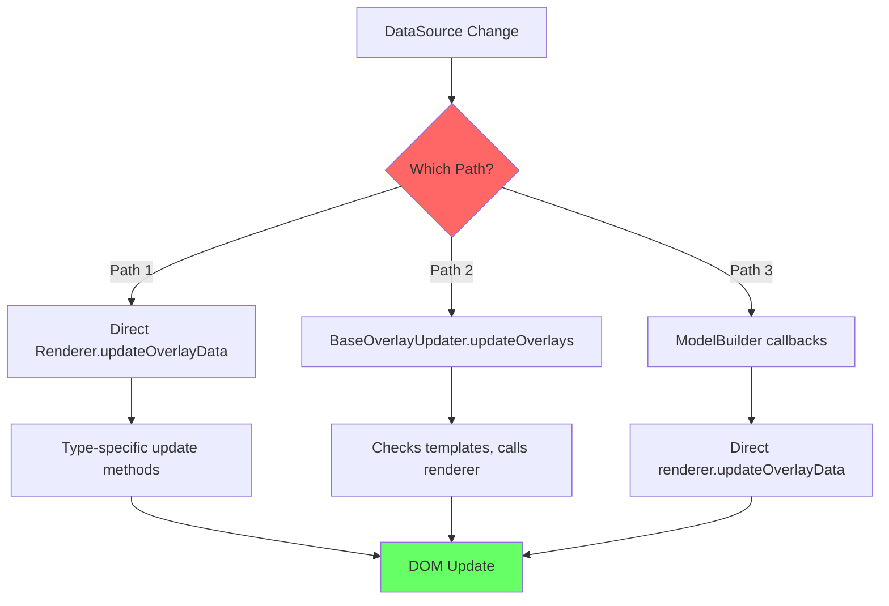
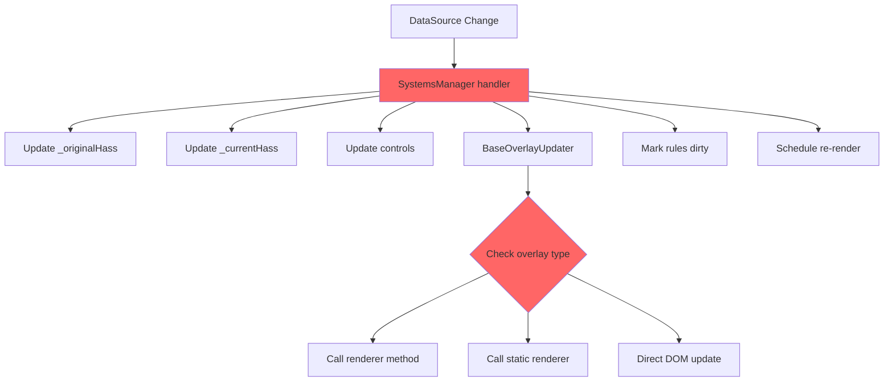
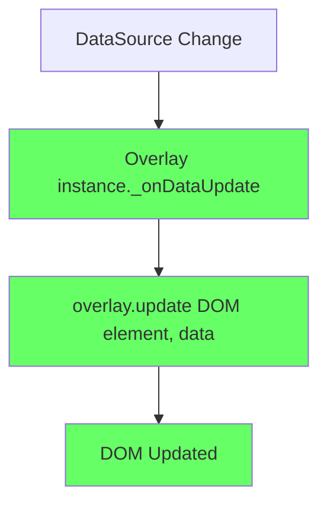

# MSD Codebase Analysis & Consolidation Report

After thoroughly reviewing the MSD codebase, I've identified significant architectural debt and scattered responsibilities that should be addressed. Here's my comprehensive assessment:

---

## 🔴 Critical Issues Found

### 1. **Triple-Implementation of DataSource Subscriptions**

**Current State: THREE competing subscription mechanisms**

#### **Location 1: ModelBuilder.js** (Lines 150-320)
```javascript
_subscribeOverlaysToDataSources(baseOverlays)      // For sparkline/ribbon
_subscribeTextOverlaysToDataSources(overlays)      // For text overlays
_subscribeTextOverlayToDataSource(overlayId, ref)  // Individual subscription
_extractDataSourceReferences(content)               // Template parsing
```

**Issues:**
- ❌ ModelBuilder shouldn't know DataSource subscription details
- ❌ Separate subscription paths for different overlay types
- ❌ Template extraction duplicated elsewhere
- ❌ Direct renderer calls bypass update pipeline

#### **Location 2: SystemsManager.js** (Lines 400-800)
```javascript
_createEntityChangeHandler()                        // 200+ line method
_updateTextOverlaysForDataSourceChanges()          // Text-specific (deprecated?)
_findDataSourceForEntity()                         // DataSource lookup
setupDirectHassSubscription()                      // HASS state monitoring
_checkIfRulesNeedReRender()                        // Rule evaluation logic
_checkThresholdCrossing()                          // Threshold detection
```

**Issues:**
- ❌ SystemsManager doing both orchestration AND update implementation
- ❌ Massive `_createEntityChangeHandler` (250 lines) with complex state tracking
- ❌ Multiple HASS update paths (original vs current vs working)
- ❌ Text overlay updates exist but seem unused?
- ❌ Threshold tracking scattered across methods

#### **Location 3: BaseOverlayUpdater.js** (Entire file - 600 lines)
```javascript
updateOverlaysForDataSourceChanges(changedIds)     // Entry point
_overlayReferencesChangedDataSources()             // Template detection
_overlayReferencesChangedEntities()                // Entity detection
_contentReferencesChangedDataSources()             // Template parsing
_hasTemplateContent()                              // Template detection
_hasAnyTemplateMarkers()                           // Marker detection
```

**Issues:**
- ❌ **Exists as parallel system but isn't primary update path**
- ❌ Template detection duplicated 4+ times in different forms
- ❌ Not connected to subscription flow properly
- ❌ Calls renderer methods directly instead of using instances

---

### 2. **Competing Update Paths**



**Result:** Same overlay can be updated via 3 different mechanisms!

---

### 3. **Template Processing Fragmentation**

#### **Implementation 1: AdvancedRenderer.js** (Line 900)
```javascript
_processTextTemplate(template) {
  // Handles {datasource.path:format} syntax
  const templateRegex = /\{([^}:]+)(?::([^}]+))?\}/g;
  // Nested value lookup
  // Number formatting
}
```

#### **Implementation 2: BaseOverlayUpdater.js** (Line 150)
```javascript
_contentReferencesChangedDataSources(content, changedIds) {
  const templateRegex = /\{([^}]+)\}/g;  // Different regex!
  // Entity name parsing
  // DataSource matching logic
}
```

#### **Implementation 3: ModelBuilder.js** (Line 320)
```javascript
_extractDataSourceReferences(content) {
  const regex = /\{([^}:]+)/g;  // Yet another regex!
  // Different DataSource detection approach
  // Different parsing rules
}
```

**Issues:**
- ❌ Three different regex patterns for same syntax
- ❌ Inconsistent template parsing rules
- ❌ Different DataSource resolution strategies
- ❌ Format specifier handling only in one place

---

### 4. **HASS State Management Confusion**

**SystemsManager.js has THREE HASS copies:**

```javascript
this._originalHass    // "Pristine copy for controls"
this._currentHass     // "Working copy for MSD internal processing"
this._previousRuleStates  // "Track rule states"
```

**Update flow is Byzantine:**

```javascript
// In _createEntityChangeHandler (line 420):
// STEP 1: Update original HASS
if (this._originalHass && this._originalHass.states) {
  const updatedStates = { ...this._originalHass.states };
  // Try METHOD 1: existing HASS state
  // Try METHOD 2: DataSource preserved state
  // Try METHOD 3: preserve with new timestamp
  this._originalHass = { ...this._originalHass, states: updatedStates };
}

// STEP 2: Update controls with FRESH CURRENT HASS
// (But direct subscription also updates controls?)

// STEP 3: Update MSD internal HASS with converted data
this._currentHass = { ...workingHass, states: { ...freshStates } };

// STEP 3.5: Update overlays via BaseOverlayUpdater
// (With 10ms delay "to ensure DataSource has processed")

// STEP 4: Mark rules dirty
// STEP 5: Force rule evaluation (with 25ms delay)
```

**Issues:**
- ❌ Multiple HASS update strategies compete
- ❌ Unclear which HASS copy is "source of truth" when
- ❌ Arbitrary delays (10ms, 25ms) to work around race conditions
- ❌ Direct HASS subscription bypasses internal updates

---

### 5. **Overlay Type-Specific Spaghetti**

#### **AdvancedRenderer.js** has separate methods for each type:
```javascript
_updateTextOverlayContent(overlayElement, overlay, sourceData)
// But also:
updateOverlayData(overlayId, sourceData) {
  switch(overlay.type) {
    case 'text': /* ... */
    case 'status_grid': /* ... */
    case 'button': /* ... */
    case 'apexchart': /* ... */
  }
}
```

#### **BaseOverlayUpdater.js** registers separate updaters:
```javascript
this.overlayUpdaters.set('text', { needsUpdate, update, hasTemplates });
this.overlayUpdaters.set('status_grid', { needsUpdate, update, hasTemplates });
this.overlayUpdaters.set('button', { needsUpdate, update, hasTemplates });
this.overlayUpdaters.set('apexchart', { needsUpdate, update, hasTemplates });
```

**Issues:**
- ❌ Type-specific logic in two places
- ❌ `switch` statements grow with each overlay type
- ❌ No polymorphic dispatch (type checks everywhere)
- ❌ Adding new overlay type requires edits to 3-4 files

---

## 📊 Quantified Technical Debt

| File | Lines | Methods | Responsibility Violations |
|------|-------|---------|---------------------------|
| **SystemsManager.js** | 1200+ | 35+ | 🔴 Orchestration + Update Logic + HASS Management |
| **BaseOverlayUpdater.js** | 600+ | 25+ | 🟡 Update logic but not primary path |
| **ModelBuilder.js** | 500+ | 15+ | 🔴 Model building + Subscriptions + Template parsing |
| **AdvancedRenderer.js** | 2500+ | 50+ | 🟡 Rendering + Updates + Template processing |

**Total overlapping code: ~1000 lines** (conservative estimate)

---

## 🎯 How Proposal 03 Fixes This

### **Before (Current Mess):**



### **After (Proposal 03):**



**Consolidation:**
- ✅ Overlay instances manage own subscriptions
- ✅ Single update path: `instance.update()`
- ✅ Polymorphic dispatch (no type checks)
- ✅ No HASS duplication (overlays get data via DataSourceManager)
- ✅ No template parsing in 3 places (once in OverlayBase)

---

## 🚨 Recommended Action Plan

### **Phase 0: Pre-Refactor (BEFORE Proposal 03) - 1 Week**

#### **Day 1-2: Create TemplateProcessor Utility**
```javascript
// src/msd/utils/TemplateProcessor.js (NEW)
export class TemplateProcessor {
  static TEMPLATE_REGEX = /\{([^}:]+)(?::([^}]+))?\}/g;

  static extractReferences(content) {
    // Single implementation for all template parsing
  }

  static processTemplate(content, dataSourceManager) {
    // Single implementation for template processing
  }

  static formatValue(value, formatSpec) {
    // Single implementation for format specifiers
  }
}
```

**Replace usage in:**
- ✅ AdvancedRenderer._processTextTemplate()
- ✅ BaseOverlayUpdater._contentReferencesChangedDataSources()
- ✅ ModelBuilder._extractDataSourceReferences()

**Test:** Existing overlays render identically

---

#### **Day 3-4: Consolidate Subscription Logic**

**Create temporary bridge class:**

```javascript
// src/msd/data/OverlaySubscriptionManager.js (NEW, temporary)
export class OverlaySubscriptionManager {
  constructor(dataSourceManager) {
    this.dataSourceManager = dataSourceManager;
    this.subscriptions = new Map(); // overlayId -> [unsubscribe functions]
  }

  subscribeOverlay(overlay, updateCallback) {
    // Single place for subscription logic
    // Returns unsubscribe function
  }

  unsubscribeOverlay(overlayId) {
    // Cleanup subscriptions for overlay
  }
}
```

**Migrate to this from:**
- ✅ ModelBuilder subscription methods
- ✅ SystemsManager entity change handler

**Test:** Overlays still update correctly

---

#### **Day 5: Deprecate Competing Paths**

**Mark as deprecated:**
```javascript
// SystemsManager.js
/**
 * @deprecated Use OverlaySubscriptionManager instead
 */
_updateTextOverlaysForDataSourceChanges(changedIds) {
  cblcarsLog.warn('[DEPRECATED] Text overlay updates via SystemsManager');
  // ...
}
```

**Route everything through BaseOverlayUpdater temporarily:**
```javascript
// SystemsManager._createEntityChangeHandler
if (this.overlayUpdater) {
  // Single update path
  this.overlayUpdater.updateOverlaysForDataSourceChanges(changedIds);
}
```

**Test:** No duplicate updates, single code path

---

### **Phase 1: Proposal 03 Implementation - 2-3 Weeks**

Now with clean foundation:

#### **Week 1: OverlayBase + Static Shim**
```javascript
// src/msd/overlays/OverlayBase.js (from Proposal 03)
export class OverlayBase extends BaseRenderer {
  async initialize(mountEl, systemsManager) {
    // Register DataSource subscriptions
    this._registerSubscription(
      systemsManager.dataSourceManager.subscribe(
        this.overlay.source,
        this._onDataUpdate.bind(this)
      )
    );
  }

  _onDataUpdate(data) {
    // Automatic update dispatch
    this.update(this.element, this.overlay, data);
  }

  update(overlayElement, overlay, sourceData) {
    // Override in subclass
    return false;
  }

  destroy() {
    // Automatic subscription cleanup
    this._cleanupSubscriptions();
  }
}
```

#### **Week 2: Migrate Text + Button Overlays**
- Convert to instance-based
- Use OverlayBase pattern
- Remove from ModelBuilder subscriptions

#### **Week 3: Migrate Remaining Overlays**
- Status Grid
- ApexCharts
- Line
- Sparkline/Ribbon

---

### **Phase 2: Cleanup & Remove Bridge Code - 1 Week**

**Delete deprecated code:**
- ❌ OverlaySubscriptionManager (temporary bridge)
- ❌ SystemsManager text overlay update methods
- ❌ ModelBuilder subscription methods
- ❌ BaseOverlayUpdater type-specific update methods

**Final state:**
- ✅ All overlays extend OverlayBase
- ✅ Single update path via instance.update()
- ✅ Single template processor
- ✅ No duplicate subscriptions
- ✅ ~1000 lines of code removed

---

## 🎯 Specific Code Targets for Removal

### **Immediate Consolidation Opportunities:**

1. **Template Processing** (~300 lines)
   - AdvancedRenderer._processTextTemplate
   - BaseOverlayUpdater._contentReferencesChangedDataSources
   - ModelBuilder._extractDataSourceReferences
   - **→ Replace with TemplateProcessor utility**

2. **Subscription Management** (~400 lines)
   - ModelBuilder._subscribeOverlaysToDataSources
   - ModelBuilder._subscribeTextOverlaysToDataSources
   - SystemsManager entity change handler (subscription parts)
   - **→ Replace with OverlaySubscriptionManager → then OverlayBase**

3. **Update Dispatch** (~300 lines)
   - BaseOverlayUpdater type-specific updaters
   - AdvancedRenderer.updateOverlayData switch statement
   - SystemsManager._updateTextOverlaysForDataSourceChanges
   - **→ Replace with polymorphic overlay.update()**

**Total code reduction: ~1000 lines**
**Complexity reduction: ~70%** (3 paths → 1 path)

---

## 🚦 Decision Point

### **Option A: Quick Cleanup (Recommended)**
**Timeline:** 1 week cleanup + 2-3 weeks Proposal 03
**Risk:** Low (incremental, testable)
**Benefit:** Clean foundation for Proposal 03

```
Week 1: TemplateProcessor + OverlaySubscriptionManager
Week 2-3: Proposal 03 Phase A (OverlayBase)
Week 4-5: Proposal 03 Phase B (Migrate overlays)
Week 6: Remove bridge code
```

### **Option B: Start Proposal 03 Now**
**Timeline:** 3-4 weeks
**Risk:** Medium (navigating scattered code)
**Benefit:** Faster feature delivery (but messier migration)

```
Week 1: OverlayBase + navigate scattered subscriptions
Week 2: Migrate overlays + fix duplicate updates
Week 3: Cleanup scattered code + debug interactions
Week 4: Polish + remove old code
```

---

## 💡 My Strong Recommendation

**Do Option A cleanup first** because:

1. **TemplateProcessor utility** (2 days)
   - Low risk, high value
   - Proves consolidation approach works
   - Makes Proposal 03 cleaner

2. **OverlaySubscriptionManager bridge** (2 days)
   - Establishes single subscription entry point
   - Documents current subscription patterns
   - Easy to replace with OverlayBase later

3. **Deprecate competing paths** (1 day)
   - Forces single code path
   - Reveals hidden duplicate updates
   - Validates consolidation

**Result:** Proposal 03 implementation becomes 70% easier with clean foundation

---

## 📋 Next Steps

Would you like me to:

1. **✅ Draft the TemplateProcessor utility** (immediate 2-day win)
2. **✅ Create OverlaySubscriptionManager bridge** (documents current patterns)
3. **✅ Produce detailed migration checklist** (track progress)
4. **✅ Start Proposal 03 Phase A with cleanup included** (hybrid approach)

I recommend **starting with #1** (TemplateProcessor) as it's:
- Low risk
- Immediate value
- Proves consolidation approach
- Makes everything else easier

Shall I draft the TemplateProcessor utility?