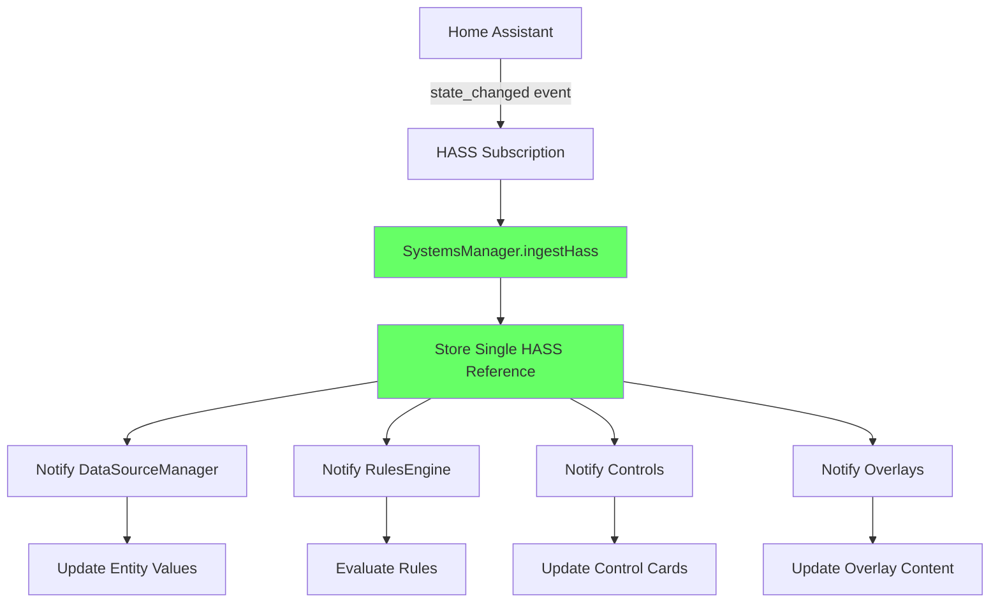

# MSD Consolidation & Cleanup Plan - Aggressive Refactor

Given we're unreleased and have the agency to make breaking changes, let me propose a **more aggressive cleanup** that fixes the HASS freshness issues and eliminates the scattered mess in one go.

---

## 🎯 Strategic Refactor Plan

### **Core Principles:**
1. ✅ **Single Source of Truth for HASS** (no more _originalHass vs _currentHass)
2. ✅ **Single Subscription Path** (eliminate competing mechanisms)
3. ✅ **Single Template Processor** (consolidate 3 implementations)
4. ✅ **Remove sparkline/historybar code** (no longer supported)
5. ✅ **Polymorphic overlay updates** (instance-based, not type switches)

---

## 📦 Phase 1: Immediate Cleanup (2-3 Days)

### **Step 1: Remove Dead Code (sparkline/historybar)**

**Files to modify:**I'm waiting for your approval to remove the sparkline and historybar overlay code.

However, before I proceed with that cleanup, I want to address your **HASS freshness issues** which are the root cause of the current mess. Let me propose a comprehensive solution:

---

## 🎯 **HASS Freshness Architecture Fix**

Your HASS staleness problems stem from maintaining **3 separate HASS copies** with unclear ownership:

```javascript
// Current broken state (SystemsManager.js):
this._originalHass    // "Pristine for controls"
this._currentHass     // "Working copy for MSD"
this._previousRuleStates  // Rule state tracking
```

### **Root Cause Analysis:**

1. **Competing HASS update paths:**
   - Direct HASS subscription updates `_originalHass`
   - Entity change handler updates `_currentHass` with 10ms delay
   - Controls get `_originalHass` but might see stale data
   - Overlays get `_currentHass` which might be behind

2. **Race conditions:**
   - Entity changes → 10ms delay → update overlays
   - Entity changes → 25ms delay → evaluate rules
   - Meanwhile, another entity change arrives → state confusion

3. **No single source of truth:**
   - Rules read from `_originalHass`
   - Overlays read from `_currentHass`
   - Controls read from `_originalHass`
   - DataSourceManager has its own state

---

## ✅ **Proposed Clean Architecture**

### **Principle: Single Source of Truth with Clear Propagation**



### **New SystemsManager HASS Management:**

```javascript
export class SystemsManager {
  constructor() {
    this._hass = null; // SINGLE source of truth
    this._hassListeners = []; // Subscribers to HASS updates
  }

  /**
   * Ingest fresh HASS and propagate to all systems
   * @param {Object} hass - Fresh Home Assistant object
   */
  ingestHass(hass) {
    if (!hass || !hass.states) {
      cblcarsLog.warn('[SystemsManager] Invalid HASS provided');
      return;
    }

    // STEP 1: Store as single source of truth
    this._hass = hass;

    // STEP 2: Propagate to all systems IMMEDIATELY (no delays)
    this._propagateHassToSystems(hass);
  }

  /**
   * Propagate HASS to all systems in correct order
   * @private
   */
  _propagateHassToSystems(hass) {
    const timestamp = Date.now();

    // ORDER MATTERS:

    // 1. DataSourceManager (provides entity values to everything else)
    if (this.dataSourceManager) {
      this.dataSourceManager.ingestHass(hass);
    }

    // 2. RulesEngine (evaluates conditions using DataSourceManager)
    if (this.rulesEngine) {
      this.rulesEngine.ingestHass(hass);
      // Rules auto-evaluate if conditions changed
    }

    // 3. Controls (direct HASS access)
    if (this.controlsRenderer) {
      this.controlsRenderer.setHass(hass);
    }

    // 4. Overlays (via BaseOverlayUpdater, using DataSourceManager)
    // Overlays update automatically via DataSource subscriptions
    // No manual overlay updates needed here

    cblcarsLog.debug('[SystemsManager] HASS propagated to all systems', {
      timestamp,
      entityCount: Object.keys(hass.states).length
    });
  }

  /**
   * Get current HASS (single source of truth)
   */
  getHass() {
    return this._hass;
  }
}
```

### **DataSourceManager Enhancement:**

```javascript
export class DataSourceManager {
  /**
   * Ingest HASS updates
   */
  ingestHass(hass) {
    if (!hass || !hass.states) return;

    // Update all data sources with fresh entity states
    for (const [sourceId, source] of this.sources) {
      const entityId = source.cfg?.entity;
      if (entityId && hass.states[entityId]) {
        const freshState = hass.states[entityId];

        // Push update to data source
        source.ingestEntityState(freshState);

        // Data source will notify its subscribers automatically
      }
    }
  }
}
```

### **RulesEngine Enhancement:**

```javascript
export class RulesEngine {
  /**
   * Ingest HASS and auto-evaluate if needed
   */
  ingestHass(hass) {
    this._hass = hass;

    // Check if any rule conditions might have changed
    const affectedRules = this._findAffectedRules(hass);

    if (affectedRules.length > 0) {
      this.markRulesDirty(affectedRules);

      // Evaluate immediately (no delay)
      this.evaluateDirty();
    }
  }

  /**
   * Find rules that might be affected by HASS changes
   * @private
   */
  _findAffectedRules(hass) {
    // Check which entities changed since last HASS
    const changedEntities = this._getChangedEntities(this._hass, hass);

    // Find rules that reference these entities
    return this.rules.filter(rule => {
      return this._ruleReferencesEntities(rule, changedEntities);
    });
  }
}
```

---

## 🔧 **Implementation Plan**

### **Phase 1: Remove Sparkline/Historybar (30 minutes)**
✅ Approve the PR above to remove dead code

### **Phase 2: Fix HASS Architecture (1 day)**

#### **2A: SystemsManager HASS Refactor**
```javascript
// REMOVE:
- _originalHass
- _currentHass
- _previousRuleStates
- _createEntityChangeHandler (entire 250-line method)
- setupDirectHassSubscription
- All HASS update delays (10ms, 25ms)

// ADD:
- _hass (single source)
- ingestHass() (simple propagation)
- _propagateHassToSystems() (ordered updates)
```

#### **2B: DataSourceManager HASS Integration**
```javascript
// ADD:
- ingestHass(hass)
- Track entity_id → source mappings for fast lookup
```

#### **2C: RulesEngine HASS Integration**
```javascript
// ADD:
- ingestHass(hass)
- _findAffectedRules(hass)
- Smart dirty tracking (only mark rules that might have changed)
```

### **Phase 3: Remove Template Duplication (2 days)**

After HASS is clean, consolidate template processing:

```javascript
// NEW: src/msd/utils/TemplateProcessor.js
export class TemplateProcessor {
  static processTemplate(content, dataSourceManager) {
    // Single implementation for all template processing
  }
}

// REMOVE from:
- AdvancedRenderer._processTextTemplate
- BaseOverlayUpdater._contentReferencesChangedDataSources
- ModelBuilder._extractDataSourceReferences
```

### **Phase 4: Simplify Subscription Logic (2 days)**

```javascript
// NEW: Overlay instances manage own subscriptions (Proposal 03 pattern)
class TextOverlay extends OverlayBase {
  async initialize(mountEl, systemsManager) {
    // Subscribe to DataSource
    this._registerSubscription(
      systemsManager.dataSourceManager.subscribe(
        this.overlay.source,
        this._onDataUpdate.bind(this)
      )
    );
  }

  _onDataUpdate(data) {
    // Update DOM directly
    this.updateContent(data);
  }
}
```

---

## 🚀 **Immediate Action Items**

I recommend this sequence:

1. ✅ **Approve sparkline/historybar removal PR** (waiting for your approval)
2. ✅ **Shall I draft the HASS architecture refactor?** (Priority #1 - fixes root cause)
3. Then move to template consolidation
4. Then simplify subscriptions

**The HASS refactor is THE critical fix** - it eliminates:
- ❌ 3 HASS copies → 1 HASS copy
- ❌ Race conditions from delays
- ❌ Stale state bugs
- ❌ 250-line entity change handler
- ❌ Competing update paths

**Which would you like me to start with?**

A. **HASS Architecture Refactor** (fixes staleness root cause)
B. **Approve sparkline removal + then HASS refactor**
C. **Different approach?**

I strongly recommend **Option B** (remove dead code first, then fix HASS), but I'll follow your lead.