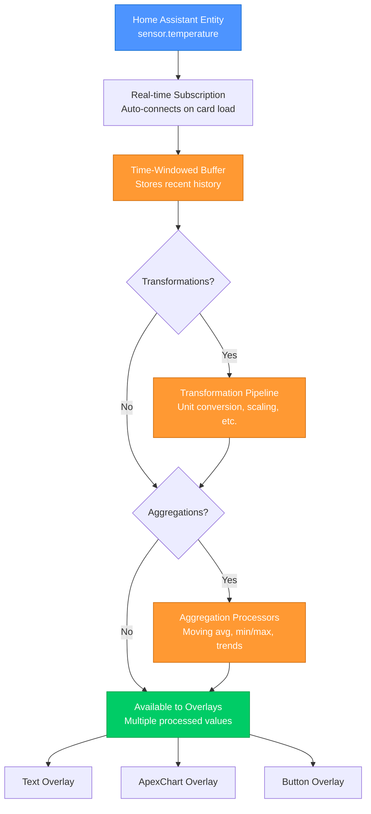
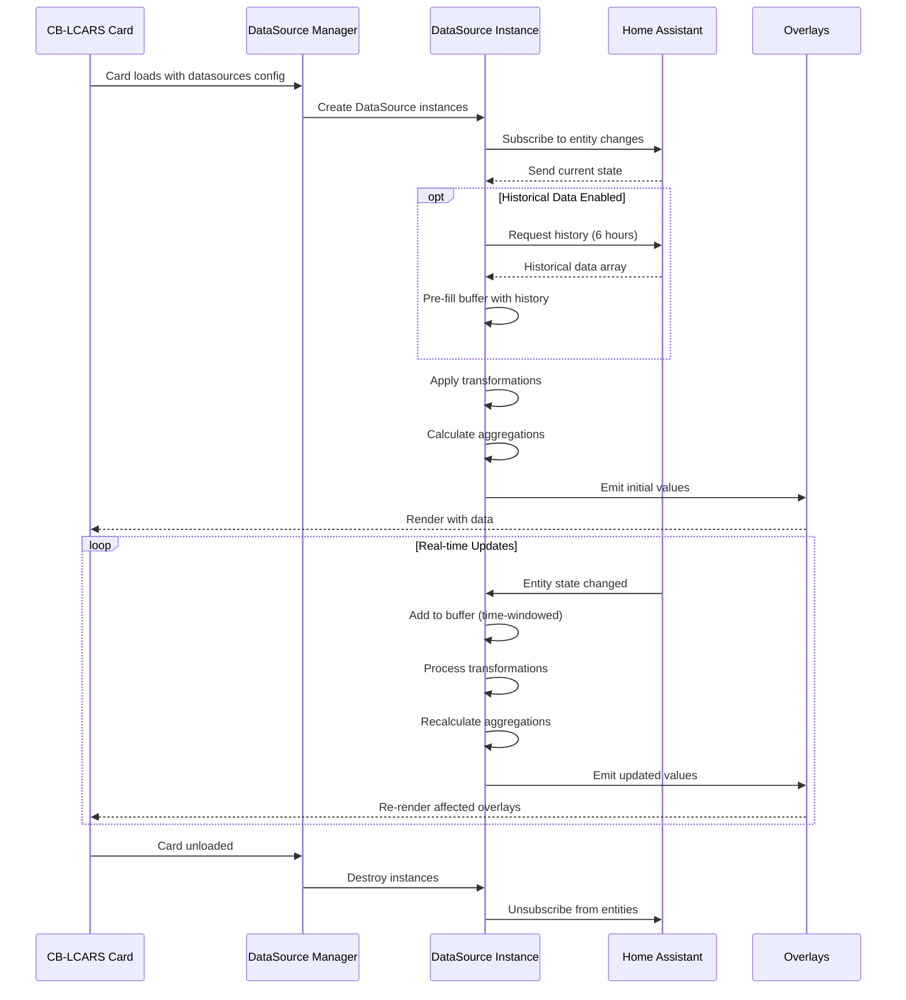
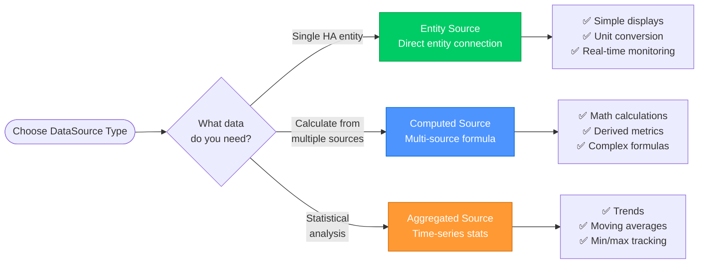
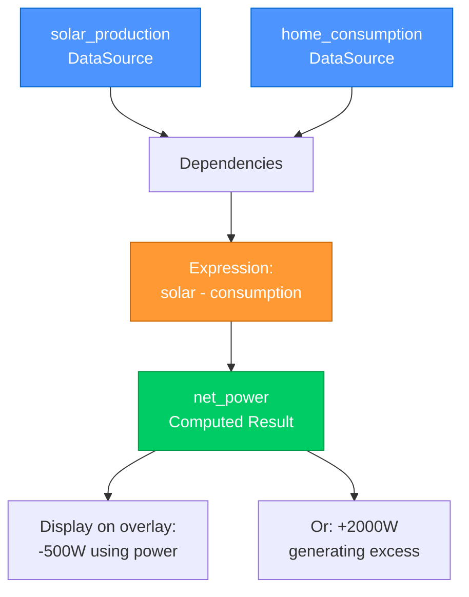
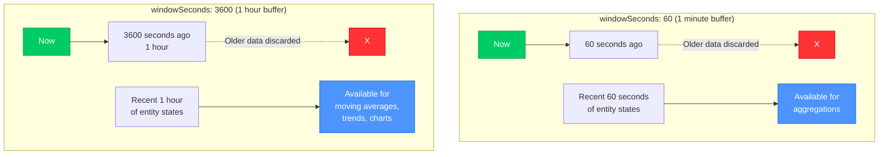
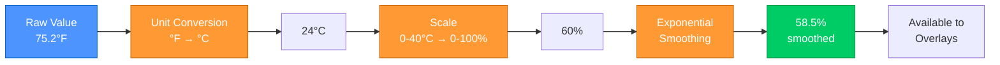

# DataSources Configuration Guide

> **Real-time data processing from Home Assistant to your overlays**
> DataSources transform entity states into processed, aggregated values that power dynamic dashboards.

---

## 🎯 Quick Start

### Simple Entity Source

```yaml
data_sources:
  temperature:
    type: entity
    entity: sensor.outdoor_temperature
```

Use in overlays:
```yaml
overlays:
  - id: temp_display
    type: text
    content: "{temperature.value}°C"
```

That's it! The datasource subscribes to the entity and provides real-time updates.

---

## 📋 Table of Contents

1. [Overview](#overview)
2. [DataSource Types](#datasource-types)
3. [Basic Configuration](#basic-configuration)
4. [Transformations](#transformations)
5. [Aggregations](#aggregations)
6. [Computed Sources](#computed-sources)
7. [Using DataSources](#using-datasources)
8. [Performance Tuning](#performance-tuning)
9. [Troubleshooting](#troubleshooting)

---

## 🌟 Overview

**DataSources are the heart of CB-LCARS.** They connect Home Assistant entities to your overlays with powerful processing capabilities:

- ✅ **Real-time subscriptions** - Instant updates when entity states change
- ✅ **Historical preload** - Load hours of history for time-series analysis
- ✅ **Transformations** - 50+ unit conversions, scaling, smoothing, expressions
- ✅ **Aggregations** - Moving averages, rates, trends, statistics
- ✅ **Computed values** - Calculate from multiple sources
- ✅ **Memory efficient** - Runtime processing, no persistent storage
- ✅ **Performance optimized** - Coalescing, throttling, smart buffering

### Data Flow



**Key Concepts:**
- 🔄 **Real-time** - Updates flow instantly from HA to overlays
- 🕐 **Buffered** - Recent history available for time-series analysis
- ⚙️ **Processed** - Data transformed through multiple stages
- 📊 **Multi-output** - One source can provide many processed values

### DataSource Lifecycle



**Lifecycle Stages:**
1. **Initialization** - DataSources created when card loads
2. **Subscription** - Auto-connect to HA entities
3. **History Preload** - Optional historical data for charts
4. **Processing** - Initial transformation and aggregation
5. **Real-time Updates** - Continuous monitoring and processing
6. **Cleanup** - Unsubscribe when card unloads

---

## 📦 DataSource Types



### 1. Entity Sources

Subscribe to Home Assistant entities with optional processing.

```yaml
data_sources:
  power_monitor:
    type: entity
    entity: sensor.power_consumption
    transformations:
      - type: unit_conversion
        from: "W"
        to: "kW"
        key: "kilowatts"
    aggregations:
      - type: moving_average
        window: "5m"
        key: "avg_5m"
```

**Use Cases:**
- Simple entity display
- Unit conversions
- Statistical analysis
- Trend monitoring

### 2. Computed Sources

Calculate values from other datasources.



```yaml
data_sources:
  # Source datasources
  solar_production:
    type: entity
    entity: sensor.solar_power

  home_consumption:
    type: entity
    entity: sensor.home_power

  # Computed net power
  net_power:
    type: computed
    expression: "solar - consumption"
    dependencies:
      solar: solar_production
      consumption: home_consumption
```

**Use Cases:**
- Multi-sensor calculations
- Derived metrics
- Complex formulas

### 3. Aggregated Sources

Focus on statistical analysis over time.

```yaml
data_sources:
  temperature_stats:
    type: entity
    entity: sensor.temperature
    windowSeconds: 3600  # 1 hour buffer
    aggregations:
      - type: moving_average
        window: "30m"
        key: "avg_30m"
      - type: min_max
        window: "1h"
        key: "hourly_range"
      - type: rate_of_change
        unit: "per_minute"
        key: "trend"
```

**Use Cases:**
- Trend analysis
- Range tracking
- Rate calculations
- Long-term statistics

---

## ⚙️ Basic Configuration

### Minimal Configuration

```yaml
data_sources:
  sensor_name:
    type: entity
    entity: sensor.entity_id
```

### Complete Configuration

```yaml
data_sources:
  detailed_sensor:
    type: entity
    entity: sensor.entity_id
    attribute: null              # Use specific attribute instead of state

    # Buffer configuration
    windowSeconds: 3600          # Time window for data buffer (default: 60)

    # Performance tuning
    minEmitMs: 100              # Min time between updates (default: 100)
    coalesceMs: 50              # Batch rapid updates (default: auto)
    maxDelayMs: 500             # Max delay before forced emit (default: auto)
    emitOnSameValue: true       # Emit even if value unchanged (default: true)

    # Historical data
    history:
      enabled: true             # Preload history (default: true)
      hours: 6                  # Hours to preload (default: 6, max: 168)

    # Processing pipelines
    transformations:
      - type: unit_conversion
        from: "°F"
        to: "°C"
        key: "celsius"

    aggregations:
      - type: moving_average
        window: "5m"
        key: "avg"
```

### Configuration Properties

| Property | Type | Default | Description |
|----------|------|---------|-------------|
| `type` | string | required | `entity`, `computed` |
| `entity` | string | required | Home Assistant entity ID |
| `attribute` | string | `null` | Use specific attribute instead of state |
| `windowSeconds` | number | `60` | Data buffer size in seconds |
| `minEmitMs` | number | `100` | Minimum milliseconds between emissions |
| `coalesceMs` | number | auto | Milliseconds to batch rapid updates |
| `maxDelayMs` | number | auto | Maximum delay before forced emission |
| `emitOnSameValue` | boolean | `true` | Emit updates even if value unchanged |
| `history.enabled` | boolean | `true` | Enable historical data preload |
| `history.hours` | number | `6` | Hours of history to preload (max 168) |
| `transformations` | array | `[]` | Transformation pipeline |
| `aggregations` | array | `[]` | Aggregation processors |

### Understanding the Buffer System

The `windowSeconds` parameter controls how much historical data is kept in memory for aggregations and time-series analysis.



**Buffer Behavior:**
- 📊 **Sliding Window** - Always keeps most recent N seconds
- 🗑️ **Auto-cleanup** - Automatically discards older data
- 💾 **Memory Efficient** - Only stores what you need
- ⏱️ **Aggregation Range** - Must be ≤ windowSeconds

**Sizing Guidelines:**
- **60s** - Real-time display, no historical analysis
- **300s** (5min) - Short-term moving averages
- **3600s** (1h) - Hourly trends and statistics
- **86400s** (24h) - Daily analysis (use sparingly)

---

## 🔄 Transformations

Transformations process data as it flows through the datasource. They can be chained for complex processing.



### Transformation Pipeline Flow

Each transformation:
1. Takes input value (raw or from previous transformation)
2. Processes it according to its type
3. Outputs result with a **key** for access
4. Passes to next transformation in chain

### Quick Examples

**Unit Conversion:**
```yaml
transformations:
  - type: unit_conversion
    from: "°F"
    to: "°C"
    key: "celsius"
```

**Scaling:**
```yaml
transformations:
  - type: scale
    input_range: [0, 100]
    output_range: [0, 255]
    key: "rgb_value"
```

**Smoothing:**
```yaml
transformations:
  - type: smooth
    method: "exponential"
    alpha: 0.3
    key: "smoothed"
```

**Expressions:**
```yaml
transformations:
  - type: expression
    expression: "value * 1.1 + 5"
    key: "adjusted"
```

### Transformation Pipeline

Transformations are applied in order, with results available by key:

```yaml
data_sources:
  complex_sensor:
    type: entity
    entity: sensor.raw_value
    transformations:
      # Step 1: Convert units
      - type: unit_conversion
        from: "°F"
        to: "°C"
        key: "celsius"

      # Step 2: Scale to percentage
      - type: scale
        input_range: [-10, 40]
        output_range: [0, 100]
        key: "percentage"

      # Step 3: Smooth the result
      - type: smooth
        method: "exponential"
        alpha: 0.3
        key: "smoothed"
```

Access results:
```yaml
overlays:
  - content: "Raw: {complex_sensor.value}°F"
  - content: "Celsius: {complex_sensor.transformations.celsius}°C"
  - content: "Percent: {complex_sensor.transformations.percentage}%"
  - content: "Smooth: {complex_sensor.transformations.smoothed}%"
```

**See:** [Transformation Reference](datasource-transformations.md) for complete transformation documentation.

---

## 📊 Aggregations

Aggregations calculate statistics over time-windowed data.

### Quick Examples

**Moving Average:**
```yaml
aggregations:
  - type: moving_average
    window: "5m"
    key: "avg_5m"
```

**Min/Max Tracking:**
```yaml
aggregations:
  - type: min_max
    window: "1h"
    key: "hourly_range"
```

**Rate of Change:**
```yaml
aggregations:
  - type: rate_of_change
    unit: "per_minute"
    key: "rate"
```

**Trend Detection:**
```yaml
aggregations:
  - type: recent_trend
    samples: 10
    threshold: 0.01
    key: "trend"
```

### Multiple Aggregations

Combine aggregations for comprehensive analysis:

```yaml
data_sources:
  temperature_analysis:
    type: entity
    entity: sensor.temperature
    windowSeconds: 3600  # 1 hour buffer
    aggregations:
      - type: moving_average
        window: "10m"
        key: "avg_10m"

      - type: moving_average
        window: "30m"
        key: "avg_30m"

      - type: min_max
        window: "1h"
        key: "hourly"

      - type: rate_of_change
        unit: "per_minute"
        key: "rate"

      - type: recent_trend
        samples: 12
        key: "trend"
```

Access results:
```yaml
overlays:
  - content: "10m avg: {temperature_analysis.aggregates.avg_10m}"
  - content: "30m avg: {temperature_analysis.aggregates.avg_30m}"
  - content: "Hourly min: {temperature_analysis.aggregates.hourly.min}"
  - content: "Rate: {temperature_analysis.aggregates.rate}"
  - content: "Trend: {temperature_analysis.aggregates.trend.direction}"
```

**See:** [Aggregation Reference](datasource-aggregations.md) for complete aggregation documentation.

---

## 🧮 Computed Sources

Computed sources derive values from other datasources using JavaScript expressions.

### Simple Calculation

```yaml
data_sources:
  temp_fahrenheit:
    type: entity
    entity: sensor.temperature_f

  temp_celsius:
    type: computed
    expression: "(temp - 32) * 5/9"
    dependencies:
      temp: temp_fahrenheit
```

### Multi-Source Calculation

```yaml
data_sources:
  solar_power:
    type: entity
    entity: sensor.solar_production

  home_power:
    type: entity
    entity: sensor.home_consumption

  battery_power:
    type: entity
    entity: sensor.battery_power

  net_power:
    type: computed
    expression: "solar - home + battery"
    dependencies:
      solar: solar_power
      home: home_power
      battery: battery_power
```

### Using Math Functions

```yaml
data_sources:
  wind_speed:
    type: entity
    entity: sensor.wind_speed

  wind_force:
    type: computed
    expression: "0.5 * 1.225 * Math.pow(speed, 2)"
    dependencies:
      speed: wind_speed
```

### Conditional Logic

```yaml
data_sources:
  temperature:
    type: entity
    entity: sensor.temperature

  comfort_level:
    type: computed
    expression: >
      temp < 18 ? 'cold' :
      temp < 22 ? 'comfortable' :
      temp < 26 ? 'warm' : 'hot'
    dependencies:
      temp: temperature
```

**See:** [Computed Sources Guide](computed-sources.md) for detailed examples.

---

## 📖 Using DataSources

### In Templates

Access datasource values in overlay content:

```yaml
overlays:
  - id: simple_value
    type: text
    content: "{temperature.value}°C"

  - id: transformation
    type: text
    content: "{temperature.transformations.fahrenheit}°F"

  - id: aggregation
    type: text
    content: "Avg: {temperature.aggregates.avg}°C"
```

### Dot Notation Access

DataSources expose values through dot notation:

- `.value` - Current processed value
- `.raw` - Original entity state
- `.timestamp` - Last update time (milliseconds)
- `.available` - Data availability (boolean)
- `.transformations.<key>` - Transformation result
- `.aggregates.<key>` - Aggregation result

### In Rules Engine

Use datasource values in conditional rendering:

```yaml
data_sources:
  cpu_temp:
    type: entity
    entity: sensor.cpu_temperature
    aggregations:
      - type: moving_average
        window: "5m"
        key: "avg"

overlays:
  - id: cpu_warning
    type: text
    content: "CPU Hot!"
    rules:
      - conditions:
          - datasource: cpu_temp.aggregates.avg
            operator: ">"
            value: 70
        properties:
          style:
            fill: var(--lcars-red)
```

### Multi-Line Content

Display multiple datasource values:

```yaml
overlays:
  - id: stats_display
    type: text
    content: |
      Current: {temperature.value}°C
      Average: {temperature.aggregates.avg}°C
      Trend: {temperature.aggregates.trend.direction}
      Min/Max: {temperature.aggregates.range.min} / {temperature.aggregates.range.max}
```

---

## ⚡ Performance Tuning

### Buffer Size

Control memory usage with `windowSeconds`:

```yaml
data_sources:
  fast_sensor:
    windowSeconds: 60      # Small buffer for recent data only

  analysis_sensor:
    windowSeconds: 3600    # Large buffer for long-term analysis
```

**Guideline:** Use smallest window that meets your aggregation requirements.

### Update Throttling

Control update frequency:

```yaml
data_sources:
  high_frequency_sensor:
    minEmitMs: 1000        # Update at most once per second
    coalesceMs: 100        # Batch updates within 100ms
    maxDelayMs: 2000       # Force update after 2 seconds max
```

**Use Cases:**
- High-frequency sensors (updating many times per second)
- Rate-limited APIs
- Reducing overlay re-renders

### Historical Preload

Control history loading:

```yaml
data_sources:
  # Don't preload if not needed
  simple_sensor:
    history:
      enabled: false

  # Minimal history for recent trends
  recent_sensor:
    history:
      enabled: true
      hours: 1

  # Extended history for daily patterns
  pattern_sensor:
    history:
      enabled: true
      hours: 24
```

**Guideline:** Only preload history if using aggregations that need it.

---

## 🐛 Troubleshooting

### DataSource Not Updating

**Problem:** Overlay shows old/no data.

**Checklist:**
1. Verify entity exists in Home Assistant
2. Check entity ID spelling
3. Ensure entity has a valid state
4. Check browser console for errors
5. Verify datasource name in template

**Debug:**
```yaml
data_sources:
  debug_sensor:
    type: entity
    entity: sensor.test
    emitOnSameValue: true  # Force updates even if value same
```

### Transformation Not Applied

**Problem:** Transformation result is undefined.

**Checklist:**
1. Verify `key` property is set
2. Check transformation type spelling
3. Verify input parameters (from/to units, ranges, etc.)
4. Check browser console for transformation errors

**Access:**
```yaml
# Wrong:
content: "{sensor.celsius}"

# Correct:
content: "{sensor.transformations.celsius}"
```

### Aggregation Shows No Data

**Problem:** Aggregation result is undefined or null.

**Checklist:**
1. Verify `windowSeconds` is large enough for aggregation window
2. Ensure sufficient data in buffer (check `history.hours`)
3. Wait for data to accumulate (moving averages need samples)
4. Verify aggregation `key` spelling

**Example:**
```yaml
data_sources:
  temp_avg:
    windowSeconds: 600     # 10 minutes
    aggregations:
      - type: moving_average
        window: "5m"        # Window must fit in buffer
        key: "avg"
```

### High Memory Usage

**Problem:** Card using too much memory.

**Solutions:**
1. Reduce `windowSeconds` for datasources
2. Reduce `history.hours` preload
3. Limit number of datasources
4. Use smaller aggregation windows

### Computed Source Returns NaN

**Problem:** Computed expression returns NaN.

**Causes:**
1. Dependency datasource not ready
2. Division by zero
3. Invalid mathematical operation
4. Missing dependency

**Solution:**
```yaml
# Add validation in expression
expression: "temp > 0 ? (other / temp) : 0"
```

---

## 📚 Related Documentation

### Architecture
- [DataSource System Architecture](../../architecture/subsystems/datasource-system.md)
- [Data Flow](../../architecture/overview.md#data-flow-pipeline)

### Configuration References
- [Transformation Reference](datasource-transformations.md) - Complete transformation documentation
- [Aggregation Reference](datasource-aggregations.md) - Complete aggregation documentation
- [Computed Sources Guide](computed-sources.md) - Detailed computed source examples

### Examples
- [DataSource Examples](../examples/datasource-examples.md) - Comprehensive examples

---

**Last Updated:** October 26, 2025
**Version:** 2025.10.1-fuk.42-69
