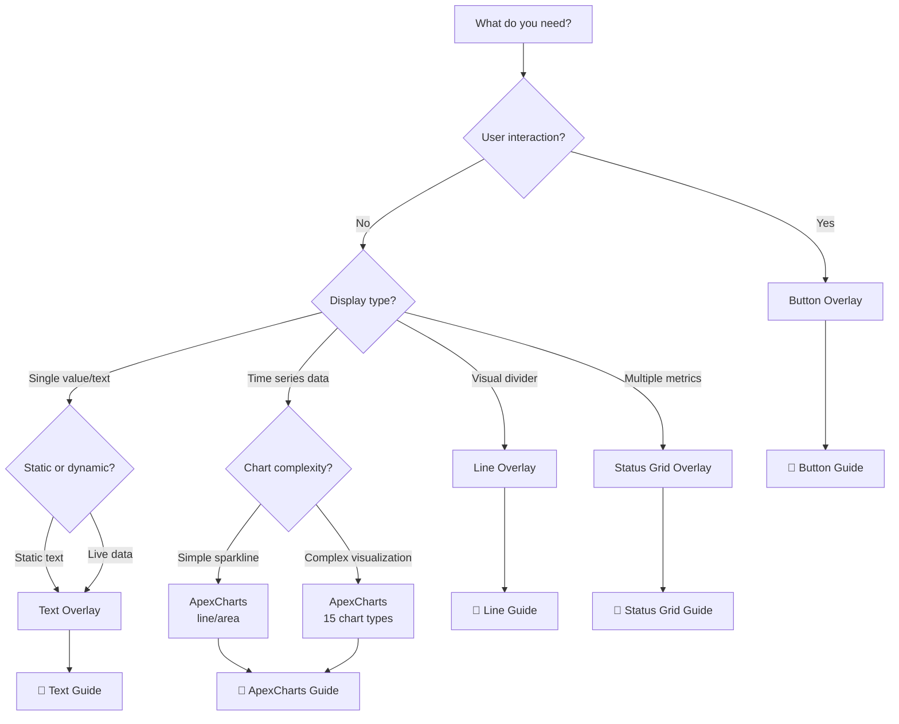

# Overlay System Guide

> **Visual elements layered on your LCARS interface**
> Overlays are interactive and informational elements positioned over your LCARS background, connected to live data sources.

---

## 📋 Table of Contents

1. [Overview](#overview)
2. [Quick Comparison](#quick-comparison)
3. [Overlay Types](#overlay-types)
4. [Common Concepts](#common-concepts)
5. [Getting Started](#getting-started)
6. [Best Practices](#best-practices)

---

## Overview

The **Overlay System** allows you to add dynamic, data-driven visual elements to your LCARS interface. Each overlay type serves a specific purpose, from displaying text and status indicators to creating interactive buttons and complex charts.

### What Are Overlays?

Overlays are visual elements that:
- ✅ **Layer over the background** - Positioned at specific coordinates
- ✅ **Connect to data** - Display live values from DataSources
- ✅ **Update in real-time** - Automatically refresh when data changes
- ✅ **Support interactions** - Buttons can trigger actions
- ✅ **Apply transformations** - Access processed data via DataSource transformations
- ✅ **Use LCARS styling** - Inherit theme colors and fonts

### Architecture

```yaml
# Basic overlay structure
overlays:
  - id: unique_identifier        # Required: Unique ID
    type: overlay_type           # Required: text, button, line, status_grid, apexchart
    source: data_source_name     # Optional: DataSource reference
    position: [x, y]             # Required: Coordinates
    size: [width, height]        # Required for some types
    style:                       # Type-specific styling
      # ... properties vary by type
```

---

## Quick Comparison

| Type | Best For | Complexity | Interactive | DataSource |
|------|----------|------------|-------------|------------|
| **[Text](#text-overlay)** | Labels, values, status | ⭐ Simple | No | Optional |
| **[Button](#button-overlay)** | Actions, controls | ⭐⭐ Moderate | Yes | Optional |
| **[Line](#line-overlay)** | Dividers, borders | ⭐ Simple | No | No |
| **[Status Grid](#status-grid-overlay)** | Multi-metric dashboards | ⭐⭐⭐ Complex | No | Yes (multiple) |
| **[ApexCharts](#apexcharts-overlay)** | Charts, graphs, gauges | ⭐⭐⭐⭐ Advanced | Optional | Yes |

### When to Use Each Type



---

## Overlay Types

### Text Overlay

**Display static text or live data values**

```yaml
overlays:
  - id: room_temp
    type: text
    source: temperature_sensor
    position: [100, 100]
    style:
      content: "Temperature: {value}°F"
      font_size: 24px
      color: var(--lcars-orange)
```

**Use cases:**
- Room labels
- Sensor readouts
- Status messages
- Timestamps
- Entity states

**Capabilities:**
- ✅ Static or dynamic content
- ✅ Text transformations (uppercase, lowercase, capitalize)
- ✅ Conditional styling based on value
- ✅ Multiple format options (number, unit, time)
- ✅ Optional borders and backgrounds

📖 **[Complete Text Overlay Guide →](text-overlay.md)**

---

### Button Overlay

**Interactive buttons that trigger actions**

```yaml
overlays:
  - id: light_toggle
    type: button
    source: light.living_room
    position: [100, 100]
    size: [200, 60]
    style:
      label: "Living Room"
      color: var(--lcars-orange)
      text_color: var(--lcars-black)
      font_size: 18px
    actions:
      - service: light.toggle
        target:
          entity_id: light.living_room
```

**Use cases:**
- Light controls
- Scene activation
- Device toggles
- Navigation
- Custom scripts

**Capabilities:**
- ✅ Trigger Home Assistant services
- ✅ State-based styling (on/off colors)
- ✅ Custom labels with live data
- ✅ Rounded or sharp corners
- ✅ Hover effects

📖 **[Complete Button Overlay Guide →](button-overlay.md)**

---

### Line Overlay

**Visual dividers and decorative lines**

```yaml
overlays:
  - id: divider
    type: line
    position: [50, 200]
    size: [400, 2]
    style:
      color: var(--lcars-orange)
      thickness: 2
      orientation: horizontal
```

**Use cases:**
- Section dividers
- Visual borders
- Decorative accents
- Connection indicators
- Panel outlines

**Capabilities:**
- ✅ Horizontal or vertical
- ✅ Custom thickness
- ✅ LCARS color integration
- ✅ Sharp or rounded ends
- ✅ Simple and performant

📖 **[Complete Line Overlay Guide →](line-overlay.md)**

---

### Status Grid Overlay

**Multi-metric dashboard grids**

```yaml
overlays:
  - id: climate_grid
    type: status_grid
    position: [100, 100]
    size: [400, 300]
    style:
      rows: 3
      columns: 2
      items:
        - label: "Living Room"
          source: temp_living
          format: "{value}°F"
        - label: "Bedroom"
          source: temp_bedroom
          format: "{value}°F"
        # ... more items
```

**Use cases:**
- Room temperature grids
- System resource monitoring
- Multi-sensor dashboards
- Entity status overviews
- Compact metric displays

**Capabilities:**
- ✅ Grid layout (rows × columns)
- ✅ Multiple data sources per grid
- ✅ Conditional formatting per item
- ✅ Label + value pairs
- ✅ Automatic spacing and alignment
- ✅ Flexible sizing

📖 **[Complete Status Grid Guide →](status-grid-overlay.md)**

---

### ApexCharts Overlay

**Advanced charting with 15 chart types**

```yaml
overlays:
  - id: temp_chart
    type: apexchart
    source: temperature_sensor
    position: [100, 100]
    size: [400, 200]
    style:
      chart_type: line
      color: var(--lcars-blue)
      time_window: "24h"
      thresholds:
        - value: 75
          color: var(--lcars-yellow)
          label: "Warning"
```

**Chart types:**
- Line, Area, Bar
- Pie, Donut, Radar
- Heatmap, RadialBar, RangeBar
- PolarArea, Treemap, RangeArea
- Scatter, Candlestick, BoxPlot

**Use cases:**
- Temperature trends
- Energy monitoring
- Network traffic
- System resources
- Financial data
- Statistical analysis

**Capabilities:**
- ✅ 15 chart types
- ✅ Multi-series support
- ✅ Real-time updates
- ✅ Interactive zoom/pan
- ✅ Threshold markers
- ✅ Time window filtering
- ✅ Animation presets
- ✅ DataSource transformations

**Replaces:** Deprecated Sparkline and HistoryBar overlays

📖 **[Complete ApexCharts Guide →](apexcharts-overlay.md)**

---

## Common Concepts

### Positioning

All overlays use absolute positioning:

```yaml
position: [x, y]    # [horizontal, vertical] in pixels
```

- **Origin:** Top-left corner of the canvas
- **X-axis:** Left to right (0 = left edge)
- **Y-axis:** Top to bottom (0 = top edge)

### Sizing

Most overlays require explicit size:

```yaml
size: [width, height]    # [horizontal, vertical] in pixels
```

**Exceptions:**
- **Text overlays** - Auto-sized based on content
- **Line overlays** - Size determines line length

### DataSource Integration

Connect overlays to live data:

```yaml
# Simple reference
source: sensor_name

# Transformation access
source: sensor_name.transformations.celsius

# Aggregation access
source: sensor_name.aggregations.avg_1h

# Multi-source (ApexCharts, Status Grid)
source:
  - sensor1
  - sensor2
  - sensor3
```

**DataSource features:**
- ✅ Real-time updates
- ✅ Transformation pipeline
- ✅ Aggregation support
- ✅ Historical data buffering
- ✅ Multiple source subscriptions

📖 **[DataSource System Guide →](../datasources.md)**

### Styling with LCARS Colors

Use LCARS theme variables for consistent styling:

```yaml
style:
  color: var(--lcars-blue)        # Primary LCARS blue
  text_color: var(--lcars-orange) # Accent orange
  border_color: var(--lcars-red)  # Alert red
```

**Available colors:**
- `var(--lcars-blue)` - Primary interface color
- `var(--lcars-orange)` - Accent/highlight color
- `var(--lcars-red)` - Alert/critical color
- `var(--lcars-yellow)` - Warning color
- `var(--lcars-green)` - Success/operational color
- `var(--lcars-purple)` - Secondary accent
- `var(--lcars-white)` - Text/labels
- `var(--lcars-gray)` - Disabled/inactive
- `var(--lcars-black)` - Background/text on buttons

### Animation

Most overlays support animation presets:

```yaml
animation_preset: lcars_standard    # or lcars_dramatic, lcars_minimal, etc.
```

**Available presets:**
- `lcars_standard` - Balanced (800ms) - Default
- `lcars_dramatic` - Cinematic (1200ms) - Important displays
- `lcars_minimal` - Quick (400ms) - Secondary elements
- `lcars_realtime` - Instant - Live data feeds
- `lcars_alert` - Attention (600ms) - Warnings
- `none` - Disabled - Accessibility

📖 **[Animation System Guide →](../../architecture/subsystems/animation-system.md)**

---

## Getting Started

### Step 1: Choose Your Overlay Type

Decide what you need:

| Need | Use This |
|------|----------|
| Display a temperature | Text Overlay |
| Control a light | Button Overlay |
| Separate sections visually | Line Overlay |
| Show multiple room temps | Status Grid Overlay |
| Graph temperature over time | ApexCharts Overlay |

### Step 2: Set Up DataSource (if needed)

```yaml
data_sources:
  temperature:
    type: entity
    entity: sensor.living_room_temperature
```

### Step 3: Add the Overlay

```yaml
overlays:
  - id: my_overlay
    type: text                    # or button, line, status_grid, apexchart
    source: temperature           # if data-driven
    position: [100, 100]
    size: [200, 50]              # if required
    style:
      # ... type-specific properties
```

### Step 4: Test and Refine

1. Save your configuration
2. View in Home Assistant
3. Check the browser console for errors
4. Adjust position, size, and styling
5. Add animations and interactivity

### Complete Example

A typical dashboard with multiple overlay types:

```yaml
data_sources:
  living_temp:
    type: entity
    entity: sensor.living_room_temperature

  living_light:
    type: entity
    entity: light.living_room

overlays:
  # Section label
  - id: section_label
    type: text
    position: [50, 50]
    style:
      content: "LIVING ROOM CONTROL"
      font_size: 24px
      color: var(--lcars-orange)
      text_transform: uppercase

  # Divider line
  - id: divider
    type: line
    position: [50, 90]
    size: [400, 2]
    style:
      color: var(--lcars-orange)
      thickness: 2

  # Temperature display
  - id: temp_display
    type: text
    source: living_temp
    position: [50, 120]
    style:
      content: "Temperature: {value}°F"
      font_size: 20px
      color: var(--lcars-blue)

  # Temperature chart
  - id: temp_chart
    type: apexchart
    source: living_temp
    position: [50, 160]
    size: [400, 150]
    style:
      chart_type: line
      color: var(--lcars-blue)
      time_window: "12h"
      show_grid: true

  # Light control button
  - id: light_button
    type: button
    source: living_light
    position: [50, 330]
    size: [200, 60]
    style:
      label: "Living Room Light"
      color: var(--lcars-orange)
      text_color: var(--lcars-black)
    actions:
      - service: light.toggle
        target:
          entity_id: light.living_room
```

---

## Best Practices

### Layout Organization

**Use a consistent grid:**
```yaml
# Define a grid system
# X: 50, 250, 450, 650
# Y: 50, 150, 250, 350
```

**Group related overlays:**
```yaml
# Climate section: Y 50-200
# Lights section: Y 220-370
# Security section: Y 390-540
```

**Add dividers between sections:**
```yaml
- id: section_divider
  type: line
  position: [50, 210]
  size: [700, 2]
```

### Performance Optimization

**Limit overlay count:**
- Keep total overlays under 50 per dashboard
- Use Status Grid instead of many Text overlays

**Optimize charts:**
```yaml
style:
  time_window: "6h"        # Shorter windows
  max_points: 300          # Fewer data points
  animatable: false        # Disable if not needed
```

**Reuse DataSources:**
```yaml
# Good: Reuse one source
data_sources:
  temperature:
    type: entity
    entity: sensor.temp

overlays:
  - id: temp_text
    source: temperature
  - id: temp_chart
    source: temperature

# Bad: Duplicate sources
data_sources:
  temp1:
    type: entity
    entity: sensor.temp
  temp2:
    type: entity
    entity: sensor.temp
```

### Responsive Design

**Consider different screen sizes:**
```yaml
# Mobile-friendly positioning
position: [10, 10]     # Not [800, 600]
size: [90vw, 200px]    # Percentage-based (not supported yet, use reasonable values)
```

**Use relative positioning mentally:**
```yaml
# Think in sections
# Top section: Y 0-200
# Middle section: Y 210-410
# Bottom section: Y 420-620
```

### Accessibility

**Use readable fonts:**
```yaml
style:
  font_size: 16px      # Minimum for readability
```

**Provide text alternatives:**
```yaml
# For charts, add text summary
- id: temp_summary
  type: text
  position: [50, 50]
  style:
    content: "Current: {value}°F, Avg: {avg}°F"
```

**Disable animations if needed:**
```yaml
animation_preset: none    # For users sensitive to motion
```

### Color Usage

**Maintain LCARS aesthetic:**
- Use theme colors: `var(--lcars-blue)`, `var(--lcars-orange)`
- Avoid custom hex colors unless necessary

**Use color meaningfully:**
```yaml
# Blue = operational/normal
color: var(--lcars-blue)

# Orange = highlight/accent
color: var(--lcars-orange)

# Yellow = warning
color: var(--lcars-yellow)

# Red = alert/critical
color: var(--lcars-red)

# Green = success/good
color: var(--lcars-green)
```

### Data Binding

**Use transformations for formatting:**
```yaml
data_sources:
  temperature:
    type: entity
    entity: sensor.temp
    transformations:
      - type: unit_conversion
        conversion: "fahrenheit_to_celsius"
        key: "celsius"

overlays:
  - id: temp_celsius
    type: text
    source: temperature.transformations.celsius
    position: [50, 50]
    style:
      content: "{value}°C"
```

**Validate data before display:**
```yaml
data_sources:
  sensor:
    type: entity
    entity: sensor.outdoor
    transformations:
      - type: expression
        expression: "value !== null && value !== undefined ? value : '---'"
        key: "validated"
```

---

## 📚 Related Documentation

### Configuration Guides
- **[DataSource System](../datasources.md)** - Configure data sources
- **[DataSource Transformations](../datasource-transformations.md)** - Transform data
- **[DataSource Aggregations](../datasource-aggregations.md)** - Aggregate data
- **[Computed Sources](../computed-sources.md)** - JavaScript expressions

### Architecture
- **[Overlay System Architecture](../../../architecture/subsystems/overlay-system.md)** - Technical details
- **[DataSource Architecture](../../../architecture/subsystems/datasource-system.md)** - Data flow
- **[Animation System](../../../architecture/subsystems/animation-system.md)** - Animation internals

### Examples
- **[DataSource Examples](../../examples/datasource-examples.md)** - Complete examples
- **[Dashboard Examples](../../examples/dashboard-examples.md)** - Full dashboard configs

---

**Last Updated:** October 26, 2025
**Version:** 2025.10.1-fuk.42-69
**Overlay Types:** Text, Button, Line, Status Grid, ApexCharts
